---
## Front matter
title: "Отчёт по лабораторной работе №2"
subtitle: "Управление версиями"
author: "Хусаинова Динара Айратовна"

## Generic otions
lang: ru-RU
toc-title: "Содержание"

## Bibliography
bibliography: bib/cite.bib
csl: pandoc/csl/gost-r-7-0-5-2008-numeric.csl

## Pdf output format
toc: true # Table of contents
toc-depth: 2
lof: true # List of figures
lot: true # List of tables
fontsize: 12pt
linestretch: 1.5
papersize: a4
documentclass: scrreprt
## I18n polyglossia
polyglossia-lang:
  name: russian
  options:
	- spelling=modern
	- babelshorthands=true
polyglossia-otherlangs:
  name: english
## I18n babel
babel-lang: russian
babel-otherlangs: english
## Fonts
mainfont: PT Serif
romanfont: PT Serif
sansfont: PT Sans
monofont: PT Mono
mainfontoptions: Ligatures=TeX
romanfontoptions: Ligatures=TeX
sansfontoptions: Ligatures=TeX,Scale=MatchLowercase
monofontoptions: Scale=MatchLowercase,Scale=0.9
## Biblatex
biblatex: true
biblio-style: "gost-numeric"
biblatexoptions:
  - parentracker=true
  - backend=biber
  - hyperref=auto
  - language=auto
  - autolang=other*
  - citestyle=gost-numeric
## Pandoc-crossref LaTeX customization
figureTitle: "Рис."
tableTitle: "Таблица"
listingTitle: "Листинг"
lofTitle: "Список иллюстраций"

lolTitle: "Листинги"
## Misc options
indent: true
header-includes:
  - \usepackage{indentfirst}
  - \usepackage{float} # keep figures where there are in the text
  - \floatplacement{figure}{H} # keep figures where there are in the text
---

# Цель работы

Изучить идеологию и применение средств контроля версий и освоить умения по работе с git.

# Ход работы

1.Создаем учетную запись на GitHub. Устанавливаем git-flow в Fedora Linux (рис. [-@fig:001]).

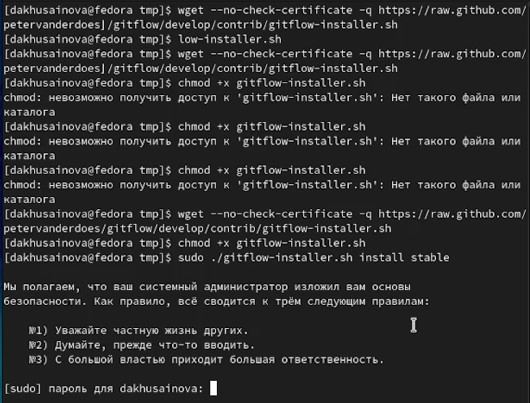{ #fig:001 width=70% }

Устанавливаем gh в Fedora Linux с помощью команды sudo( рис. [-@fig:002]).

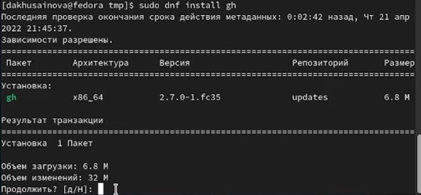{ #fig:002 width=70% }

Далее следует базовая настройка git. Используем имя, которое мы вводили при регистрации на GitHub и ту же электронную почту(рис. [-@fig:003]).

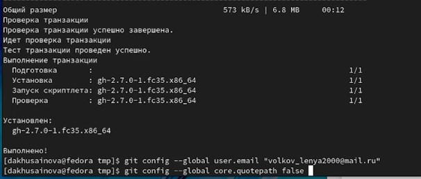{ #fig:003 width=70% }

Настраиваем utf-8 в выводе сообщений git (рис. [-@fig:004]).

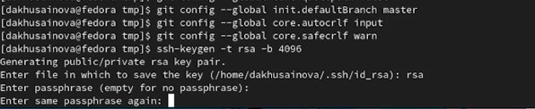{ #fig:004 width=70% }

При генерации ключа выбираем необходимые опции (рис. [-@fig:005],[-@fig:006]).

- тип RSA and RSA;
- размер 4096;
- выберите срок действия; значение по умолчанию— 0 (срок действия не истекает никогда).
- GPG запросит личную информацию, которая сохранится в ключе:
- Имя (не менее 5 символов).
- Адрес электронной почты.
- При вводе email убедитесь, что он соответствует адресу, используемому на GitHub.
- Комментарий

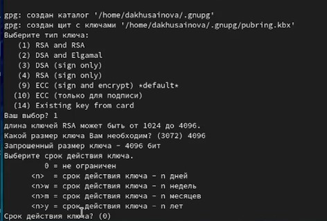{ #fig:005 width=70% }

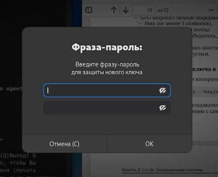{ #fig:006 width=70% }

Выводим список ключей и копируем отпечаток приватного ключа, устанавливаем необходимый пакет для дальнейших действий с ключом (рис. [-@fig:007] -[-@fig:008]).

{ #fig:007 width=70% }

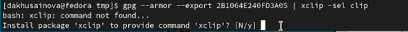{ #fig:008 width=70% }

Заходим на сам сайт GitHub, копируем сгенерированный PGP ключ в буфер обмена и вставляем полученный ключ в поле ввода (рис.[-@fig:009],[-@fig:010],[-@fig:011]).

{ #fig:009 width=70% }

{ #fig:010 width=70% }

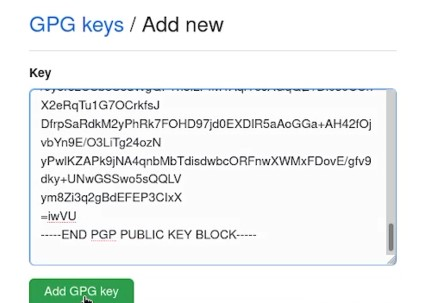{ #fig:011 width=70% }

Настраиваем автоматические подписи коммитов git, отвечаем на вопросы, выбирая GitHub,SSH,yes,вводим пароль, «залогиниться через браузер»(рис.[-@fig:012]-[-@fig:013]).

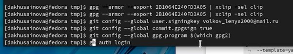{ #fig:012 width=70% }

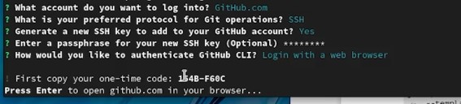{ #fig:013 width=70% }

Получаем код в терминале и вводим его на сайте( рис.[-@fig:014]).

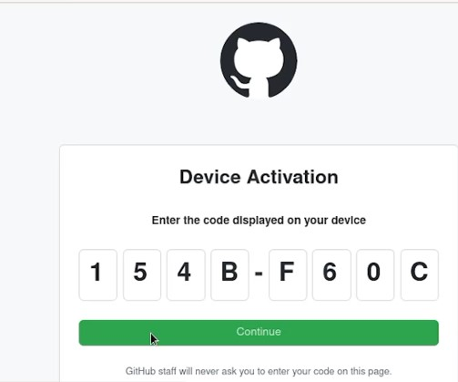{ #fig:014 width=70% }

Переходим в каталог курса, удаляем ненужные файлы, создаем, создаем каталог os-intro и отправляем файлы на сервер(рис. [-@fig:015],[-@fig:016]).

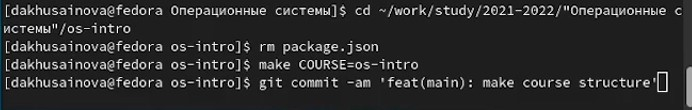{ #fig:015 width=70% }

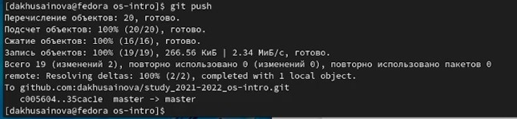{ #fig:016 width=70% }

# Контрольные вопросы

**1.** Что такое системы контроля версий (VCS) и для решения каких задач они предназначаются?

Система контроля версий (Version Control System, VCS) — программное обеспечение для облегчения работы с изменяющейся информацией. u VCS позволяет хранить несколько версий одного и того же документа, при необходимости возвращаться к более ранним версиям, определять, кто и когда сделал то или иное изменение, и многое другое.

**2.** Объясните следующие понятия VCS и их отношения: хранилище, commit, история, рабочая копия.

- Commit (Коммит) – сохранение изменений в репозиторий.
- Хранилище (repository), или репозитарий, — место хранения всех версий и служебной информации.
- История — список всех изменений проекта с возможностью отката в любую точку истории.
- Рабочая копия (working copy) — текущее состояние файлов проекта (любой версии), полученных из хранилища и, возможно, измененных.

**3.** Что представляют собой и чем отличаются централизованные и децентрализованные VCS? Приведите примеры VCS каждого вида.

Централизованные системы — это системы, которые используют архитектуру клиент / сервер, где один или несколько клиентских узлов напрямую подключены к центральному серверу. Это наиболее часто используемый тип систем во многих организациях, где клиент отправляет запрос на сервер компании и получает ответ.
- Wikipedia. Рассмотрим огромный сервер, на который мы отправляем наши запросы, и сервер отвечает запрашиваемой статьей. Предположим, мы ввели поисковый запрос «нездоровая пища» в строке поиска Википедии. Этот поисковый запрос отправляется как запрос на серверы Википедии (в основном, расположенные в штате Вирджиния, США), которые затем возвращают статьи, основанные на релевантности. В этой ситуации мы являемся клиентским узлом, серверы Википедии являются центральным сервером.

В децентрализованных системах каждый узел принимает свое собственное решение. Конечное поведение системы является совокупностью решений отдельных узлов. Обратите внимание, что нет единого объекта, который получает и отвечает на запрос
- Bitcoin. Давайте возьмем биткойны, например, потому что это самый популярный пример использования децентрализованных систем. Ни одна организация / организация не владеет сетью биткойнов. Сеть представляет собой сумму всех узлов, которые общаются друг с другом для поддержания количества биткойнов, которое есть у каждого владельца счета.

**4.** Опишите действия с VCS при единоличной работе с хранилищем.

Инициализация системы управления версиями git через git init. Работа над проектом используя git-flow для отдельных частей проекта. Git commit для фиксации изменений. При необходимости использование удаленного сервера для хранения с помощью remote и git push. Удаленный сервер также позволяет работать с нескольких устройств с использованием git pull.

**5.** Опишите порядок работы с общим хранилищем VCS.

При существующей версии проекта в хранилище, скопировать его оттуда через git pull. Использовать git-flow для работы над частями проекта. После окончания работы зафиксировать изменения через git commit и загрузить в хранилище через git push.

**6.** Каковы основные задачи, решаемые инструментальным средством git?

Git — это система управления версиями. У Git две основных задачи: первая — хранить информацию о всех изменениях в вашем коде, начиная с самой первой строчки, а вторая — обеспечение удобства командной работы над кодом. Ведение истории изменений, фиксирование изменений, совмещение версий, веток и др., а также откат к прошлым версиям.

**7.** Назовите и дайте краткую характеристику командам git.

- git init — инициализация проекта с системой контроля версий.
- git add — добавление файла/директории в систему контроля версий как отслеживаемое.
- git commit — фиксация изменений в отслеживаемых файлах.

**8.** Приведите примеры использования при работе с локальным и удалённым репозиториями.

При работе с локальным репозиторием все изменения хранятся локально и не выгружаются на удаленный сервер. Не требуется использование команд push, pull, remote и т.д. При работе с удаленным репозиторием для отображения изменения на удаленном репозитории и его актуализации, последние изменения должны быть загружены на удаленный сервер.

**9.** Что такое и зачем могут быть нужны ветви (branches)?

Ветка (англ. branch) — это последовательность коммитов, в которой ведётся параллельная разработка какого-либо функционала Основная ветка– master Ветки в GIT. Показать все ветки, существующие в репозитарии git branch. Создать ветку git branch имя.

**10.**	Как и зачем можно игнорировать некоторые файлы при commit?
Игнорирование файлов при commit происходит с помощью .gitignore файла.

В нем указываются пути, названия, расширения и другие идентификации
нежелательных объектов которые не будут учитываться в commit. Это
полезно для исключения как "мусорных" файлов, которые не являются
значимой частью проекта, а также конфиденциальных файлов, которые
содержат в себе приватную информацию, такую как пароли и токены.

# Вывод

Мы изучили идеологию и применение средств контроля версий и освоили умения по работе с git.

::: {#refs}
:::

