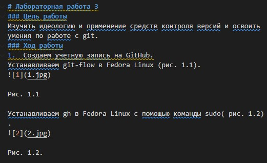

---
## Front matter
lang: ru-RU
title: Презентация лабораторной работы 3 Markdown
author: |
	Cvanova Angelin D
institute: |
	\inst{1}RUDN University, Moscow, Russian Federation
	\and
	\inst{2}LIT JINR, Dubna, Russian Federation
	\and
	\inst{3}BLTP JINR, Dubna, Russian Federation
	\and
	\inst{4}Technical University of Košice, Košice, Slovakia
date: NEC--2019, 30 September -- 4 October, 2019 Budva, Montenegro

## Formatting
toc: false
slide_level: 2
theme: metropolis
header-includes: 
 - \metroset{progressbar=frametitle,sectionpage=progressbar,numbering=fraction}
 - '\makeatletter'
 - '\beamer@ignorenonframefalse'
 - '\makeatother'
aspectratio: 43
section-titles: true
---

# Презентация лабораторной работы 3 

## Markdown

Выполнила Чванова Ангелина Дмитриевна
Группа НПИбд02-21

## Цель работы и задание

Научиться оформлять отчёты с помощью легковесного языка разметки Markdown

- Сделайте отчёт по предыдущей лабораторной работе в формате Markdown.

– В качестве отчёта просьба предоставить отчёты в 3 форматах: pdf, docx и md (в архиве,
поскольку он должен содержать скриншоты, Makefile и т.д.)

## Теоретическое введение

Чтобы создать заголовок, используйте знак ( # ).

Чтобы задать для текста полужирное начертание, заключите его в двойные звездочк.

Чтобы задать для текста курсивное начертание, заключите его в одинарные звездочки.

Чтобы задать для текста полужирное и курсивное начертание, заключите его в тройные
звездочки.

Блоки цитирования создаются с помощью символа >.

Неупорядоченный (маркированный) список можно отформатировать с помощью звездочек или тире. Также упорядоченный список можно отформатировать с помощью соответствующих цифр.

## Выполнение лабораторной работы

. Выполнение отчёта по предыдущей лабораторной работе номер 2 в формате Markdown.(рис1.1-1.3)

Рис1.1 Скрин процесса выполнения отчета в markdown

## Выполнение лабораторной работы

Рис1.2 Пример вставки фото в отчет markdown

## Выполнение лабораторной работы

2. Преобразование файла из markdown в форматы pdf, docx с помощью Pandoc в консоли.(рис2.1-2.2)
pandoc file-name.md -o file-name.pdf

pandoc file-name.md -o file-name.docx

Рис.2.1 Преобразование отчета из markdown в pdf, docx

Рис.2.2 Скрин папки с отчетом в фоматах md, docx, pdf.

## Выводы

Мы изучили оформление отчёты с помощью легковесного языка разметки Markdown, а также преобразование формата md в docx, pdf с помощью Pandoc.

## Спасибо за внимание

