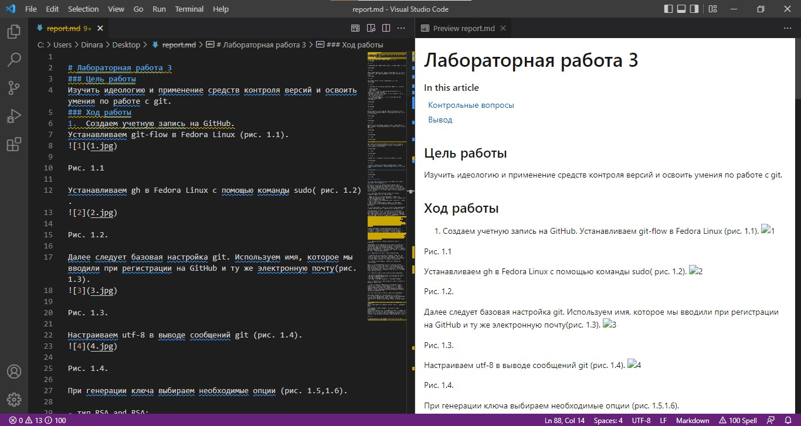

---
## Front matter
lang: ru-RU
title: Лабораторная работа 3 Markdown 
author: |
	Хусаинова Динара Айратовна
institute: |
	RUDN
date: 28.04.2022

## Formatting
toc: false
slide_level: 2
theme: metropolis
header-includes: 
 - \metroset{progressbar=frametitle,sectionpage=progressbar,numbering=fraction}
 - '\makeatletter'
 - '\beamer@ignorenonframefalse'
 - '\makeatother'
aspectratio: 43
section-titles: true
---

## Цель работы

Научиться оформлять отчёты с помощью легковесного языка разметки Markdown

## Ход работы 1

Скачиваем программу Visual Studio Code (рис. [-@fig:001]).

{ #fig:001 width=70% }

## Ход работы 2

Редактируем отчет согласно правилам Markdown (рис. [-@fig:002]).

{ #fig:002 width=70% }

## Ход работы 3

Переводим файл md в формат pdf и docx с помощью команды make и файла Makefile. 

## Вывод

Мы научились оформлять отчёты с помощью легковесного языка разметки Markdown.

