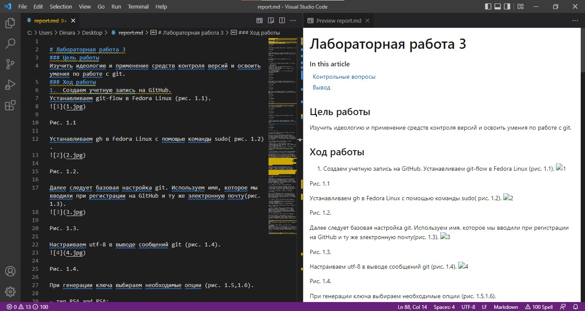
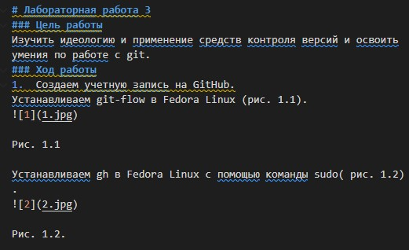
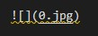
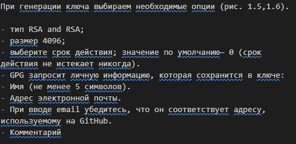
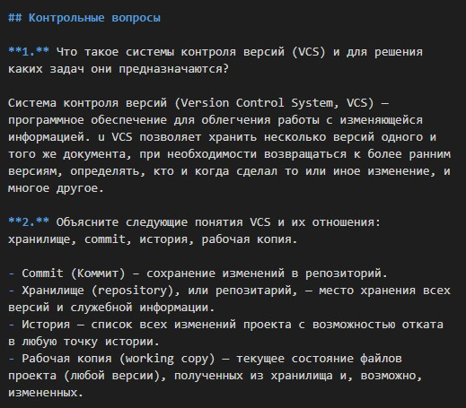
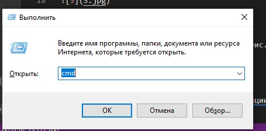
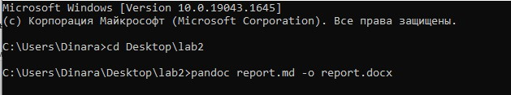
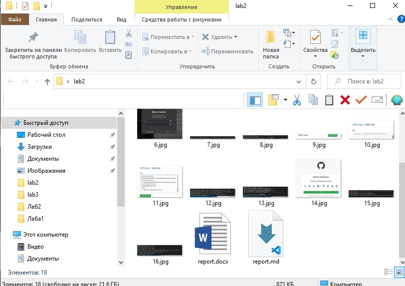

---
## Front matter
title: "Отчёт по лабораторной работе №3"
subtitle: "Markdown"
author: "Хусаинова Динара Айратовна"

## Generic otions
lang: ru-RU
toc-title: "Содержание"

## Bibliography
bibliography: bib/cite.bib
csl: pandoc/csl/gost-r-7-0-5-2008-numeric.csl

## Pdf output format
toc: true # Table of contents
toc-depth: 2
lof: true # List of figures
lot: true # List of tables
fontsize: 12pt
linestretch: 1.5
papersize: a4
documentclass: scrreprt
## I18n polyglossia
polyglossia-lang:
  name: russian
  options:
	- spelling=modern
	- babelshorthands=true
polyglossia-otherlangs:
  name: english
## I18n babel
babel-lang: russian
babel-otherlangs: english
## Fonts
mainfont: PT Serif
romanfont: PT Serif
sansfont: PT Sans
monofont: PT Mono
mainfontoptions: Ligatures=TeX
romanfontoptions: Ligatures=TeX
sansfontoptions: Ligatures=TeX,Scale=MatchLowercase
monofontoptions: Scale=MatchLowercase,Scale=0.9
## Biblatex
biblatex: true
biblio-style: "gost-numeric"
biblatexoptions:
  - parentracker=true
  - backend=biber
  - hyperref=auto
  - language=auto
  - autolang=other*
  - citestyle=gost-numeric
## Pandoc-crossref LaTeX customization
figureTitle: "Рис."
tableTitle: "Таблица"
listingTitle: "Листинг"
lofTitle: "Список иллюстраций"

lolTitle: "Листинги"
## Misc options
indent: true
header-includes:
  - \usepackage{indentfirst}
  - \usepackage{float} # keep figures where there are in the text
  - \floatplacement{figure}{H} # keep figures where there are in the text
---

# Цель работы
Научиться оформлять отчёты с помощью легковесного языка разметки Markdown

# Ход работы

1. Скачиваем программу Visual Studio Code, выбираем язык разметки Markdown, создавая новый файл для отчета. 
2. Открываем рабочее окно (рис. [-@fig:001]).

{#fig:001 width=70% }

3. Для заголовка файла используем один символ #, для подзаголовков используем ##(рис. [-@fig:002]), а для вставки скриншотов мы используем структуру (рис. [-@fig:003]). В квадратных скобкам мы пишем любой комментарий, а в круглых - название картинки, находящейся в той же папке, где и находится наш отчет.

{ #fig:002 width=70% }

{ #fig:003 width=70% }

4. Для обозначения пунктов используем - перед каждым (рис. [-@fig:004]).

{ #fig:004 width=70% }

5. Чтобы сделать текст жирным начертанием, используем ** (рис. [-@fig:005]).

{ #fig:005 width=70% }

6. После окончания создания отчета, переносим файл из формата md в формат docx с помощью командной строки Windows. Для этого открываем ее, нажимая Win + R, после пишем cmd, выбираем OK (рис. [-@fig:006]). Но перевести отчет в формат docx и pdf можно и через Linux с помощью файла Makefile и команды make. Это я сделала через дисплейный класс и получила в своем репозитории нужные форматы отчета.

{ #fig:006 width=70% }

7. Переходим с помощью команды cd на Рабочий стол и в папку, где лежит наш отчет в формате md (рис. [-@fig:007]).

{ #fig:007 width=70% }

8. Видим файл в формате docx в папке рядом с файлов в формате md(рис.[-@fig:008]).

{ #fig:008 width=70% }

# Вывод

Мы научились оформлять отчёты с помощью легковесного языка разметки Markdown. 

::: {#refs}
:::
