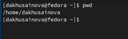
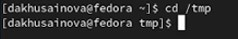
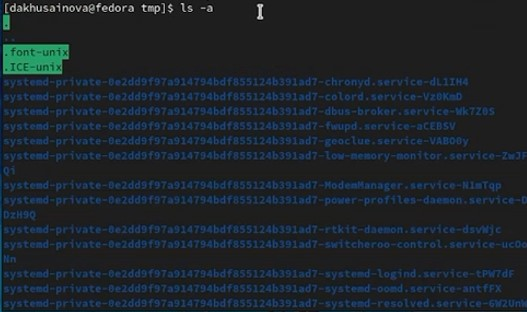
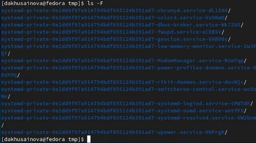
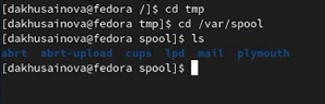
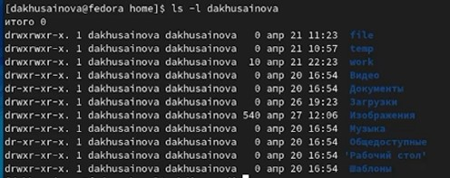
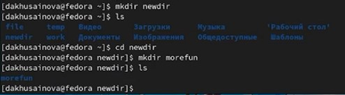
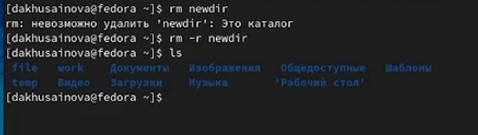
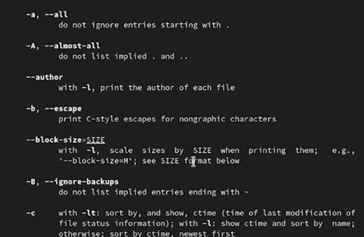
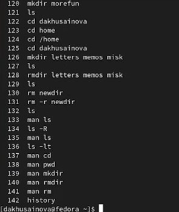

---
## Front matter
lang: ru-RU
title: Лабораторная работа 4 Основы интерфейса взаимодействия пользователя с системой Unix на уровне командной строки
author: |
	Хусаинова Динара Айратовна
institute: |
	RUDN
date: 28.04.2022

## Formatting
toc: false
slide_level: 2
theme: metropolis
header-includes: 
 - \metroset{progressbar=frametitle,sectionpage=progressbar,numbering=fraction}
 - '\makeatletter'
 - '\beamer@ignorenonframefalse'
 - '\makeatother'
aspectratio: 43
section-titles: true
---

## Цель работы

Приобретение практических навыков взаимодействия пользователя с системой посредством командной строки.

## Ход работы 1

Определяем полное имя нашего домашнего каталога (рис. [-@fig:001]).

{ #fig:001 width=70% }

## Ход работы 2

Переходим в каталог tmp (рис. [-@fig:002]).

{ #fig:002 width=70% }

## Ход работы 3

Выводим его содержимое (рис. [-@fig:003]).

{ #fig:003 width=70% }

## Ход работы 4

Пользуемся командой ls и несколькими ее опциями (рис. [-@fig:004]).

{ #fig:004 width=70% }

## Ход работы 5

Проверяем наличие подкаталога (рис. [-@fig:005]).

{ #fig:005 width=70% }

## Ход работы 6

Определим владельца каталога(рис. [-@fig:006]).

{ #fig:006 width=70% }

## Ход работы 7

Создаем и удаляем каталоги(рис. [-@fig:007]).

{ #fig:007 width=70% }

## Ход работы 8

Работаем с командами удаления каталогов(рис. [-@fig:008]).

{ #fig:008 width=70% }

## Ход работы 9

Работаем с командами удаления каталогов(рис. [-@fig:009]).

{ #fig:009 width=70% }

## Ход работы 10

Работаем с командами удаления каталогов(рис. [-@fig:010]).

{ #fig:010 width=70% }

## Вывод

Приобрели практические навыки взаимодействия с системой посредством командной строки.

