---
## Front matter
title: "Отчёт по лабораторной работе №4"
subtitle: "Основы интерфейса взаимодействия пользователя с системой Unix на уровне командной строки"
author: "Хусаинова Динара Айратовна"

## Generic otions
lang: ru-RU
toc-title: "Содержание"

## Bibliography
bibliography: bib/cite.bib
csl: pandoc/csl/gost-r-7-0-5-2008-numeric.csl

## Pdf output format
toc: true # Table of contents
toc-depth: 2
lof: true # List of figures
lot: true # List of tables
fontsize: 12pt
linestretch: 1.5
papersize: a4
documentclass: scrreprt
## I18n polyglossia
polyglossia-lang:
  name: russian
  options:
	- spelling=modern
	- babelshorthands=true
polyglossia-otherlangs:
  name: english
## I18n babel
babel-lang: russian
babel-otherlangs: english
## Fonts
mainfont: PT Serif
romanfont: PT Serif
sansfont: PT Sans
monofont: PT Mono
mainfontoptions: Ligatures=TeX
romanfontoptions: Ligatures=TeX
sansfontoptions: Ligatures=TeX,Scale=MatchLowercase
monofontoptions: Scale=MatchLowercase,Scale=0.9
## Biblatex
biblatex: true
biblio-style: "gost-numeric"
biblatexoptions:
  - parentracker=true
  - backend=biber
  - hyperref=auto
  - language=auto
  - autolang=other*
  - citestyle=gost-numeric
## Pandoc-crossref LaTeX customization
figureTitle: "Рис."
tableTitle: "Таблица"
listingTitle: "Листинг"
lofTitle: "Список иллюстраций"

lolTitle: "Листинги"
## Misc options
indent: true
header-includes:
  - \usepackage{indentfirst}
  - \usepackage{float} # keep figures where there are in the text
  - \floatplacement{figure}{H} # keep figures where there are in the text
---

# Цель работы

Приобретение практических навыков взаимодействия пользователя с системой посредством командной строки.

# Ход работы

**1.** Определяем полное имя нашего домашнего каталога с помощью команды pwd(рис. [-@fig:001]).

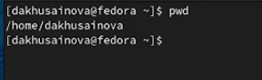{ #fig:001 width=70% }

**2.** Переходим в каталог /tmp с помощью команды cd(рис. [-@fig:002]).

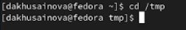{ #fig:002 width=70% }

**3.** Выводим на экран содержимое каталога /tmp с помощью команды ls, меняя при этом опции команды(рис. [-@fig:003],[-@fig:004],[-@fig:005],[-@fig:006]). Для того, чтобы отобразить имена скрытых файлов, необходимо использовать команду ls с опцией a. Можно также получить информацию о типах файлов (каталог, исполняемый файл, ссылка), для чего используется опция F. Чтобы вывести на экран подробную информацию о файлах и каталогах, необходимо использовать опцию l. Опция -alF выдает более подробную информацию. 

{ #fig:003 width=70% }

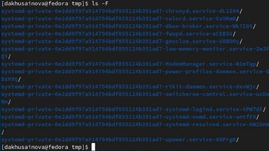{ #fig:004 width=70% }

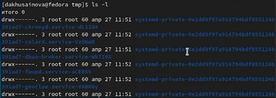{ #fig:005 width=70% }

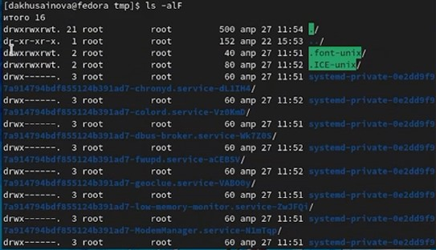{ #fig:006 width=70% }

**4.** Определяем, есть ли в каталоге /var/spool подкаталог с именем cron. Его там нет, в этом можно убедиться, вписав команду ls(рис. [-@fig:007]).

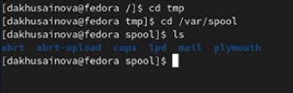{ #fig:007 width=70% }

**5.** Переходим в домашний каталог и выведим на экран его содержимое с помощью ls. Определяем, кто является владельцем файлов и подкаталогов с помощью опции l(рис. [-@fig:008],[-@fig:009]).

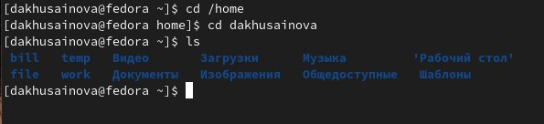{ #fig:008 width=70% }

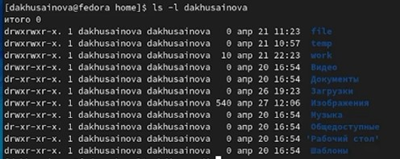{ #fig:009 width=70% }

**6.** В домашнем каталоге создаем новый каталог с именем newdir (команда mkdir). В каталоге ~/newdir создаем новый каталог с именем morefun(рис. [-@fig:010]).

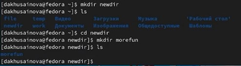{ #fig:010 width=70% }

**7.** В домашнем каталоге создаем одной командой три новых каталога с именами letters, memos, misk(команда mkdir), затем удаляем эти каталоги одной командой(rmdir команда)(рис. [-@fig:011]).

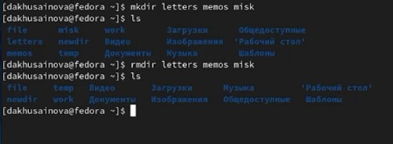{ #fig:011 width=70% }

**8.** Попробуем удалить ранее созданный каталог /newdir командой rm. Проверим, был ли каталог удалён. Выдается, что "невозможно удалить каталог", потому что мы используем команду для удаления пустых директорий, а нам нужна команда другая, поскольку newdir содержит в себе подкаталог. Удаляем каталог /newdir/morefun из домашнего каталога. Проверяем, был ли он удалён. Да, он удален(рис. [-@fig:012]).

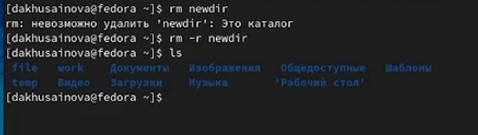{ #fig:012 width=70% }

**9.** С помощью команды man определяем, какую опцию команды ls нужно использовать для просмотра содержимое не только указанного каталога, но и подкаталогов, входящих в него. Это опция -R (рис. [-@fig:013],[-@fig:014],[-@fig:015],[-@fig:016]).

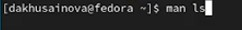{ #fig:013 width=70% }

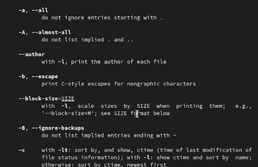{ #fig:014 width=70% }

{ #fig:015 width=70% }

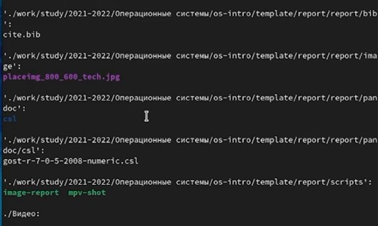{ #fig:016 width=70% }

**10.** С помощью команды man определяем набор опций команды ls, позволяющий отсортировать по времени последнего изменения выводимый список содержимого каталога с развёрнутым описанием файлов. Это опция -lt(рис. [-@fig:017],[-@fig:018]).

{ #fig:017 width=70% }

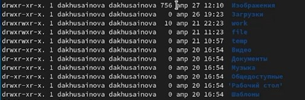{ #fig:018 width=70% }

**11.** Используем команду man для просмотра описания следующих команд: cd, pwd, mkdir, rmdir, rm(рис. [-@fig:019]).

- cd - команда для перемещения по каталогам.
- pwd - команда для просмотра полного пути до текущей папки
- mkdir - команда для создания директорий
- rmdir - команда для удаления пустых каталогов
- rm - команда для удаления файлов и каталогов(не пустых)

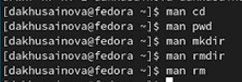{ #fig:019 width=70% }

**12.** Используя информацию, полученную при помощи команды history, выполним модификацию и исполнение нескольких команд из буфера команд. Вводим в командную строку команду history и получаем список всех вводимых мною команд, а после выполним несколько действий, но с другими каталогами как пример. Выполним несколько команд с помощью указания их номера, в данном случае мы их выполнить не можем, поскольку данные команды требуют аргумента(рис. [-@fig:020],[-@fig:021],[-@fig:022]).

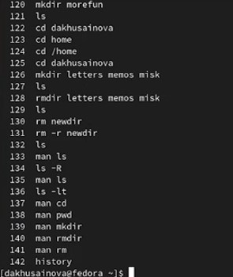{ #fig:020 width=70% }

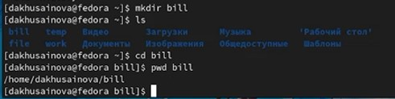{ #fig:021 width=70% }

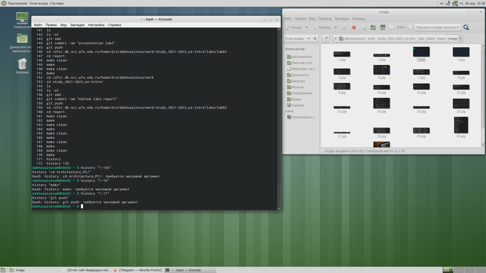{ #fig:022 width=70% }

# Вывод 

Приобрели практические навыки взаимодействия с системой посредством командной строки.

::: {#refs}
:::

