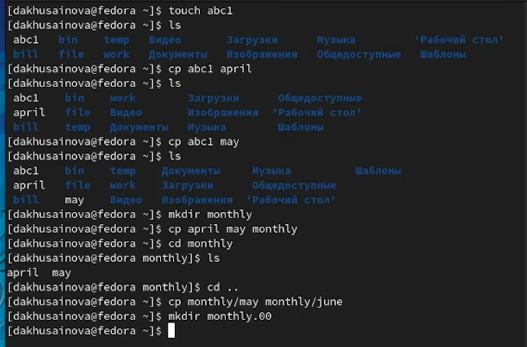
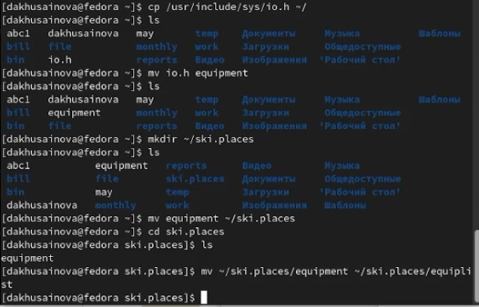
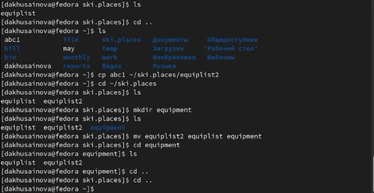
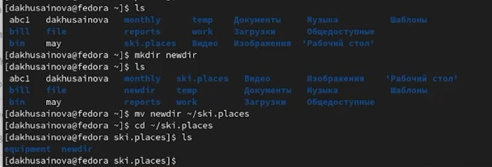
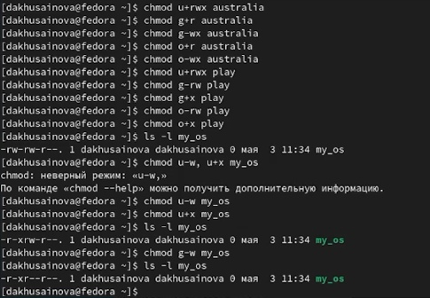
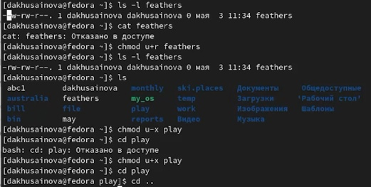
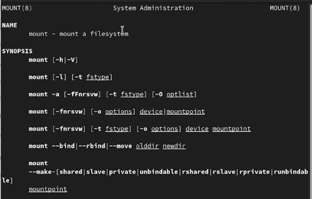
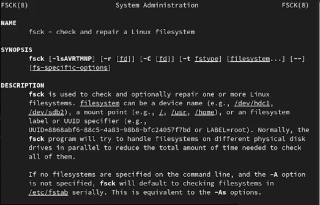
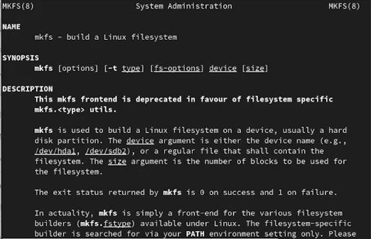
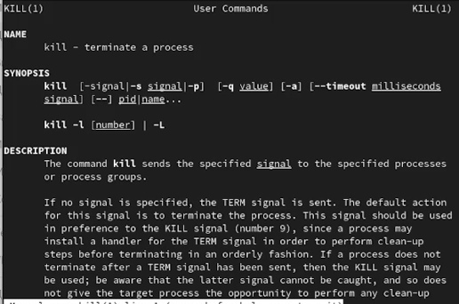

---
## Front matter
lang: ru-RU
title: Лабораторная работа 5 Анализ файловой системы Linux. Команды для работы с файлами и каталогами.
author: |
	Хусаинова Динара Айратовна
institute: |
	RUDN
date: 03.05.2022

## Formatting
toc: false
slide_level: 2
theme: metropolis
header-includes: 
 - \metroset{progressbar=frametitle,sectionpage=progressbar,numbering=fraction}
 - '\makeatletter'
 - '\beamer@ignorenonframefalse'
 - '\makeatother'
aspectratio: 43
section-titles: true
---

## Цель работы

Ознакомление с файловой системой Linux, её структурой, именами и содержанием каталогов. Приобретение практических навыков по применению команд для работы с файлами и каталогами, по управлению процессами (и работами), по проверке использования диска и обслуживанию файловой системы.

## Выполнение создания файлов, копирование, перемещение и создание каталогов

Приведем примеры команд, которые мы изучили(рис. [-@fig:001]).

{ #fig:001 width=70% }

## Работа с каталогом ski.places

Создаем каталог ski.places и перемещаем туда файл(рис. [-@fig:002]).

{ #fig:002 width=70% }

## Работа с каталогом ski.places

Создаем новую директорию(рис. [-@fig:003]).

{ #fig:003 width=70% }

## Работа с каталогом ski.places

Выполняем перемещние(рис. [-@fig:004]).

{ #fig:004 width=70% }

## Права доступа

Определяем опции команды chmod, необходимые для того, чтобы присвоить перечисленным файлам некоторые права доступа(рис. [-@fig:005]).

{ #fig:005 width=70% }

## Попытка произвести действия после изменения прав доступа

Меняем права доступа и проверяем, правильно ли изменили права(рис. [-@fig:008]).

{ #fig:008 width=70% }

## Команда man

Даем краткую характеристику командам(рис. [-@fig:009]).

{ #fig:009 width=70% }

## Команда man

Работаем с командами удаления каталогов(рис. [-@fig:010]).

{ #fig:010 width=70% }

## Команда man

Просматриваем опции c помощью команды man(рис. [-@fig:011]).

{ #fig:011 width=70% }

## Команда man

Работаем с командой history(рис. [-@fig:012]).

{ #fig:012 width=70% }

## Вывод

Ознакомились с файловой системой Linux, её структурой, именами и содержанием каталогов, а также приобрели практические навыки по применению команд для работы с файлами и каталогами, по управлению процессами (и работами), по проверке использования диска и обслуживанию файловой системы.

