---
## Front matter
title: "Отчёт по лабораторной работе №5"
subtitle: "Анализ файловой системы Linux. Команды для работы с файлами и каталогами"
author: "Хусаинова Динара Айратовна"

## Generic otions
lang: ru-RU
toc-title: "Содержание"

## Bibliography
bibliography: bib/cite.bib
csl: pandoc/csl/gost-r-7-0-5-2008-numeric.csl

## Pdf output format
toc: true # Table of contents
toc-depth: 2
lof: true # List of figures
lot: true # List of tables
fontsize: 12pt
linestretch: 1.5
papersize: a4
documentclass: scrreprt
## I18n polyglossia
polyglossia-lang:
  name: russian
  options:
	- spelling=modern
	- babelshorthands=true
polyglossia-otherlangs:
  name: english
## I18n babel
babel-lang: russian
babel-otherlangs: english
## Fonts
mainfont: PT Serif
romanfont: PT Serif
sansfont: PT Sans
monofont: PT Mono
mainfontoptions: Ligatures=TeX
romanfontoptions: Ligatures=TeX
sansfontoptions: Ligatures=TeX,Scale=MatchLowercase
monofontoptions: Scale=MatchLowercase,Scale=0.9
## Biblatex
biblatex: true
biblio-style: "gost-numeric"
biblatexoptions:
  - parentracker=true
  - backend=biber
  - hyperref=auto
  - language=auto
  - autolang=other*
  - citestyle=gost-numeric
## Pandoc-crossref LaTeX customization
figureTitle: "Рис."
tableTitle: "Таблица"
listingTitle: "Листинг"
lofTitle: "Список иллюстраций"

lolTitle: "Листинги"
## Misc options
indent: true
header-includes:
  - \usepackage{indentfirst}
  - \usepackage{float} # keep figures where there are in the text
  - \floatplacement{figure}{H} # keep figures where there are in the text
---

# Цель работы

Ознакомление с файловой системой Linux, её структурой, именами и содержанием каталогов. Приобретение практических навыков по применению команд для работы с файлами и каталогами, по управлению процессами (и работами), по проверке использования диска и обслуживанию файловой системы.

# Ход работы

**1.** Выполним все примеры, приведённые в первой части описания лабораторной работы, то есть создаем необходимые файлы, копируем один файл в другой, создаем каталоги, пермещаем одни файлы в другие каталоги и т.д.(рис. [-@fig:001]).

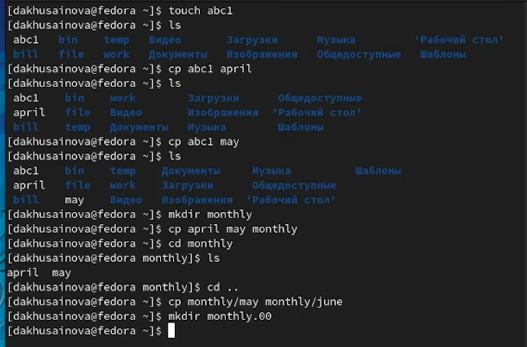{ #fig:001 width=70% }

**2.** Скопируем файл /usr/include/sys/io.h в домашний каталог и назовем его equipment. Далее в домашнем каталоге создаем директорию /ski.plases, перемещаем файл equipment в каталог /ski.plases. Переименовываем файл /ski.plases/equipment в /ski.plases/equiplist.(рис. [-@fig:002]).

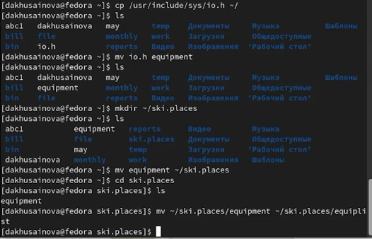{ #fig:002 width=70% }

**3.** . Создаeм и переименовываем каталог /newdir в каталог /ski.plases и называем его plans.(рис. [-@fig:003],[-@fig:004]).

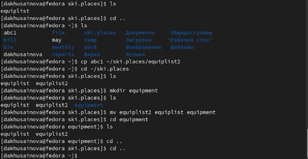{ #fig:003 width=70% }

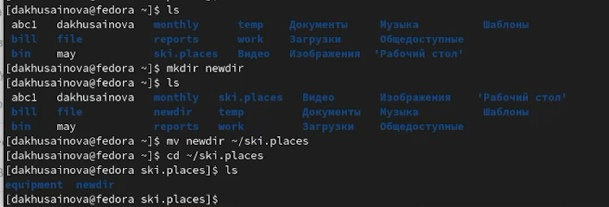{ #fig:004 width=70% }

**4.** Определяем опции команды chmod, необходимые для того, чтобы присвоить перечисленным ниже файлам выделенные права доступа, то есть каталогам и файлам с названиями: australia, play, my_os,feathers(рис. [-@fig:005]).

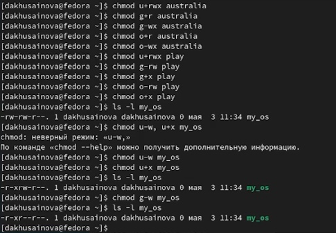{ #fig:005 width=70% }

**5.** Просмотрим содержимое файла /etc/password. Скопируем файл /feathers в файл /file.old. Переместим файл /file.old в каталог /play и скопируем каталог /play в каталог /fun.(рис. [-@fig:006]).

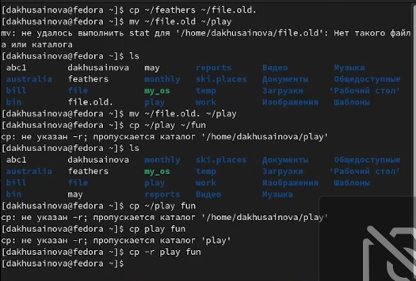{ #fig:006 width=70% }

**6.** Переместим каталог /fun в каталог /play и назовем его games, после этого лишим владельца файла /feathers права на чтение (r), при попытке просмотреть данный файл консоль выводит нам сообщение о том, что нам отказано в доступе. Теперь дадим владельцу файла /feathers право на чтение (r). Лишим владельца каталога /play права на выполнение. При попытке перейти в данный каталог, нам будет отказано в доступе. Дадим владельцу каталога /play право на выполнение(рис. [-@fig:007],  [-@fig:008]).

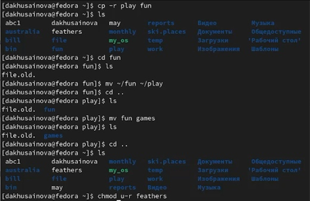{ #fig:007 width=70% }

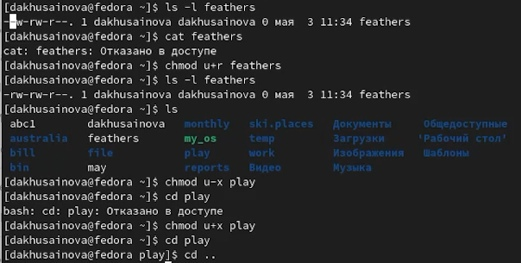{ #fig:008 width=70% }

**7.** Даем краткую характеристику командам mount, fsck, mkfs, kill с помощью команды man(рис. [-@fig:009], [-@fig:010], [-@fig:011],[-@fig:012]).

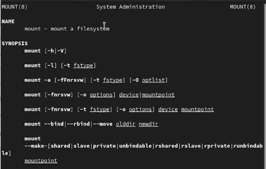{ #fig:009 width=70% }

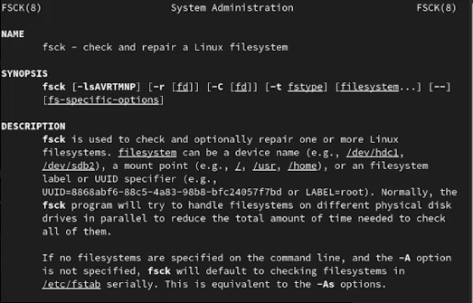{ #fig:010 width=70% }

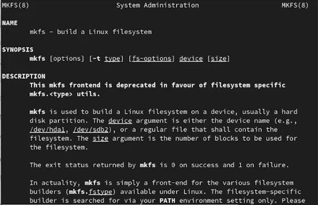{ #fig:011 width=70% }

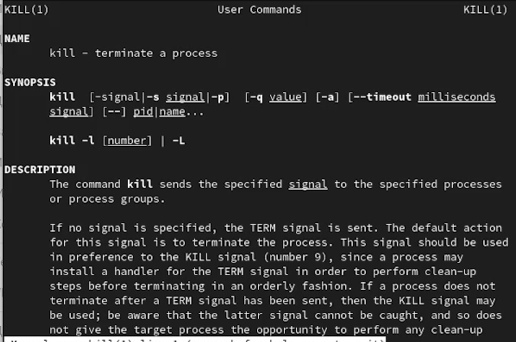{ #fig:012 width=70% }

# Вывод 

Ознакомились с файловой системой Linux, её структурой, именами и содержанием каталогов, а также приобрели практические навыки по применению команд для работы с файлами и каталогами, по управлению процессами (и работами), по проверке использования диска и обслуживанию файловой системы.

::: {#refs}
:::

