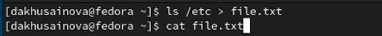
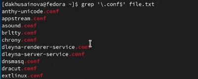
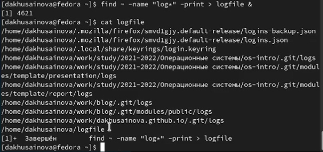
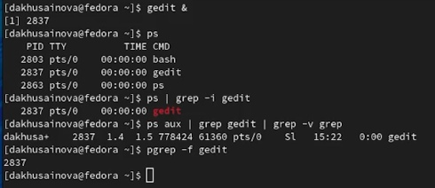
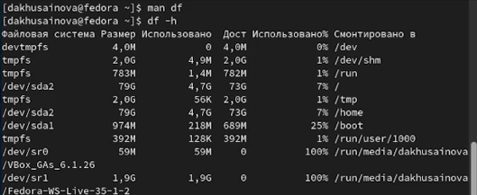
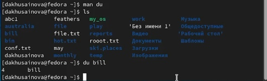

---
## Front matter
lang: ru-RU
title: Лабораторная работа 6 Поиск файлов. Перенаправление ввода-вывода. Просмотр запущенных процессов
author: |
	Хусаинова Динара Айратовна
institute: |
	RUDN
date: 28.04.2022

## Formatting
toc: false
slide_level: 2
theme: metropolis
header-includes: 
 - \metroset{progressbar=frametitle,sectionpage=progressbar,numbering=fraction}
 - '\makeatletter'
 - '\beamer@ignorenonframefalse'
 - '\makeatother'
aspectratio: 43
section-titles: true
---

## Цель работы

Ознакомление с инструментами поиска файлов и фильтрации текстовых данных. Приобретение практических навыков: по управлению процессами (и заданиями), по проверке использования диска и обслуживанию файловых систем.

## Запись названий файлов

Запишем в файл file.txt названия файлов, содержащихся в каталоге /etc с помощью команды ls. Затем допишем в этот же файл названия файлов, содержащихся в вашем домашнем каталоге(рис. [-@fig:002]).

{ #fig:002 width=70% }

## Разширение conf

Выводим имена всех файлов из file.txt, имеющих расширение .conf, после чего запишем их в новый текстовой файл conf.txt(рис. [-@fig:004]).

{ #fig:004 width=70% }

## Вывод файлов по страницам

Выводим на экран по странично имена файлов из каталога etc, начинающиеся с символа h (рис. [-@fig:007])

{ #fig:007 width=70% }

## Запуск процесса в фоновом режиме

Запускаем в фоновом режиме процесс, который будет записывать в файл /logfile файлы, имена которых начинаются с log (рис. [-@fig:009]).

{ #fig:009 width=70% }

## Определяем PID

Запускаем из консоли в фоновом режиме редактор gedit, определяем идентификатор(PID) процесса gedit, используя команду ps, конвейер и фильтр grep, приведем на скринах несколько вариантов(рис. [-@fig:011]).

{ #fig:011 width=70% }

## Команда kill

Прочитаем справку (man) команды kill, после чего используем её для завершения процесса gedit(рис. [-@fig:012]).

{ #fig:012 width=70% }

## Команды df и du

Выполним команды df и du, предварительно получив более подробную информацию об этих командах, с помощью команды man(рис. [-@fig:013],[-@fig:014]).

{ #fig:013 width=70% }

## Команды df и du

{ #fig:014 width=70% }

## Команда find

Воспользовавшись справкой команды find, выводим имена всех директорий, имеющихся в домашнем каталоге (рис. [-@fig:015]).

{ #fig:015 width=70% }

## Вывод

Ознакомились с инструментами поиска файлов и фильтрации текстовых данных, приобрели практические навыки: по управлению процессами (и заданиями), по проверке использования диска и обслуживанию файловых систем.

