---
## Front matter
title: "Отчёт по лабораторной работе №6"
subtitle: "Поиск файлов. Перенаправление ввода-вывода. Просмотр запущенных процессов"
author: "Хусаинова Динара Айратовна"

## Generic otions
lang: ru-RU
toc-title: "Содержание"

## Bibliography
bibliography: bib/cite.bib
csl: pandoc/csl/gost-r-7-0-5-2008-numeric.csl

## Pdf output format
toc: true # Table of contents
toc-depth: 2
lof: true # List of figures
lot: true # List of tables
fontsize: 12pt
linestretch: 1.5
papersize: a4
documentclass: scrreprt
## I18n polyglossia
polyglossia-lang:
  name: russian
  options:
	- spelling=modern
	- babelshorthands=true
polyglossia-otherlangs:
  name: english
## I18n babel
babel-lang: russian
babel-otherlangs: english
## Fonts
mainfont: PT Serif
romanfont: PT Serif
sansfont: PT Sans
monofont: PT Mono
mainfontoptions: Ligatures=TeX
romanfontoptions: Ligatures=TeX
sansfontoptions: Ligatures=TeX,Scale=MatchLowercase
monofontoptions: Scale=MatchLowercase,Scale=0.9
## Biblatex
biblatex: true
biblio-style: "gost-numeric"
biblatexoptions:
  - parentracker=true
  - backend=biber
  - hyperref=auto
  - language=auto
  - autolang=other*
  - citestyle=gost-numeric
## Pandoc-crossref LaTeX customization
figureTitle: "Рис."
tableTitle: "Таблица"
listingTitle: "Листинг"
lofTitle: "Список иллюстраций"

lolTitle: "Листинги"
## Misc options
indent: true
header-includes:
  - \usepackage{indentfirst}
  - \usepackage{float} # keep figures where there are in the text
  - \floatplacement{figure}{H} # keep figures where there are in the text
---

# Цель работы

Ознакомление с инструментами поиска файлов и фильтрации текстовых данных. Приобретение практических навыков: по управлению процессами (и заданиями), по проверке использования диска и обслуживанию файловых систем.

# Ход работы

**1.** Выполним вход в систему, введя пароль(рис. [-@fig:001]).

{ #fig:001 width=70% }

**2.** Запишем в файл file.txt названия файлов, содержащихся в каталоге /etc с помощью команды ls. Затем допишем в этот же файл названия файлов, содержащихся в вашем домашнем каталоге(рис. [-@fig:002],[-@fig:003]).

{ #fig:002 width=70% }

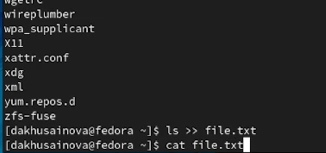{ #fig:003 width=70% }

**3.** Теперь мы выводим имена всех файлов из file.txt, имеющих расширение .conf, после чего запишем их в новый текстовой файл conf.txt(рис. [-@fig:004],[-@fig:005]).

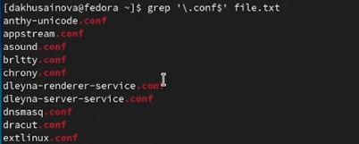{ #fig:004 width=70% }

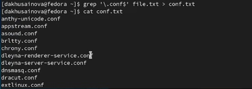{ #fig:005 width=70% }

**4.** Определим, какие файлы в вашем домашнем каталоге имеют имена, начинавшиеся с символа c? Представим на скринах несколько вариантов, как это сделать(рис. [-@fig:006]).

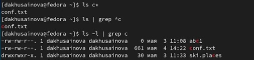{ #fig:006 width=70% }

**5.** Выведим на экран по странично имена файлов из каталога etc, начинающиеся с символа h (рис. [-@fig:007],[-@fig:008]).

{ #fig:007 width=70% }

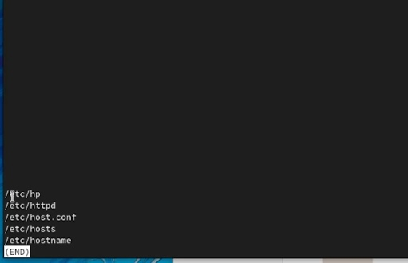{ #fig:008 width=70% }

**6.** Запускаем в фоновом режиме процесс, который будет записывать в файл /logfile файлы, имена которых начинаются с log (рис. [-@fig:009]).

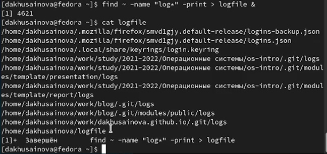{ #fig:009 width=70% }

**7.** Удаляем файл /logfile(рис. [-@fig:010]).

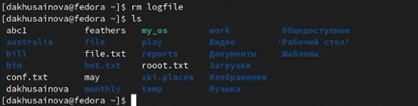{ #fig:010 width=70% }

**8.** Запускаем из консоли в фоновом режиме редактор gedit, определяем идентификатор(PID) процесса gedit, используя команду ps, конвейер и фильтр grep, приведем на скринах несколько вариантов(рис. [-@fig:011]).

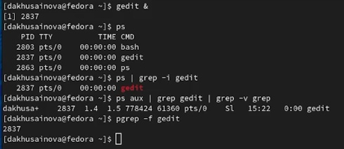{ #fig:011 width=70% }

**9.** Прочитаем справку (man) команды kill, после чего используем её для завершения процесса gedit(рис. [-@fig:012]).

{ #fig:012 width=70% }

**10.** Выполним команды df и du, предварительно получив более подробную информацию об этих командах, с помощью команды man(рис. [-@fig:013],[-@fig:014]).

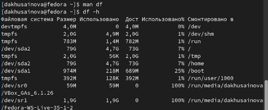{ #fig:013 width=70% }

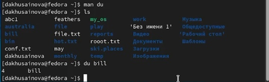{ #fig:014 width=70% }

**11.** Воспользовавшись справкой команды find, выводим имена всех директорий, имеющихся в домашнем каталоге (рис. [-@fig:015],[-@fig:016]).

{ #fig:015 width=70% }

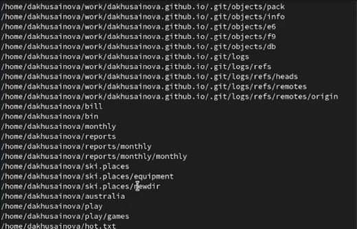{ #fig:016 width=70% }

# Контрольные вопросы

1. Какие потоки ввода вывода вы знаете?

stdout – стандартный поток вывода , отображает вывод команд и имеет дескриптор 1  
stderr – стандартный поток ошибок , отображает ошибки команд и имеет дескриптор 2  
stdin – стандартный поток ввода , передает входные данные командам и имеет дескриптор 0

2. Объясните разницу между операцией > и >>.

">" при каждом вызове создает новый файл (перезапись).  
">>" При вызове дописывает в файл без его перезаписи.

3. Что такое конвейер?

Конвейер умеет передавать выходные данные из одной программы, как входные данные для другой. Т.е. выполняется команда, мы получаем результат и передаем эти данные далее на обработку другой программе.

4. Что такое процесс? Чем это понятие отличается от программы?

Программа и процесс являются родственными терминами. Основное различие между программой и процессом заключается в том, что программа представляет собой группу инструкций для выполнения определенной задачи, тогда как процесс представляет собой программу в процессе выполнения. Хотя процесс является активной сущностью, программа считается пассивной.  
Между процессом и программой существует отношение многие-к-одному, что означает, что одна программа может вызывать несколько процессов или, другими словами, несколько процессов могут быть частью одной и той же программы.

5. Что такое PID и GID?

PID - (parent process ID) идентификатор родительского процесса. Процесс может порождать и другие процессы. UID, GID - реальные идентификаторы пользователя и его группы, запустившего данный процесс. EUID, EGID - эффективные идентификаторы пользователя и его группы.

6. Что такое задачи и какая команда позволяет ими управлять?

Как и другие многозадачные системы, Linux выполняет сразу несколько процессов одновременно. Кажется, что они работают одновременно. На самом деле одно ядро процессора может выполнять только один процесс в определенный момент времени. Но ядро Linux управляет процессами и чередует выполнение процессов на процессоре так, что нам кажется их выполнение одновременным.  
Существует множество команд для управления процессами в командной строки. Мы рассмотрим некоторые из них:  
ps — список запущенных процессов на компьютере  
kill — отправка сигнала одному или нескольким процессам (обычно «убийство» процесса)  
jobs — просмотр списка собственных задач (процессов)  
bg — выполнение процесса в фоновом режиме  
fg — возврат процесса из фонового режима  

7. Найдите информацию об утилитах top и htop. Каковы их функции?

Команда htop похожа на команду top по выполняемой функции: они обе показывают информацию о процессах в реальном времени, выводят данные о потреблении системных ресурсов и позволяют искать, останавливать и управлять процессами. У обеих команд есть свои преимущества. Например, в программе htop реализован очень удобный поиск по процессам, а также их фильтрация.

8. Назовите и дайте характеристику команде поиска файлов. Приведите примеры использования этой команды.

Команда find - это одна из наиболее важных и часто используемых утилит системы Linux. Это команда для поиска файлов и каталогов на основе специальных условий. Ее можно использовать в различных обстоятельствах, например, для поиска файлов по разрешениям, владельцам, группам, типу, размеру и другим подобным критериям.

Утилита find предустановлена по умолчанию во всех Linux дистрибутивах, поэтому вам не нужно будет устанавливать никаких дополнительных пакетов. Это очень важная находка для тех, кто хочет использовать командную строку наиболее эффективно.
Например:  find . -print

9. Можно ли по контексту (содержанию) найти файл? Если да, то как?

Можно. В Linux всё это делается с помощью одной очень простой, но в то же время мощной утилиты grep. С её помощью можно искать не только строки в файлах, но и фильтровать вывод команд, и много чего ещё.

10. Как определить объем свободной памяти на жёстком диске?

С помощью команды df. Или: Узнать свободное место на диске Ubuntu/Gnome можно более простым способом, с помощью утилиты системный монитор. Откройте утилиту системный монитор с помощью Dash или главного меню: Затем перейдите на вкладку файловые системы: Здесь отображены все подключенные разделы, а также их размер и количество доступного пространства. В KDE такая функция не поддерживается системным монитором.

11. Как определить объем вашего домашнего каталога?

Для того, чтобы узнать общий размер, который занимает определенная папка вызовите команду du с ключем -s: du -s /home. Пример результатов: 291210112 /home/ Лучше будет запустить команду du с ключами -s и -h совместно: du -hs /home. Тогда вывод воспринять легче: 278G /home/ Ключ -c используется для подсчета общей суммы размеров папок так: du -chs /etc /root/ Результат: 56M /etc 62M /root/ 118M итого.

12. Как удалить зависший процесс?

С помощью команды kill.

# Вывод 

Ознакомились с инструментами поиска файлов и фильтрации текстовых данных, приобрели практические навыки: по управлению процессами (и заданиями), по проверке использования диска и обслуживанию файловых систем.

::: {#refs}
:::