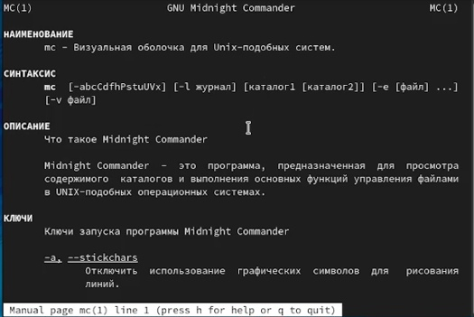
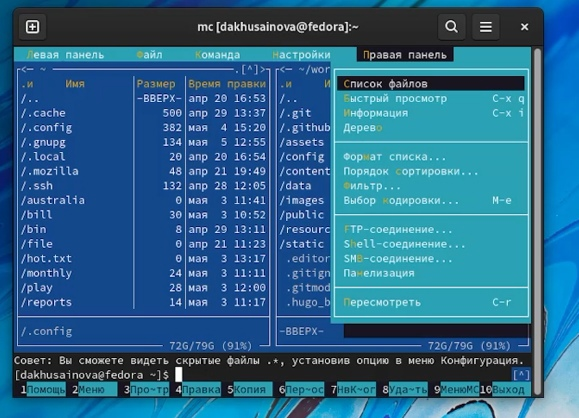
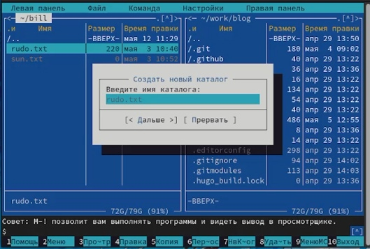
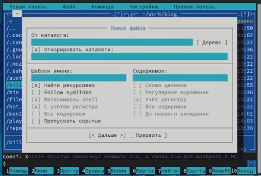
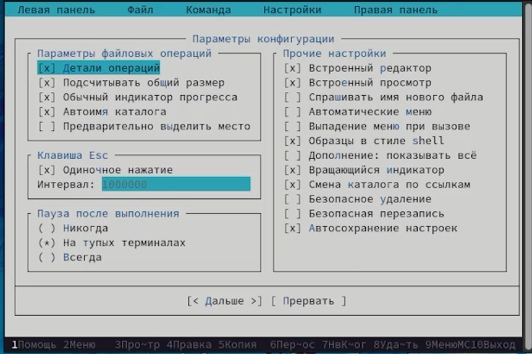
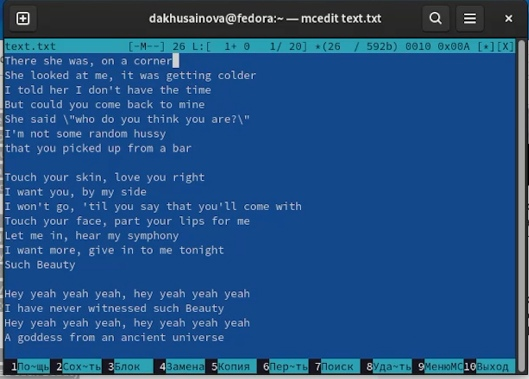
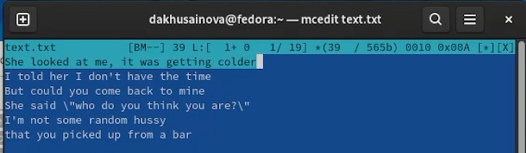
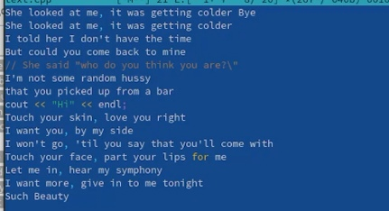

---
## Front matter
lang: ru-RU
title: Лабораторная работа 7 Командная оболочка Midnight Commander
author: |
	Хусаинова Динара Айратовна
institute: |
	RUDN
date: 28.04.2022

## Formatting
toc: false
slide_level: 2
theme: metropolis
header-includes: 
 - \metroset{progressbar=frametitle,sectionpage=progressbar,numbering=fraction}
 - '\makeatletter'
 - '\beamer@ignorenonframefalse'
 - '\makeatother'
aspectratio: 43
section-titles: true
---

## Цель работы

Освоение основных возможностей командной оболочки Midnight Commander. Приобретение навыков практической работы по просмотру каталогов и файлов; манипуляций с ними.

## Изучаем mc

Изучаем для начала информацию о mc, вызвав в командной строке man mc.(рис. [-@fig:001]).

{ #fig:001 width=70% }

## Запуск mc

Запускаем из командной строки mc, изучаем его структуру и меню, пробуя выполнить определенные команды. Выполняем несколько операций в mc, используя управляющие клавиши(рис. [-@fig:002]).

{ #fig:002 width=70% }

## Панель ФАЙЛ

Используя возможности подменю **Файл** , выполним просмотр содержимого текстового файла, редактирование содержимого текстового файла (без сохранения результатов редактирования),создание каталога, копирование в файлов в созданный каталог.(рис. [-@fig:008]).

{ #fig:008 width=70% }

## Панель КОМАНДА

С помощью соответствующих средств подменю **Команда** осуществляем действия(рис. [-@fig:009]).

{ #fig:009 width=70% }

## Панель НАСТРОЙКИ

Вызываем подменю **Настройки**.(рис. [-@fig:013]).

{ #fig:013 width=70% }

## Работа с файлом

Создаем текстовой файл text.txt, открываем этот файл с помощью встроенного в mc редактора, вставляем в открытый файл небольшой фрагмент текста, скопированный из Интернета, а потом проделываем с текстом манипуляции, используя горячие клавиши, то есть удаляем строки, переносим их на другие строки, сохраняем файл, переходим в конец, в начало файла, а после меняем разширение файла на файл для С++, а после включаем подсветку синтактиса(рис. [-@fig:014],[-@fig:015],[-@fig:016]).

## Работа с файлом

{ #fig:014 width=70% }

## Работа с файлом

{ #fig:015 width=70% }

## Работа с файлом

{ #fig:016 width=70% }

## Вывод

Мы освоили основные возможности командной оболочки Midnight Commander и приобрели навыки практической работы по просмотру каталогов и файлов, манипуляций с ними.

