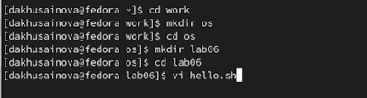
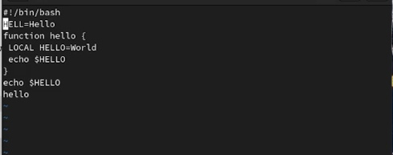
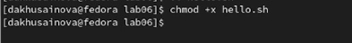
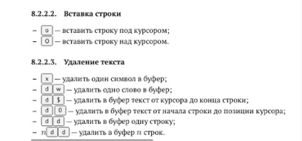
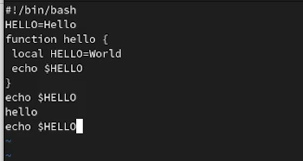
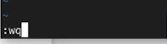

---
## Front matter
lang: ru-RU
title: Лабораторная работа 8 Текстовой редактор vi
author: |
	Хусаинова Динара Айратовна
institute: |
	RUDN
date: 28.04.2022

## Formatting
toc: false
slide_level: 2
theme: metropolis
header-includes: 
 - \metroset{progressbar=frametitle,sectionpage=progressbar,numbering=fraction}
 - '\makeatletter'
 - '\beamer@ignorenonframefalse'
 - '\makeatother'
aspectratio: 43
section-titles: true
---

## Цель работы

Познакомиться с операционной системой Linux. Получить практические навыки работы с редактором vi, установленным по умолчанию практически во всех дистрибутивах.

## Создание каталогов и файлов для дальнейшей работы

Создаем каталог с именем ~/work/os/lab06, переходим во созданный каталог, а после вызываем vi и создаем файл hello.sh(рис. [-@fig:001]).

{ #fig:001 width=70% }

## Работа с файлом

Нажимаем клавишу i и вводим необходимый текст (рис. [-@fig:002]). Нажимаем клавишу Esc для перехода в командный режим после завершения ввода текста.

{ #fig:002 width=70% }

## Создание исполняемого файла

Делаем файл исполняемым(рис. [-@fig:003]).

{ #fig:003 width=70% }

## Редактор vi

Вновь вызываем редактор vi и редактируем файл по заданию с помощью клавиш, о которых написано в файле. Например, используем x для удаления символов(рис. [-@fig:004],[-@fig:005]).

{ #fig:004 width=70% }

## Редактор vi

{ #fig:005 width=70% }

## Завершение работы

Нажимаем вновь w (записать), q (выйти), клавишу Enter для сохранения текста и завершения работы.(рис. [-@fig:006]).

{ #fig:006 width=70% }

## Вывод

Мы познакомились с операционной системой Linux, получили практические навыки работы с редактором vi, установленным по умолчанию.

