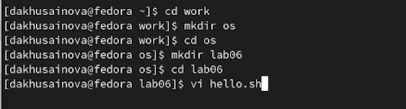
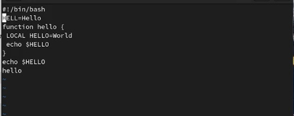
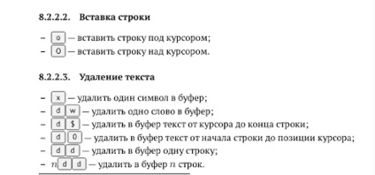
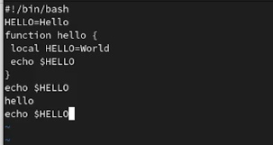
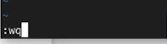
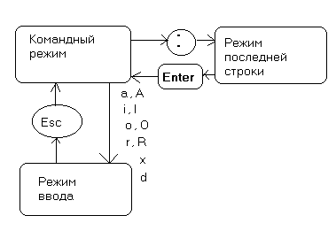

---
## Front matter
title: "Отчёт по лабораторной работе №8"
subtitle: "Текстовой редактор vi"
author: "Хусаинова Динара Айратовна"

## Generic otions
lang: ru-RU
toc-title: "Содержание"

## Bibliography
bibliography: bib/cite.bib
csl: pandoc/csl/gost-r-7-0-5-2008-numeric.csl

## Pdf output format
toc: true # Table of contents
toc-depth: 2
lof: true # List of figures
lot: true # List of tables
fontsize: 12pt
linestretch: 1.5
papersize: a4
documentclass: scrreprt
## I18n polyglossia
polyglossia-lang:
  name: russian
  options:
	- spelling=modern
	- babelshorthands=true
polyglossia-otherlangs:
  name: english
## I18n babel
babel-lang: russian
babel-otherlangs: english
## Fonts
mainfont: PT Serif
romanfont: PT Serif
sansfont: PT Sans
monofont: PT Mono
mainfontoptions: Ligatures=TeX
romanfontoptions: Ligatures=TeX
sansfontoptions: Ligatures=TeX,Scale=MatchLowercase
monofontoptions: Scale=MatchLowercase,Scale=0.9
## Biblatex
biblatex: true
biblio-style: "gost-numeric"
biblatexoptions:
  - parentracker=true
  - backend=biber
  - hyperref=auto
  - language=auto
  - autolang=other*
  - citestyle=gost-numeric
## Pandoc-crossref LaTeX customization
figureTitle: "Рис."
tableTitle: "Таблица"
listingTitle: "Листинг"
lofTitle: "Список иллюстраций"

lolTitle: "Листинги"
## Misc options
indent: true
header-includes:
  - \usepackage{indentfirst}
  - \usepackage{float} # keep figures where there are in the text
  - \floatplacement{figure}{H} # keep figures where there are in the text
---

# Цель работы

Познакомиться с операционной системой Linux. Получить практические навыки работы с редактором vi, установленным по умолчанию практически во всех дистрибутивах.

# Теоретическое введение

В большинстве дистрибутивов Linux в качестве текстового редактора по умолчанию
устанавливается интерактивный экранный редактор vi (Visual display editor).  
Редактор vi имеет три режима работы:  
– командный режим — предназначен для ввода команд редактирования и навигации по
редактируемому файлу;  
– режим вставки — предназначен для ввода содержания редактируемого файла;  
– режим последней (или командной) строки используется для записи изменений в файл
и выхода из редактора.  
Для вызова редактора vi необходимо указать команду vi и имя редактируемого файла:  
vi <имя_файла>  
При этом в случае отсутствия файла с указанным именем будет создан такой файл.  
Переход в командный режим осуществляется нажатием клавиши Esc . Для выхода из редактора vi необходимо перейти в режим последней строки: находясь в командном режиме, нажать Shift-; (по сути символ : — двоеточие), затем:  
– набрать символы wq, если перед выходом из редактора требуется записать изменения в файл;  
– набрать символ q (или q!), если требуется выйти из редактора без сохранения.  
Замечание. Следует помнить, что vi различает прописные и строчные буквы при наборе (восприятии) команд.  

# Ход работы

**1.** Создаем каталог с именем ~/work/os/lab06, переходим во созданный каталог, а после вызываем vi и создаем файл hello.sh(рис. [-@fig:001]).

{ #fig:001 width=70% }

**2.** Нажимаем клавишу i и вводим необходимый текст (рис. [-@fig:002]). Нажимаем клавишу Esc для перехода в командный режим после завершения ввода текста, после вводим : для перехода в режим последней строки и внизу нашего с вами экрана появится приглашение в виде двоеточия, Нажимаем w (записать) и q (выйти), а затем нажимаем клавишу Enter для сохранения текста и завершения работы.

{ #fig:002 width=70% }

**3.** Делаем файл исполняемым(рис. [-@fig:003]).

{ #fig:003 width=70% }

**4.** Вновь вызываем редактор vi и редактируем файл по заданию с помощью клавиш, о которых написано в файле. Например, используем x для удаления символов(рис. [-@fig:004],[-@fig:005]).

{ #fig:004 width=70% }

{ #fig:005 width=70% }

**5.** Затем нажимаем вновь w (записать), q (выйти), клавишу Enter для сохранения текста и завершения работы.(рис. [-@fig:006]).

{ #fig:006 width=70% }

# Контрольные вопросы

**1.** Редактор vi имеет три режима работы:
  - командный режим -- предназначен для ввода команд редактирования и навигации по редактируемому файлу
  - режим вставки -- предназначен для ввода содержания редактируемого файла
  - режим последней (или командной) строки -- используется для записи изменений в файл и выхода из редактора

**2.** Введя команду `:q!` в командном режиме.

**3.**
  - <kbd>0</kbd> -- переход в начало строки
  - <kbd>$</kbd> -- переход в конец строки
  - <kbd>G</kbd>-- переход в конец файла
  - `𝑛`<kbd>G</kbd> — переход на строку с номером n (например `9G`)

**4.** В зависимости от используемой команды редактор vi понимает слово по-разному. При использовании прописных <kbd>W</kbd> и <kbd>B</kbd> под разделителями понимаются только пробел, табуляция и возврат каретки. При использовании строчных <kbd>w</kbd> и <kbd>b</kbd> под разделителями понимаются также любые знаки пунктуации.

**5.**
  - <kbd>g</kbd><kbd>g</kbd> -- переход в начало файла
  - <kbd>G</kbd> -- переход в конец файла

**6.**
  - Вставка текста текста позволяет вставить текст относительно курсора или строки (n раз)
  - Вставка строки позволяет вставить строку относительно курсора
  - Удаление текста позволяет удалять текст посимвольно, относительно курсора, относительно строки и номерам строк
  - Отмена и повтор произведенных изменений позволяет отменить и повторить произведенные изменения
  - Копирование текста позволяет скопировать строку, n строк или слово в буфер
  - Вставка текста позволяет вставить текст из буфера относительно курсора
  - Замена текста позволяет заменить текст или слова
  - Поиск текста позволяет произвести поиск текста внутри файла

**7.** Как один из вариантов реализации задания -- использовать команду `10A$`<kbd>Esc</kdb>, где `10` -- кол-во символов на замену в строке.

**8.** Командой <kbd>u</kbd>.

**9.** Команды копирования и перемещения текста позволяют удалять, перемещать и копировать текст (строки), а также записывать их в отдельный файл. Команды записи файла и выхода из редактора позволяют записать измененный текст как с выходом из редактора, так и без, а также выйти из редактора без записи изменений.

**10.** Можно использовать команду <kbd>$</kbd>.

**11.** В редакторе Vi существует огромное множество опций. Их назначение можно узнать используя команду `:help`, например `:help G`.

**12.** Зачастую режим работы редактора указан в последней строке.

**13.** рис. [-@fig:007].

{ #fig:007 width=70% }

# Вывод 

Мы познакомились с операционной системой Linux, получили практические навыки работы с редактором vi, установленным по умолчанию.

::: {#refs}
:::