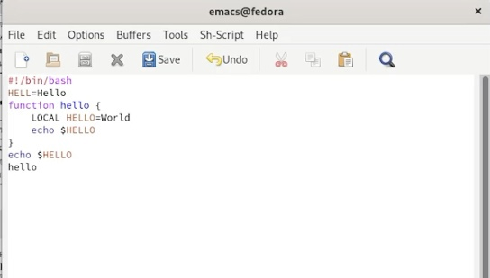
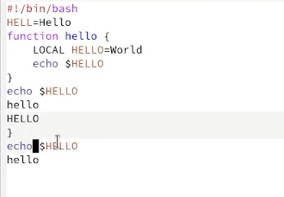
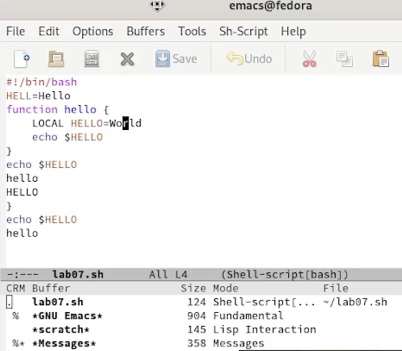
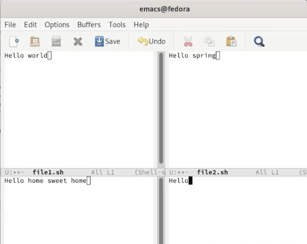
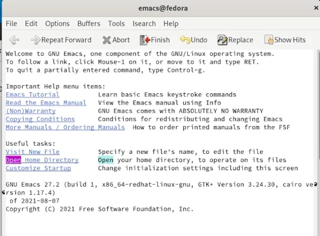
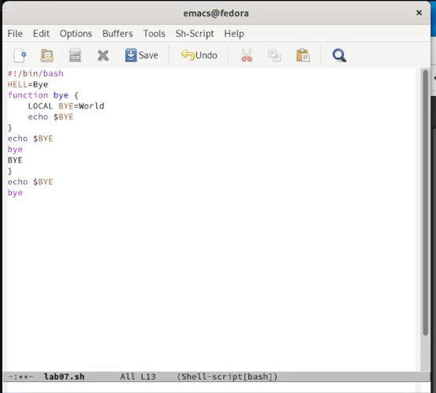

---
## Front matter
lang: ru-RU
title: Лабораторная работа 9 Текстовой редактор emacs
author: |
	Хусаинова Динара Айратовна
institute: |
	RUDN
date: 28.04.2022

## Formatting
toc: false
slide_level: 2
theme: metropolis
header-includes: 
 - \metroset{progressbar=frametitle,sectionpage=progressbar,numbering=fraction}
 - '\makeatletter'
 - '\beamer@ignorenonframefalse'
 - '\makeatother'
aspectratio: 43
section-titles: true
---

## Цель работы

Познакомиться с операционной системой Linux. Получить практические навыки работы с редактором Emacs.

## Открытие редактора emacs

Для начала открываем emacs, введя в командную строку "emacs", потом создаем файл lab07.sh с помощью комбинации Ctrl-x Ctrl-f, набираем текст, как показано на первом скриншоте,сохраняем файл с помощью комбинации Ctrl-x Ctrl-s(рис. [-@fig:001]).

{ #fig:001 width=70% }

## Стандартные процедуры редактирования

Проделываем с текстом стандартные процедуры редактирования, каждое действие осуществляя комбинацией клавиш(рис. [-@fig:002]). 

{ #fig:002 width=70% }

## Команды по перемещению курсора

Теперь мы учимся использовать команды по перемещению курсора: перемещаем курсор в начало строки с помощью комбинации Ctrl-a, перемещаем курсор в конец строки с Ctrl-e, перемещаем курсор в начало буфера (Meta или Alt-<), перемещаем курсор в конец буфера (Meta или Alt->).

## Управление буферами

Перемещаемся во вновь открытое окно с помощью CtrlC-x со списком открытых буферов и переключаемся на другой буфер. Затем закрываем это окно. Вновь переключаемся между буферами, но уже без вывода их списка на экран (рис. [-@fig:003]). 

{ #fig:003 width=70% }

## Управление окнами

Поделим фрейм на 4 части(рис. [-@fig:004]).

{ #fig:004 width=70% }

## Режим поиска

Изучаем режим поиска:  
Переключаемся в режим поиска (Ctrl-s) и найдем несколько слов, присутствующих в тексте (open), переключимся между результатами поиска, нажимая Ctrl-s(рис. [-@fig:005]). После выходим из режима поиска, нажав Ctrl-g. Перейдем в режим поиска и замены (Meta или Alt-%), введем текст, который следует найти и заменить (я заменяю hello на bye), нажмимаем Enter, затем вводим текст для замены. После того как будут подсвечены результаты поиска, нажмем ! для подтверждения замены. И замена произведется (рис. [-@fig:006],[-@fig:007])
Испробуем другой режим поиска, нажав Meta-s o. В этом случае буфер выведется в отдельное окно.

## Режим поиска

{ #fig:005 width=70% }

## Режим поиска и замены 

{ #fig:006 width=70% }

## Режим поиска и замены  

{ #fig:007 width=70% }

## Вывод

Мы познакомились с операционной системой Linux и получили практические навыки работы с редактором Emacs.

