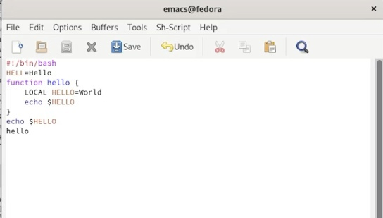
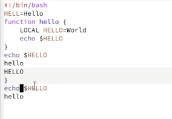
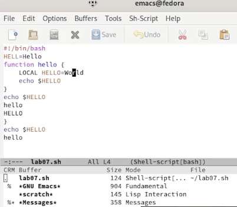
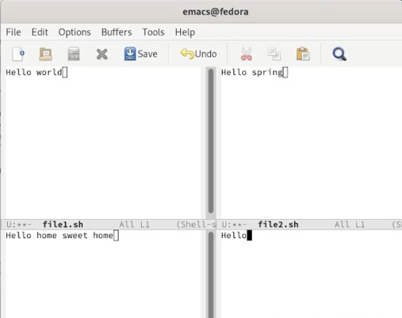
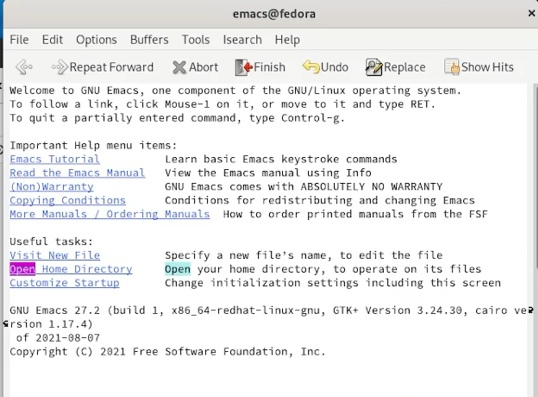
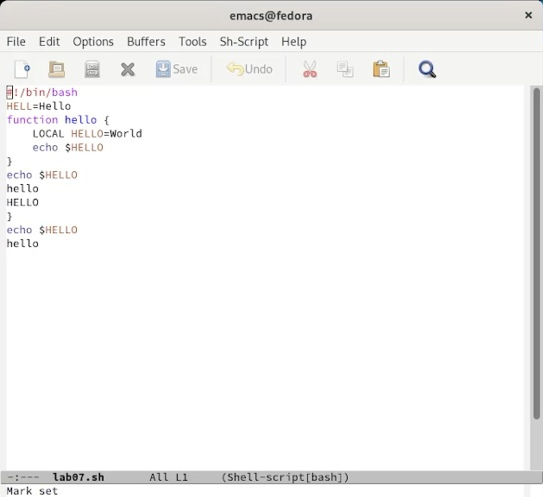
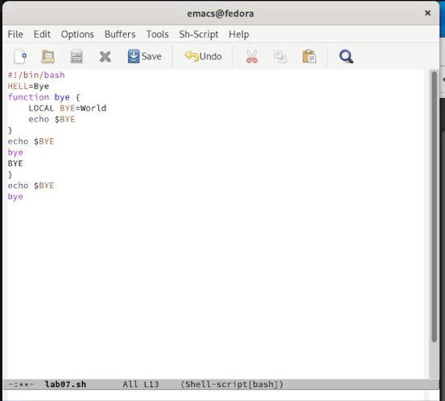

---
## Front matter
title: "Отчёт по лабораторной работе №9"
subtitle: "Текстовой редактор emacs"
author: "Хусаинова Динара Айратовна"

## Generic otions
lang: ru-RU
toc-title: "Содержание"

## Bibliography
bibliography: bib/cite.bib
csl: pandoc/csl/gost-r-7-0-5-2008-numeric.csl

## Pdf output format
toc: true # Table of contents
toc-depth: 2
lof: true # List of figures
lot: true # List of tables
fontsize: 12pt
linestretch: 1.5
papersize: a4
documentclass: scrreprt
## I18n polyglossia
polyglossia-lang:
  name: russian
  options:
	- spelling=modern
	- babelshorthands=true
polyglossia-otherlangs:
  name: english
## I18n babel
babel-lang: russian
babel-otherlangs: english
## Fonts
mainfont: PT Serif
romanfont: PT Serif
sansfont: PT Sans
monofont: PT Mono
mainfontoptions: Ligatures=TeX
romanfontoptions: Ligatures=TeX
sansfontoptions: Ligatures=TeX,Scale=MatchLowercase
monofontoptions: Scale=MatchLowercase,Scale=0.9
## Biblatex
biblatex: true
biblio-style: "gost-numeric"
biblatexoptions:
  - parentracker=true
  - backend=biber
  - hyperref=auto
  - language=auto
  - autolang=other*
  - citestyle=gost-numeric
## Pandoc-crossref LaTeX customization
figureTitle: "Рис."
tableTitle: "Таблица"
listingTitle: "Листинг"
lofTitle: "Список иллюстраций"

lolTitle: "Листинги"
## Misc options
indent: true
header-includes:
  - \usepackage{indentfirst}
  - \usepackage{float} # keep figures where there are in the text
  - \floatplacement{figure}{H} # keep figures where there are in the text
---

# Цель работы

Познакомиться с операционной системой Linux. Получить практические навыки работы с редактором Emacs.

# Теоретическое введение

Буфер — объект, представляющий какой-либо текст.  
Буфер может содержать что угодно, например, результаты компиляции программы или встроенные подсказки. Практически всё взаимодействие с пользователем, в том числе интерактивное, происходит посредством буферов.  
Фрейм соответствует окну в обычном понимании этого слова. Каждый фрейм содержит область вывода и одно или несколько окон Emacs.
Окно — прямоугольная область фрейма, отображающая один из буферов.  
Каждое окно имеет свою строку состояния, в которой выводится следующая информация: название буфера, его основной режим, изменялся ли текст буфера и как далеко вниз
по буферу расположен курсор. Каждый буфер находится только в одном из возможных основных режимов. Существующие основные режимы включают режим Fundamental (наименее специализированный), режим Text, режим Lisp, режим С, режим Texinfo и другие. Под второстепенными режимами понимается список режимов, которые включены в данный момент в буфере выбранного окна.  
Область вывода — одна или несколько строк внизу фрейма, в которой Emacs выводит различные сообщения, а также запрашивает подтверждения и дополнительную информацию от пользователя.    
Минибуфер используется для ввода дополнительной информации и всегда отображается в области вывода.  
Точка вставки — место вставки (удаления) данных в буфере.  
Основы работы в Emacs  
Для запуска Emacs необходимо в командной строке набрать emacs (или emacs & для работы в фоновом режиме относительно консоли).  
Для работы с Emacs можно использовать как элементы меню, так и различные сочетания клавиш. Например, для выхода из Emacs можно воспользоваться меню File и выбрать пункт Quit , а можно нажать последовательно Ctrl-x Ctrl-c (в обозначениях Emacs: C-x C-c).
Многие рутинные операции в Emacs удобнее производить с помощью клавиатуры, а не графического меню. Наиболее часто в командах Emacs используются сочетания c клавишами Ctrl и Meta (в обозначениях Emacs: C- и M-; клавиша Shift в Emasc обозначается как S-). Так как на клавиатуре для IBM PC совместимых ПК клавиши Meta нет, то вместо неё можно использовать Alt или Esc . Для доступа к системе меню используйте клавишу F10.
Клавиши Ctrl , Meta и Shift принято называть префиксными. Например, запись M-x означает, что надо удерживая клавишу Meta (или Alt ), нажать на клавишу x.Для открытия файла следует использовать команду C-x C-f (надо, удерживая клавишу Ctrl , нажать на клавишу x , затем отпустить обе клавиши и снова, удерживая клавишу Ctrl , нажать на
клавишу f ).  
По назначению префиксные сочетания клавиш различаются следующим образом:  
– C-x — префикс ввода основных команд редактора (например, открытия, закрытии,
сохранения файла и т.д.);  
– C-c — префикс вызова функций, зависящих от используемого режима.  
Режим — пакет расширений, изменяющий поведение буфера Emacs при
редактировании и просмотре текста (например, для редактирования исходного текста программ на языках С или Perl).

# Ход работы

**1.** Для начала открываем emacs, введя в командную строку "emacs", потом создаем файл lab07.sh с помощью комбинации Ctrl-x Ctrl-f, набираем текст, как показано на первом скриншоте,сохраняем файл с помощью комбинации Ctrl-x Ctrl-s(рис. [-@fig:001]).

{ #fig:001 width=70% }

**2.** Проделываем с текстом стандартные процедуры редактирования, каждое действие осуществляя комбинацией клавиш.
Вырезать одной командой целую строку (Ctrl-k).
Вставить эту строку в конец файла (Ctrl-y).
Выделить область текста (Ctrl-space).
Скопировать область в буфер обмена (Meta-w).
Вставить область в конец файла.
Вновь выделить эту область и на этот раз вырезать её (Ctrl-w).
Отменить последнее действие (Ctrl-/) (рис. [-@fig:002]). 

{ #fig:002 width=70% }

**3.** Теперь мы учимся использовать команды по перемещению курсора: перемещаем курсор в начало строки с помощью комбинации Ctrl-a, перемещаем курсор в конец строки с Ctrl-e, перемещаем курсор в начало буфера (Meta или Alt-<), перемещаем курсор в конец буфера (Meta или Alt->).

**4.** Изучаем управление буферами:  
Выводим список активных буферов на экран(Ctrl-x CtrlC-b)(рис. [-@fig:003]). Перемещаемся во вновь открытое окно с помощью CtrlC-x со списком открытых буферов и переключаемся на другой буфер. Затем закрываем это окно (Ctrl-x 0). Теперь вновь переключаемся между буферами, но уже без вывода их списка на
экран (Ctrl-x b).

{ #fig:003 width=70% }

**5.** Изучаем управление окнами:  
Поделим фрейм на 4 части: разделим сначала фрейм на два окна по вертикали (Ctrl-x 3), а затем каждое из этих окон на две части по горизонтали (Ctrl-x 2) (рис. [-@fig:004]). В каждом из четырёх созданных окон откроем новый буфер (файл) и введем
несколько строк текста.

{ #fig:004 width=70% }

**6.** Изучаем режим поиска:  
Переключаемся в режим поиска (Ctrl-s) и найдем несколько слов, присутствующих в тексте (open), переключимся между результатами поиска, нажимая Ctrl-s(рис. [-@fig:005]). После выходим из режима поиска, нажав Ctrl-g. Перейдем в режим поиска и замены (Meta или Alt-%), введем текст, который следует найти и заменить (я заменяю hello на bye), нажмимаем Enter, затем вводим текст для замены. После того как будут подсвечены результаты поиска, нажмем ! для подтверждения замены. И замена произведется (рис. [-@fig:006],[-@fig:007])
Испробуем другой режим поиска, нажав Meta-s o. В этом случае буфер выведется в отдельное окно.

{ #fig:005 width=70% }

{ #fig:006 width=70% }

{ #fig:007 width=70% }

# Контрольные вопросы

**1.** Кратко охарактеризуйте редактор emacs.  
Emacs − один из наиболее мощных и широко распространённых редакторов, используемых в мире Unix. По популярности он соперничает с редактором vi и его клонами. В зависимости от ситуации, Emacs может быть текстовым редактором; программой для чтения почты и новостей Usenet; интегрированной средой разработки (IDE); операционной системой и т.д.Всё это разнообразие достигается благодаря архитектуре Emacs, которая позволяет расширять возможности редактора при помощи языка Emacs Lisp. На языке C написаны лишь самые базовые и низкоуровневые части Emacs, включая полнофункциональный. интерпретатор языка Lisp. Таким образом, Emacs имеет встроенный язык программирования, который может использоваться для настройки, расширения и изменения поведения редактора. В действительности, большая часть того редактора, с которым пользователи Emacs работают в наши дни,написана на языке Lisp.

**2.** Какие особенности данного редактора могут сделать его сложным для освоения новичком?  
Новичкам может быть сложно из-за большого числа команд и непривычных комбинаций для этих команд, так как это отличается от того, что они привыкли видеть в windows и других редакторах.

**3.** Своими словами опишите, что такое буфер и окно в терминологии emacs’а.  
Буфер –это объект, представляющий собой текст. Если имеется несколько буферов, то редактировать можно только один. Обычно буфер считывает данные из файла или записывает в файл данные из буфера.Окно –это область экрана, отображающая буфер. При запуске редактора отображается одно окно, но при обращении к некоторым функциям могут открыться дополнительные окна.

**4.** Можно ли открыть больше 10 буферов в одном окне?  
Да

**5.** Какие буферы создаются по умолчанию при запуске emacs?  
«scratch»(буфер для несохраненного текста)
«Messages»(журнал ошибок, включающий такжеинформацию, которая появляется в области EchoArea)
«GNUEmacs»(справочный буфер о редакторе).

**6.** Какие клавиши вы нажмёте, чтобы ввести следующую комбинацию C-c | и C-c C-|?  
C-c |удерживаю «ctrl»,нажимаю «c»,после –отпускаю обе клавиши и нажимаю «|» C-c C-|удерживаю «ctrl»,нажимаю «с», после –отпускаю обе клавиши и, удерживаю «ctrl», нажимаю «|».

**7.** Как поделить текущее окно на две части?  
Комбинации делят окно:
«Ctrl-x 3»(по вертикали)
«Ctrl-x 2» (по горизонтали).

**8.** В каком файле хранятся настройки редактора emacs?  
Настройки Emacs хранятся в файле .emacs.

**9.** Какую функцию выполняет клавиша «←» и можно ли её переназначить?  
По умолчанию клавиша «←» удаляет символ перед курсором. в редакторе её можно переназначить. Для её переназначения необхдимо изменить конфигурацию файла .emacs.

**10.** Какой редактор вам показался удобнее в работе vi или emacs? Поясните почему.  
Более удобным я считаю редактор emacs, потому что в нем можно использовать сразу несколько окон и проще открывать другие файлы

# Вывод 

Мы познакомились с операционной системой Linux и получили практические навыки работы с редактором Emacs.

::: {#refs}
:::