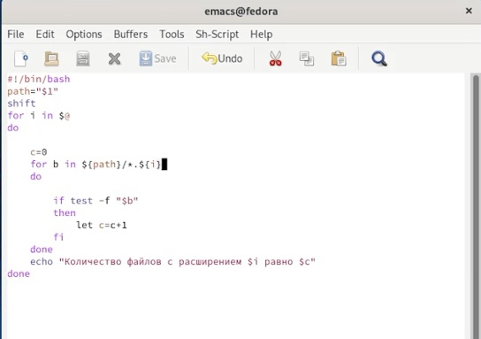

---
## Front matter
lang: ru-RU
title: Лабораторная работа 10 Программирование в командном процессоре ОС UNIX.Командные файлы
author: |
	Хусаинова Динара Айратовна
institute: |
	RUDN
date: 28.04.2022

## Formatting
toc: false
slide_level: 2
theme: metropolis
header-includes: 
 - \metroset{progressbar=frametitle,sectionpage=progressbar,numbering=fraction}
 - '\makeatletter'
 - '\beamer@ignorenonframefalse'
 - '\makeatother'
aspectratio: 43
section-titles: true
---

## Цель работы

Изучить основы программирования в оболочке ОС UNIX/Linux. Научиться писать небольшие командные файлы.

## Первый командный файл

Это скрипт, который при запуске будет делать резервную копию самого себя в другую директорию backup в домашнем каталоге. При этом файл будет архивироваться архиватором bzip2(рис. [-@fig:001],[-@fig:003]).

{ #fig:001 width=70% }

## Первый командный файл Проверка

{ #fig:003 width=70% }

## Второй командный файл

Файл, обрабатывающий любое число аргументов командной строки. Выведем последовательно введенные числа(рис. [-@fig:004], [-@fig:005]). 

{ #fig:004 width=70% }

## Второй командный файл Проверка

{ #fig:005 width=70% }

## Третий командный файл 

Напишем аналог команды ls без использования самой этой команды и команды dir (рис. [-@fig:007],[-@fig:009]). 

{ #fig:007 width=70% }

## Третий командный файл Проверка 

{ #fig:009 width=70% }

## Четвертый командный файл для поиска файлов по форматам

Пишем командный файл, который получает в качестве аргумента командной строки формат файла (.txt, .doc, .jpg, .pdf и т.д.) и вычисляет количество таких файлов в указанной директории. Создаем файл, пишем код и запускаем, видим, сколько файлов заданного формата есть в проверяемом каталоге(рис. [-@fig:011],[-@fig:012]). 

## Четвертый командный файл Заполнение файла

{ #fig:011 width=70% }

## Четвертый командный файл Проверка работы поиска

{ #fig:012 width=70% }

## Вывод

Изучили основы программирования в оболочке ОС UNIX/Linux и научились писать небольшие командные файлы.

