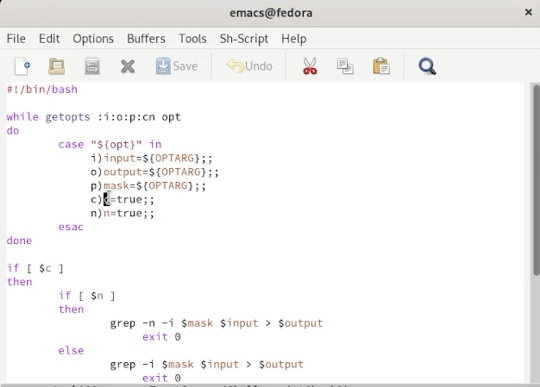
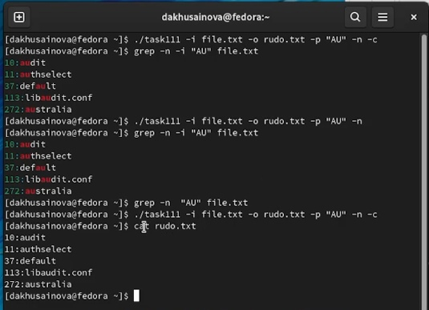
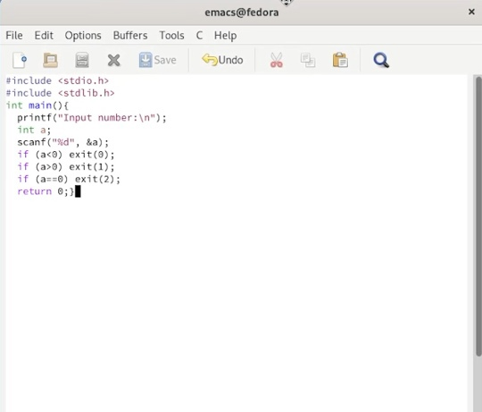
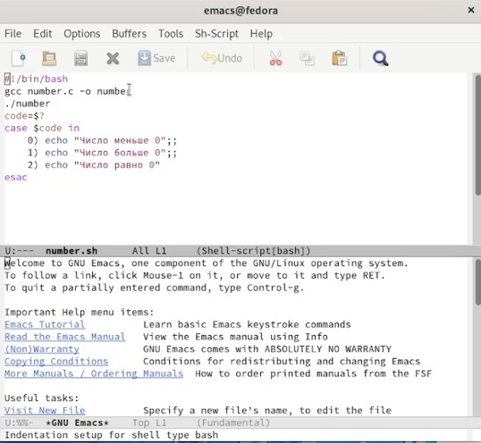
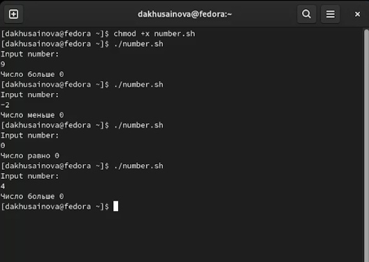
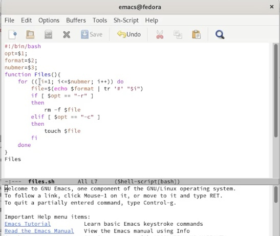
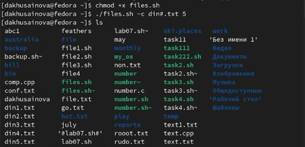
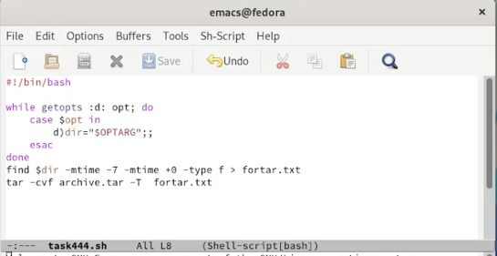
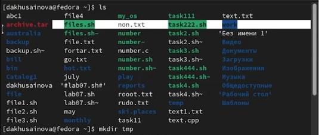

---
## Front matter
lang: ru-RU
title: Лабораторная работа 11 Программирование в командном процессоре ОС UNIX. Ветвления и циклы
author: |
	Хусаинова Динара Айратовна
institute: |
	RUDN
date: 25.05.2022

## Formatting
toc: false
slide_level: 2
theme: metropolis
header-includes: 
 - \metroset{progressbar=frametitle,sectionpage=progressbar,numbering=fraction}
 - '\makeatletter'
 - '\beamer@ignorenonframefalse'
 - '\makeatother'
aspectratio: 43
section-titles: true
---

## Цель работы

Изучить основы программирования в оболочке ОС UNIX. Научится писать более сложные командные файлы с использованием логических управляющих конструкций и циклов.

## Первый командный файл

Используя команды getopts grep, напишем командный файл, который анализирует командную строку(рис. [-@fig:001]).

{ #fig:001 width=70% }

## Результат

Работа файла(рис. [-@fig:004]). 

{ #fig:004 width=70% }

## Второй командный файл

Напишем на языке Си программу, которая вводит число и определяет, является ли оно больше нуля, меньше нуля или равно нулю(рис. [-@fig:005],[-@fig:006],[-@fig:007]).

{ #fig:005 width=70% }

## Второй командный файл

{ #fig:006 width=70% }

## Результат

{ #fig:007 width=70% }

## Третий командный файл

Напишем командный файл, создающий указанное число файлов, пронумерованных последовательно от 1 до 𝑁 (рис. [-@fig:008],[-@fig:009]).

{ #fig:008 width=70% }

## Результат

{ #fig:009 width=70% }

## Четвертый командный файл

Напишем командный файл, который с помощью команды tar запаковывает в архив все файлы в указанной директории. Модифицировать его так, чтобы запаковывались
только те файлы, которые были изменены менее недели тому назад(рис. [-@fig:011],[-@fig:012]).

{ #fig:011 width=70% }

## Результат

{ #fig:012 width=70% }

## Вывод

Мы изучили основы программирования в оболочке ОС UNIX. Научились писать более сложные командные файлы с использованием логических управляющих конструкций и циклов.

