---
## Front matter
title: "Отчёт по лабораторной работе №11"
subtitle: "Программирование в командном процессоре ОС UNIX. Ветвления и циклы"
author: "Хусаинова Динара Айратовна"

## Generic otions
lang: ru-RU
toc-title: "Содержание"

## Bibliography
bibliography: bib/cite.bib
csl: pandoc/csl/gost-r-7-0-5-2008-numeric.csl

## Pdf output format
toc: true # Table of contents
toc-depth: 2
lof: true # List of figures
lot: true # List of tables
fontsize: 12pt
linestretch: 1.5
papersize: a4
documentclass: scrreprt
## I18n polyglossia
polyglossia-lang:
  name: russian
  options:
	- spelling=modern
	- babelshorthands=true
polyglossia-otherlangs:
  name: english
## I18n babel
babel-lang: russian
babel-otherlangs: english
## Fonts
mainfont: PT Serif
romanfont: PT Serif
sansfont: PT Sans
monofont: PT Mono
mainfontoptions: Ligatures=TeX
romanfontoptions: Ligatures=TeX
sansfontoptions: Ligatures=TeX,Scale=MatchLowercase
monofontoptions: Scale=MatchLowercase,Scale=0.9
## Biblatex
biblatex: true
biblio-style: "gost-numeric"
biblatexoptions:
  - parentracker=true
  - backend=biber
  - hyperref=auto
  - language=auto
  - autolang=other*
  - citestyle=gost-numeric
## Pandoc-crossref LaTeX customization
figureTitle: "Рис."
tableTitle: "Таблица"
listingTitle: "Листинг"
lofTitle: "Список иллюстраций"

lolTitle: "Листинги"
## Misc options
indent: true
header-includes:
  - \usepackage{indentfirst}
  - \usepackage{float} # keep figures where there are in the text
  - \floatplacement{figure}{H} # keep figures where there are in the text
---

# Цель работы

Изучить основы программирования в оболочке ОС UNIX. Научится писать более сложные командные файлы с использованием логических управляющих конструкций и циклов.

# Теоретическое введение

Циклы позволяют выполнять один и тот же участок кода необходимое количество раз. В большинстве языков программирования существует несколько типов циклов. Большинство из них поддерживаются оболочкой Bash. Мы рассмотрим их все в сегодняшней статье, но сначала поговорим какими они бывают:  

for - позволяет перебрать все элементы из массива или использует переменную-счетчик для определения количества повторений;  
while - цикл выполняется пока условие истинно;  
until - цикл выполняется пока условие ложно.  
Циклы Bash, это очень полезная вещь и разобраться с ними будет несложно. Bash позволяет использовать циклы как в скриптах, так и непосредственно в командной оболочке. Дальше мы рассмотрим каждый из этих видов циклов.  

ЦИКЛ FOR  
Цикл for bash применяется очень часто из-за своей специфики. Его проще всего использовать когда вы знаете сколько раз нужно повторить операцию или вам нужно просто обработать по очереди все элементы массива и вы не хотите контролировать количество повторений.  

Цикл for имеет несколько синтаксисов и может вести себя по разному. Для перебора элементов списка удобно использовать такой синтаксис:  

for переменная in список  
do  
команда1  
команда2  
done  
Каждый цикл for независимо от типа начинается с ключевого слова for. Дальше все зависит от типа. В этом случае после for указывается имя переменной, в которую будет сохранен каждый элемент списка, затем идет ключевое слово in и сам список. Команды, которые нужно выполнять в цикле размещаются между словами do и done.

# Ход работы

**1.** Используя команды getopts grep, напишем командный файл, который анализирует
командную строку с ключами:
– -iinputfile — прочитать данные из указанного файла;  
– -ooutputfile — вывести данные в указанный файл;  
– -pшаблон — указать шаблон для поиска;  
– -C — различать большие и малые буквы;  
– -n — выдавать номера строк.  
а затем ищет в указанном файле нужные строки, определяемые ключом -p(рис. [-@fig:001],[-@fig:002]).

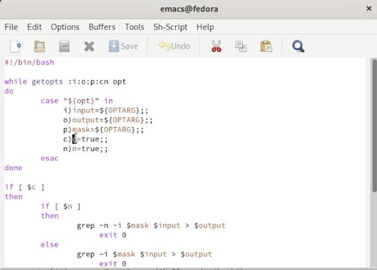{ #fig:001 width=70% }

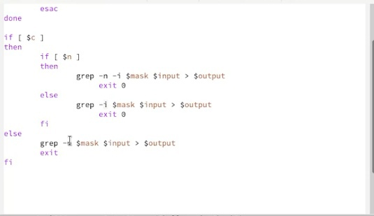{ #fig:002 width=70% }

Теперь проверим его работу, сначала даем права на выполнение, а затем запускаем и осуществляем поиск комбинации букв AU(рис. [-@fig:003],[-@fig:004]).

{ #fig:003 width=70% }

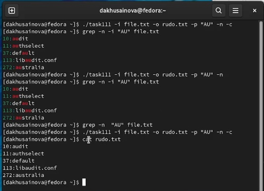{ #fig:004 width=70% }

**2.**Напишем на языке Си программу, которая вводит число и определяет, является ли оно больше нуля, меньше нуля или равно нулю. Затем программа завершится с помощью функции exit(n), передавая информацию в о коде завершения в оболочку( рис. [-@fig:005],[-@fig:006],[-@fig:007]). 

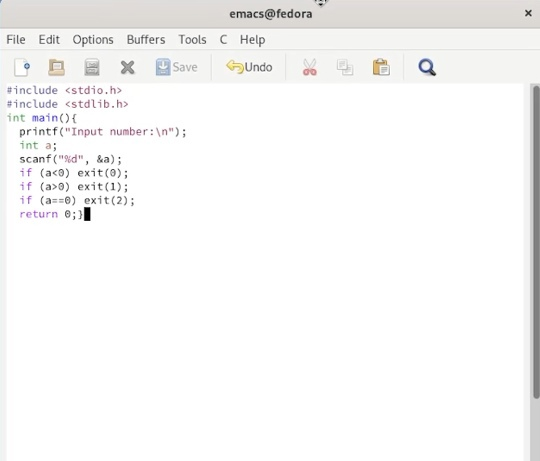{ #fig:005 width=70% }

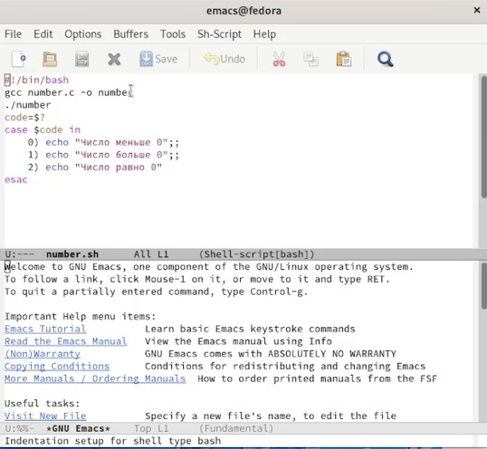{ #fig:006 width=70% }

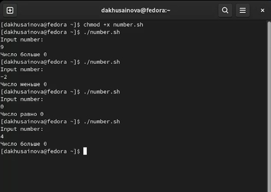{ #fig:007 width=70% }

**3.** Напишем командный файл, создающий указанное число файлов, пронумерованных последовательно от 1 до 𝑁 (например 1.tmp, 2.tmp, 3.tmp,4.tmp и т.д.). Число файлов, которые необходимо создать, передаётся в аргументы командной строки. Этот же командный файл должен уметь удалять все созданные им файлы (если они существуют)(рис. [-@fig:008],[-@fig:009],[-@fig:010]). 

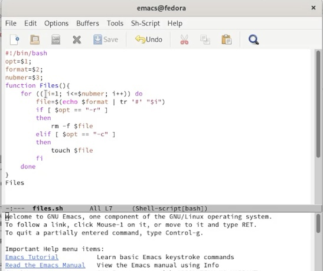{ #fig:008 width=70% }

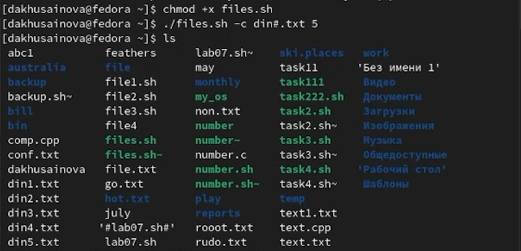{ #fig:009 width=70% }

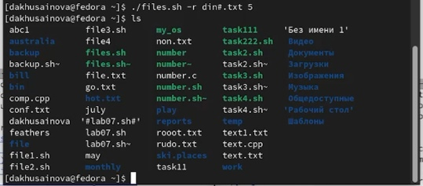{ #fig:010 width=70% }

**4.** Напишем командный файл, который с помощью команды tar запаковывает в архив все файлы в указанной директории. Модифицировать его так, чтобы запаковывались
только те файлы, которые были изменены менее недели тому назад (использовать команду find)(рис. [-@fig:011],[-@fig:012]).

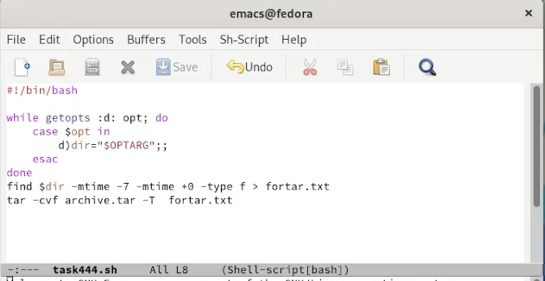{ #fig:011 width=70% }

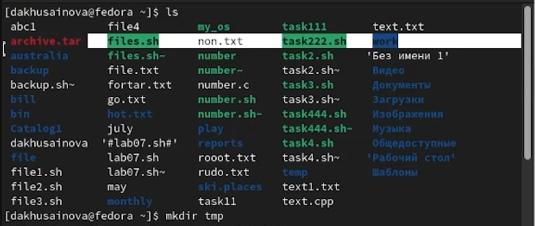{ #fig:012 width=70% }

# Контрольные вопросы

**1.** Каково предназначение команды getopts?  
Getopts-это встроенная команда оболочки Unix для анализа аргументов командной строки. Он предназначен для обработки аргументов командной строки, которые следуют рекомендациям синтаксиса утилиты POSIX, основанным на интерфейсе C getopt.

**2.** Какое отношение метасимволы имеют к генерации имён файлов?  
При генерации имен используют метасимволы:
звездочка - произвольная (возможно пустая) последовательность символов;
"?"	- один произвольный символ;
[...]	любой из символов, указанных в скобках перечислением и/или с указанием диапазона;
cat f*	выдаст все файлы каталога, начинающиеся с "f";
cat *f*	выдаст все файлы, содержащие "f";
cat program.?	выдаст файлы данного каталога с однобуквенными расширениями, скажем "program.c" и "program.o", но не выдаст "program.com";
cat [a-d]*	выдаст файлы, которые начинаются с "a", "b", "c", "d". Аналогичный эффект дадут и команды "cat [abcd]*" и "cat [bdac]*".  

**3.** Какие операторы управления действиями вы знаете?  
Точка с запятой (;)  
Амперсанд (&)  
Символ доллара со знаком вопроса ($?)  
Двойной амперсанд (&&)  
Двойная вертикальная черта (||)  
Комбинирование операторов && и ||  
Знак фунта (#)  

**4.** Какие операторы используются для прерывания цикла?  
Утверждения прерывания и продолжения. Операторы break и continue могут использоваться для управления выполнением цикла for. Заявление о перерыве. Чтобы использовать оператор break, пользователи должны указать конкретное условие, при выполнении которого цикл будет прерван.

**5.** Для чего нужны команды false и true?  
В Unix-подобных операционных систем, trueи falseявляются командами, единственной функцией которых является всегда возвращаются с заданным статусом выхода. Программисты и сценарии часто используют статус выхода команды для оценки успеха (нулевой статус выхода) или отказа (ненулевое значение) команды. trueИ falseкоманды, представляют собой логические значения из командного успеха, потому что истинные возвращает 0, и ложное возвращение 1.

**6.** Что означает строка if test -f man$s/$i.$s, встреченная в командном файле?   
Конструкция условного оператора в слегка упрощенном виде выглядит так:
if list1 then list2 else list3 fi
где list1, list2 и list3 — это последовательности команд, разделенные запятыми и оканчивающиеся точкой с запятой или символом новой строки. Кроме того, эти последовательности могут быть заключены в фигурные скобки: {list}.
Оператор if проверяет значение, возвращаемое командами из list1. Если в этом списке несколько команд, то проверяется значение, возвращаемое последней командой списка. Если это значение равно 0, то будут выполняться команды из list2; если это значение не нулевое, будут выполнены команды из list3. Значение, возвращаемой таким составным оператором if, совпадает со значением, выдаваемым последней командой выполняемой последовательности.
Полный формат команды if имеет вид:
if list then list [ elif list then list ] ... [ else list ] fi
(здесь квадратные скобки означают только необязательность присутствия в операторе того, что в них содержится).
В качестве выражения, которое стоит сразу после if или elif, часто используется команда test, которая может обозначаться также квадратными скобками [ ]. Команда test выполняет вычисление некоторого выражения и возвращает значение 0, если выражение истинно, и 1 в противном случае. Выражение передается программе test как аргумент. Вместо того, чтобы писать
test expression,
можно заключить выражение в квадратные скобки:
[ expression ].
Заметьте, что test и [ — это два имени одной и той же программы, а не какое-то магическое преобразование, выполняемое оболочкой bash (только синтаксис [ требует, чтобы была поставлена закрывающая скобка). Заметьте также, что вместо test в конструкции if может быть использована любая программа.

**7.** Объясните различия между конструкциями while и until.  
Оператор while выполняет тело цикла, пока какое-то условие истинно, т.е. выражение или команда возвращают нулевой код. Оператор until наоборот, выполняет тело цикла, пока условие ложно, т.е. код возврата выражения или команды отличен от нуля. Простой пример цикла while: count= 0 while [$count - lt 5]; do (count++) echo $count done 1 2 3 4 5.

# Вывод 

Мы изучили основы программирования в оболочке ОС UNIX. Научились писать более сложные командные файлы с использованием логических управляющих конструкций и циклов.

::: {#refs}
:::