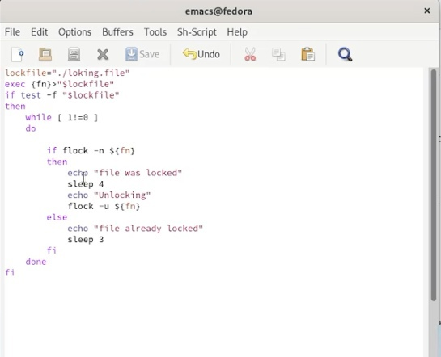
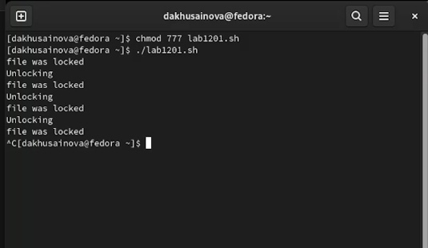
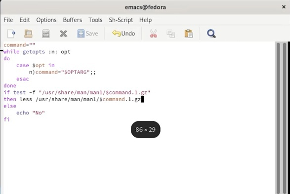
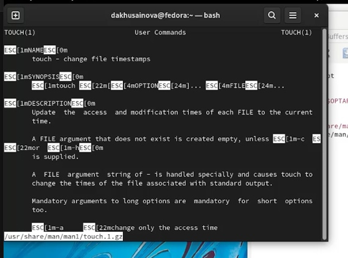
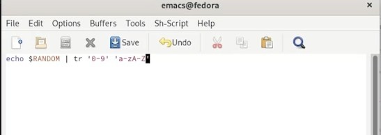
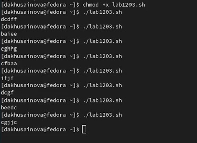

---
## Front matter
lang: ru-RU
title: Лабораторная работа 12 Программирование в командном процессоре ОС UNIX. Расширенное программирование
author: |
	Хусаинова Динара Айратовна
institute: |
	RUDN
date: 25.05.2022

## Formatting
toc: false
slide_level: 2
theme: metropolis
header-includes: 
 - \metroset{progressbar=frametitle,sectionpage=progressbar,numbering=fraction}
 - '\makeatletter'
 - '\beamer@ignorenonframefalse'
 - '\makeatother'
aspectratio: 43
section-titles: true
---

## Цель работы

Изучить основы программирования в оболочке ОС UNIX. Научиться писать более сложные командные файлы с использованием логических управляющих конструкций и циклов.

## Упрощённый механизм семафоров

Напишем командный файл, реализующий упрощённый механизм семафоров(рис. [-@fig:001],[-@fig:002]).

{ #fig:001 width=70% }

## Результат

{ #fig:002 width=70% }

## Реализация команды man с помощью командного файла

Реализуем команду man с помощью командного файла(рис. [-@fig:003],[-@fig:005]).

{ #fig:003 width=70% }

## Результат

{ #fig:005 width=70% }

## Генерация случайной последовательности букв

Используя встроенную переменную $RANDOM, напишем командный файл, генерирующий случайную последовательность букв латинского алфавита(рис. [-@fig:007],[-@fig:008]). 

{ #fig:007 width=70% }

## Результат

{ #fig:008 width=70% }

## Вывод

Мы изучили основы программирования в оболочке ОС UNIX и научились писать более сложные командные файлы с использованием логических управляющих конструкций и циклов.

