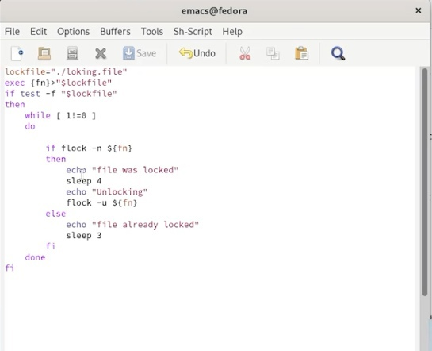
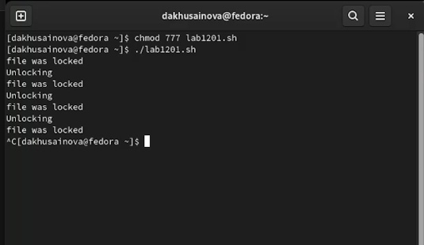
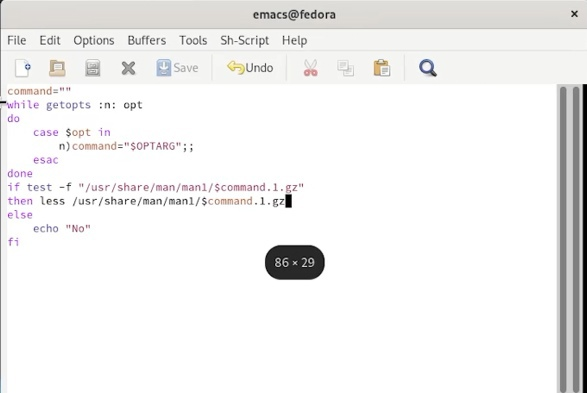
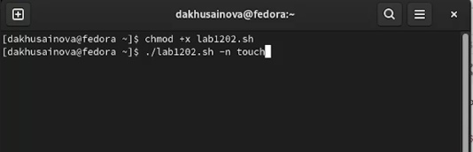
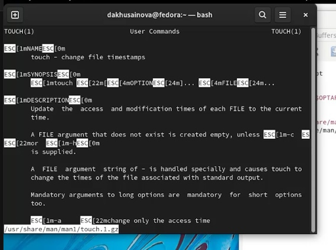
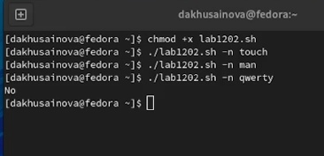
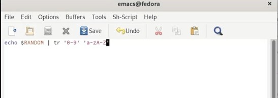
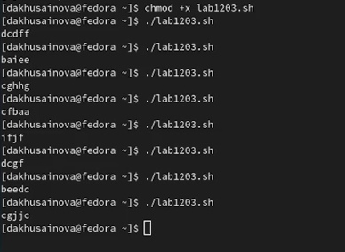

---
## Front matter
title: "Отчёт по лабораторной работе №12"
subtitle: "Программирование в командном процессоре ОС UNIX. Расширенное программирование"
author: "Хусаинова Динара Айратовна"

## Generic otions
lang: ru-RU
toc-title: "Содержание"

## Bibliography
bibliography: bib/cite.bib
csl: pandoc/csl/gost-r-7-0-5-2008-numeric.csl

## Pdf output format
toc: true # Table of contents
toc-depth: 2
lof: true # List of figures
lot: true # List of tables
fontsize: 12pt
linestretch: 1.5
papersize: a4
documentclass: scrreprt
## I18n polyglossia
polyglossia-lang:
  name: russian
  options:
	- spelling=modern
	- babelshorthands=true
polyglossia-otherlangs:
  name: english
## I18n babel
babel-lang: russian
babel-otherlangs: english
## Fonts
mainfont: PT Serif
romanfont: PT Serif
sansfont: PT Sans
monofont: PT Mono
mainfontoptions: Ligatures=TeX
romanfontoptions: Ligatures=TeX
sansfontoptions: Ligatures=TeX,Scale=MatchLowercase
monofontoptions: Scale=MatchLowercase,Scale=0.9
## Biblatex
biblatex: true
biblio-style: "gost-numeric"
biblatexoptions:
  - parentracker=true
  - backend=biber
  - hyperref=auto
  - language=auto
  - autolang=other*
  - citestyle=gost-numeric
## Pandoc-crossref LaTeX customization
figureTitle: "Рис."
tableTitle: "Таблица"
listingTitle: "Листинг"
lofTitle: "Список иллюстраций"

lolTitle: "Листинги"
## Misc options
indent: true
header-includes:
  - \usepackage{indentfirst}
  - \usepackage{float} # keep figures where there are in the text
  - \floatplacement{figure}{H} # keep figures where there are in the text
---

# Цель работы

Изучить основы программирования в оболочке ОС UNIX. Научиться писать более сложные командные файлы с использованием логических управляющих конструкций и циклов.

# Теоретическое введение

Командные процессоры или оболочки – это программы, позволяющие пользователю взаимодействовать с компьютером. Их можно рассматривать как настоящие интерпретируемые языки, которые воспринимают команды пользователя и обрабатывают их. Поэтому командные процессоры также называют интерпретаторами команд. На языках оболочек можно писать программы и выполнять их подобно любым другим программам. UNIX обладает большим количеством оболочек. Наиболее популярными являются следующие четыре оболочки:  
– оболочка Борна (Bourne) – первоначальная командная оболочка UNIX: базовый, но полный набор функций;  
– С-оболочка – добавка университета Беркли к коллекции оболочек: она надстраивается над оболочкой Борна, используя С-подобный синтаксис команд, и сохраняет историю выполненных команд;  
– оболочка Корна – напоминает оболочку С, но операторы управления программой совместимы с операторами оболочки Борна;  
– BASH – сокращение от Bourne Again Shell (опять оболочка Борна), в основе своей совмещает свойства оболочек С и Корна (разработка компании Free Software Foundation).  
Стандарт POSIX  
POSIX (Portable Operating System Interface for Computer Environments) – интерфейс переносимой операционной системы для компьютерных сред. Представляет собой набор стандартов, подготовленных институтом инженеров по электронике и радиотехники (IEEE), который определяет различные аспекты построения операционной системы. POSIX включает такие темы, как программный интерфейс, безопасность, работа с сетями и графический интерфейс. POSIX-совместимые оболочки являются будущим поколением оболочек UNIX и других ОС. Windows NT рекламируется как система, удовлетворяющая POSIX-стандартам.  
POSIX-совместимые оболочки разработаны на базе оболочки Корна; фонд бесплатного программного обеспечения (Free Software Foundation) работает над тем, чтобы и оболочку BASH сделать POSIX-совместимой.  
Рассмотрим основные элементы программирования в оболочке bash. В других оболочках большинство команд будет совпадать с описанными ниже.  
Использование арифметических вычислений. Операторы let и read  
Оболочка bash поддерживает встроенные арифметические функции. Команда let является показателем того, что последующие аргументы представляют собой выражение, это единичный терм (term), обычно подлежащее вычислению. Простейшее выражение целочисленный.
Целые числа можно записывать как последовательность цифр или в любом базовом формате. Этот формат – radix#number, где radix (основание системы счисления) любое число не более 26. Для большинства команд основания систем счисления это – 2 (двоичная), 8 (восьмеричная) и 16 (шестнадцатеричная). Простейшими математическими выражениями являются сложение (+), вычитание (-), умножение (*), целочисленное деление (/) и целочисленный остаток (%). Команда let берет два операнда и присваивает их переменной.

# Ход работы

**1.** Напишем командный файл, реализующий упрощённый механизм семафоров. Командный файл должен в течение некоторого времени t1 дожидаться освобождения ресурса, выдавая об этом сообщение, а дождавшись его освобождения, использовать его в течение некоторого времени t2<>t1, также выдавая информацию о том, что
ресурс используется соответствующим командным файлом (процессом)(рис. [-@fig:001],[-@fig:002]).

{ #fig:001 width=70% }

{ #fig:002 width=70% }

**2.** Теперь мы реализуем команду man с помощью командного файла. Изучите содержимое каталога /usr/share/man/man1. В нем находятся архивы текстовых файлов, содержащих
справку по большинству установленных в системе программ и команд. Каждый архив можно открыть командой less сразу же просмотрев содержимое справки. Командный файл должен получать в виде аргумента командной строки название команды и в виде
результата выдавать справку об этой команде или сообщение об отсутствии справки, если соответствующего файла нет в каталоге( рис. [-@fig:003],[-@fig:003],[-@fig:005],[-@fig:006]). 

{ #fig:003 width=70% }

{ #fig:004 width=70% }

{ #fig:005 width=70% }

{ #fig:006 width=70% }

**3.** Используя встроенную переменную $RANDOM, напишем командный файл, генерирующий случайную последовательность букв латинского алфавита(рис. [-@fig:007],[-@fig:008]). 

{ #fig:007 width=70% }

{ #fig:008 width=70% }

# Контрольные вопросы

**1.** Найдите синтаксическую ошибку в следующей строке:  
"while [$1 != "exit"]"
Вместо exit должна стоять цифра, а не это слово. 

**2.** Как объединить (конкатенация) несколько строк в одну?  
Самый простой способ объединить две или более строковые переменные – записать их одну за другой:  
VAR1="Hello,"  
VAR2=" World"  
VAR3="$VAR1$VAR2"  
echo "$VAR3"  
Hello, World  

**3.** Найдите информацию об утилите seq. Какими иными способами можно реализовать её функционал при программировании на bash?  
Эти утилиты выводят последовательность целых чисел с шагом, заданным пользователем.
По-умолчанию, выводимые числа отделяются друг от друга символом перевода строки, однако, с помощью ключа -s может быть задан другой разделитель.  
bash$ seq 5  
1  
2  
3  
4  
5  
bash$ seq -s : 5  
1  
2  
3  
4  
5  
Обе утилиты, и jot, и seq, очень удобно использовать для генерации списка аргументов в цикле for.

**4.** Какой результат даст вычисление выражения $((10/3))?  
3

**5.** Укажите кратко основные отличия командной оболочки zsh от bash.  
Чтобы дать лучше понять набор отличительных черт Z Shell, вот список того, что вы получите, используя Z Shell вместо Bash:
Встроенная команда zmv поможет вам массово переименовать файлы/директории, например, чтобы добавить ‘.txt’ к имени каждого файла, запустите zmv –C '(*)(#q.)' '$1.txt'.
Утилита zcalc — это замечательный калькулятор командной строки, это удобный способ считать быстро, не покидая терминал. Загрузите её через autoload -Uz zcalc и запустите командой zcalc.
Команда zparseopts — это однострочник, который поможет вам разобрать сложные варианты, которые предоставляются вашему скрипту(?)
Команда autopushd позволяет вам делать popd после того, как вы с помощью cd, чтобы вернуться в предыдущую директорию.
Поддержка чисел с плавающей точкой (коей Bash, к удивлению, не содержит).
Поддержка для структур данных “хэш”.
Есть также ряд особенностей, которые присутствуют в Bash, но их нет почти во всех остальных командных оболочках. Вот также некоторые из них:  
Опция командной строки –norc, которая позволяет пользователю иметь дело с инициализацией командной строки, не читая файл .bashrc
Использование опции –rcfile <filename> с bash позволяет вам исполнять команды из определённого файла.
Отличные возможности вызова (набор опций для командной строки)
Может быть вызвана командой sh
Bash можно запустить в определённом режиме POSIX.  Применитеset –o posix, чтобы включить режим, или ––posix при запуске.
Вы можете управлять видом командной строки в Bash. Настройка переменной PROMPT_COMMAND с одним или более специальными символами настроит её за вас.
Bash также можно включить в режиме ограниченной оболочки (с rbash или --restricted), это означает, что некоторые команды/действия больше не будут доступны:
Настройка и удаление значений служебных переменных SHELL, PATH, ENV,  BASH_ENV
Перенаправление вывода с использованием операторов ‘>’, ‘>|’, ‘<>’, ‘>&’, ‘&>’, ‘>>’
Разбор значений SHELLOPTS из окружения оболочки при запуске
Использование встроенного оператора exec, чтобы заменить оболочку другой командой.

**6.** Проверьте, верен ли синтаксис данной конструкции
1 for ((a=1; a <= LIMIT; a++))  
Надо убрать дополнительные круглые скобки.

**7.** Сравните язык bash с какими-либо языками программирования. Какие преимущества у bash по сравнению с ними? Какие недостатки?  
Использование Bash для написания Shell-сценариев
Каждая популярная операционная система обычно предлагает интерфейс командной строки (CLI) через приложение терминала. Приложение терминала выполняет команды через определенный интерпретатор командной строки, такой как Bash, Z shell, C shell и KornShell. Определенные команды помещаются в файл и выполняются через выбранный интерпретатор командной строки. Другими словами, мы можем писать Shell-сценарии с помощью Bash, Z shell и т. д. Bash является широко используемым интерпретатором командной строки, поскольку он включен по умолчанию почти во все Unix или Unix-подобные операционные системы. Поэтому с помощью Bash можно писать переносимые POSIX-сценарии.

Bash позволяет писать Shell-сценарии с минимальной грамматикой. Если нужно выполнить несколько команд, достаточно поместить их в сценарий Bash построчно. Bash поддерживает основные концепции программирования:

операторы if-else;
циклы;
арифметические операции;
функции;
переменные.
Bash поддерживает процессы нативно. Иначе говоря, вы можете инициировать другие двоичные файлы в качестве команд. Например, если вам нужно выполнить двоичный ping, можете написать команду ping в своих сценариях Bash. Есть несколько способов отображения графического интерфейса с помощью сценариев Bash.

Bash — это командный язык, а не язык программирования общего назначения. Поэтому с усложнением логики вашего автоматизированного сценария он становится более запутанным и менее читаемым. Кроме того, Bash все и всегда воспринимает как команду, потому что это командный язык. См. следующий пример:

#!/bin/bash
x=10
echo $x # prints 10
x = 10 # x: command not found
echo $x
У Bash нет стандартного API, однако он поставляется с простыми встроенными функциями (например, со встроенной тестовой обработкой). Однако вам часто придется создавать процессы для обработки данных (помните sed?). Таким образом, Bash работает очень медленно по сравнению с другими языками, предназначенными для создания автоматизированных сценариев.

Использование Python для написания Shell-сценариев
Python — популярная альтернатива Bash для написания сценариев настройки среды, сборки и выпуска. Я знаю, что проект Electron использует Python для сценариев нескольких утилит. В Python нельзя выполнять команды напрямую, поскольку это не командный язык. Но запуск команд и перехват вывода реализуются проще простого с помощью модуля subprocess. Взгляните на следующий пример:

#!/usr/bin/python3
import subprocess
o = subprocess.check_output(['node', '--version'], text = True)
print('You are using Node ' + o)
Приведенный выше сценарий Python печатает текущую компьютерную версию Nodejs. Этот сценарий эквивалентен следующему сценарию Bash:

#!/usr/bin/bash
o=$(node --version)
echo You are using Node $o
Используя встроенные функции Python, можно писать современные сложные Shell-сценарии. Но, в отличие от Bash, интерпретатор Python изначально не поддерживает выполнение процесса. Поэтому, если нужно упростить сценарий Python, чтобы он больше походил на Bash, используется такой инструмент, как Shellpy. Посмотрите на следующий сценарий Shellpy, который выполняет работу предыдущего сценария:

!/usr/local/bin/shellpy3
o = `node --version
print('You are using Node ' + o.stdout)
Python — язык, очень удобный для разработчиков. Кроме того, он поставляется со многими полезными встроенными библиотеками. Интерпретатор Python предустановлен почти во все Unix-подобные операционные системы. Поэтому Python также является хорошей альтернативой для написания переносимых автоматизированных сценариев.

Но в отличие от других языков, для Python характерно медленное время выполнения программы. Когда вы используете некоторые библиотеки, Python работает слишком медленно даже по сравнению с Bash. Такие инструменты, как Shellpy и Plumbum, предлагают удобные API для работы с процессами и командами. Тем не менее, вам придется настроить и написать дополнительный код.

# Вывод 

Мы изучили основы программирования в оболочке ОС UNIX и научились писать более сложные командные файлы с использованием логических управляющих конструкций и циклов.

::: {#refs}
:::