---
## Front matter
lang: ru-RU
title: Лабораторная работа 13 Средства, применяемые при разработке программного обеспечения в ОС типа UNIX/Linux
author: |
	Хусаинова Динара Айратовна
institute: |
	RUDN
date: 02.06.2022

## Formatting
toc: false
slide_level: 2
theme: metropolis
header-includes: 
 - \metroset{progressbar=frametitle,sectionpage=progressbar,numbering=fraction}
 - '\makeatletter'
 - '\beamer@ignorenonframefalse'
 - '\makeatother'
aspectratio: 43
section-titles: true
---

## Цель работы

Приобрести простейшие навыки разработки, анализа, тестирования и отладки приложений в ОС типа UNIX/Linux на примере создания на языке программирования С калькулятора с простейшими функциями.

## Создание файлов

В домашнем каталоге создаем подкаталог ~/work/os/lab_prog.
А после создаем в нём файлы: calculate.h, calculate.c, main.c.(рис. [-@fig:001]).

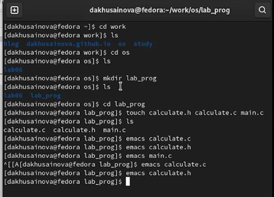{ #fig:001 width=70% }

## calculate.h

Реализация функций калькулятора в файле calculate.h( рис. [-@fig:003]). 

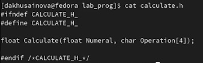{ #fig:003 width=70% }

## calculate.с

Реализация функций калькулятора в файле calculate.с( рис. [-@fig:002]).  

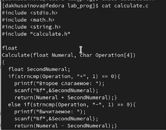{ #fig:002 width=70% }

## main.с

Реализация функций калькулятора в файле main.с( рис. [-@fig:004]).  

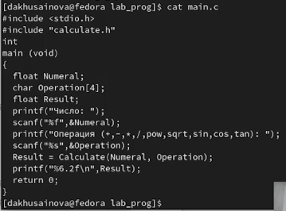{ #fig:004 width=70% }

## Компиляция

Выполняем компиляцию программы посредством gcc( рис. [-@fig:005]).  

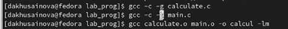{ #fig:005 width=70% }

## Makefile

Создаем Makefile со следующим содержанием( рис. [-@fig:006]).  

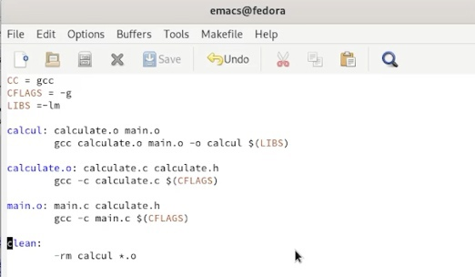{ #fig:006 width=70% }

## Запускаем калькулятор

Запускаем наш калькулятор и проверяем его работу. Просматриваем строки файлов, ставим точки останова, запускаем программу внутри отладчика и убеждаемся, что программа остановится в момент прохождения точки останова(рис. [-@fig:008],[-@fig:009],[-@fig:011],[-@fig:012]).  

## Квадратный корень

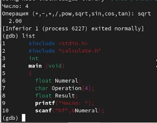{ #fig:008 width=70% }

## Строки файлов

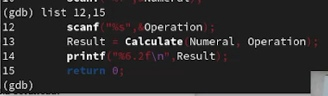{ #fig:009 width=70% }

## Точки останова 

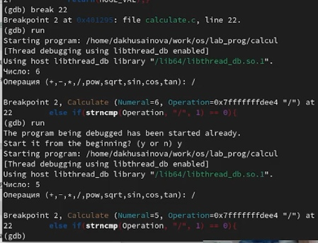{ #fig:011 width=70% }

## Удаление точек останова

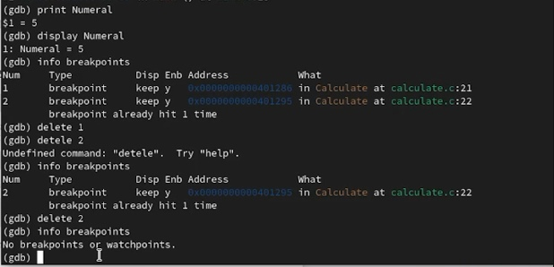{ #fig:012 width=70% }

## Утилита splint

С помощью утилиты splint проанализируем коды файлов calculate.c и main.c( рис. [-@fig:013]).

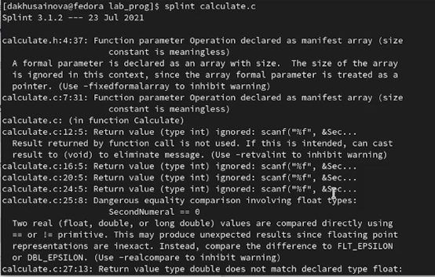{ #fig:013 width=70% }

## Вывод

Я приобрела простейшие навыки разработки, анализа, тестирования и отладки приложений в ОС типа UNIX/Linux на примере создания на языке программирования С калькулятора с простейшими функциями.

