---
## Front matter
title: "Отчёт по лабораторной работе №13"
subtitle: "Средства, применяемые при разработке программного обеспечения в ОС типа UNIX/Linux"
author: "Хусаинова Динара Айратовна"

## Generic otions
lang: ru-RU
toc-title: "Содержание"

## Bibliography
bibliography: bib/cite.bib
csl: pandoc/csl/gost-r-7-0-5-2008-numeric.csl

## Pdf output format
toc: true # Table of contents
toc-depth: 2
lof: true # List of figures
lot: true # List of tables
fontsize: 12pt
linestretch: 1.5
papersize: a4
documentclass: scrreprt
## I18n polyglossia
polyglossia-lang:
  name: russian
  options:
	- spelling=modern
	- babelshorthands=true
polyglossia-otherlangs:
  name: english
## I18n babel
babel-lang: russian
babel-otherlangs: english
## Fonts
mainfont: PT Serif
romanfont: PT Serif
sansfont: PT Sans
monofont: PT Mono
mainfontoptions: Ligatures=TeX
romanfontoptions: Ligatures=TeX
sansfontoptions: Ligatures=TeX,Scale=MatchLowercase
monofontoptions: Scale=MatchLowercase,Scale=0.9
## Biblatex
biblatex: true
biblio-style: "gost-numeric"
biblatexoptions:
  - parentracker=true
  - backend=biber
  - hyperref=auto
  - language=auto
  - autolang=other*
  - citestyle=gost-numeric
## Pandoc-crossref LaTeX customization
figureTitle: "Рис."
tableTitle: "Таблица"
listingTitle: "Листинг"
lofTitle: "Список иллюстраций"

lolTitle: "Листинги"
## Misc options
indent: true
header-includes:
  - \usepackage{indentfirst}
  - \usepackage{float} # keep figures where there are in the text
  - \floatplacement{figure}{H} # keep figures where there are in the text
---

# Цель работы

Приобрести простейшие навыки разработки, анализа, тестирования и отладки приложений в ОС типа UNIX/Linux на примере создания на языке программирования С калькулятора с простейшими функциями.

# Теоретическое введение

Процесс разработки программного обеспечения обычно разделяется на следующие
этапы:  
– планирование, включающее сбор и анализ требований к функционалу и другим характеристикам разрабатываемого приложения;  
– проектирование, включающее в себя разработку базовых алгоритмов и спецификаций, определение языка программирования;  
– непосредственная разработка приложения:  
– кодирование — по сути создание исходного текста программы (возможно в нескольких вариантах);  
– анализ разработанного кода;  
– сборка, компиляция и разработка исполняемого модуля;  
– тестирование и отладка, сохранение произведённых изменений;  
– документирование.
Для создания исходного текста программы разработчик может воспользоваться любым
удобным для него редактором текста: vi, vim, mceditor, emacs, geany и др.  
После завершения написания исходного кода программы (возможно состоящей из
нескольких файлов), необходимо её скомпилировать и получить исполняемый модуль.  
Стандартным средством для компиляции программ в ОС типа UNIX является GCC (GNU Compiler Collection). Это набор компиляторов для разного рода языков программирования (С, C++, Java, Фортран и др.). Работа с GCC производится при помощи одноимённой
управляющей программы gcc, которая интерпретирует аргументы командной строки, определяет и осуществляет запуск нужного компилятора для входного файла. Файлы с расширением (суффиксом) .c воспринимаются gcc как программы на языке С, файлы с расширением .cc или .C — как файлы на языке C++, а файлы c расширением .o считаются объектными.  

# Ход работы

**1.** В домашнем каталоге создаем подкаталог ~/work/os/lab_prog.
А после создаем в нём файлы: calculate.h, calculate.c, main.c.(рис. [-@fig:001]).

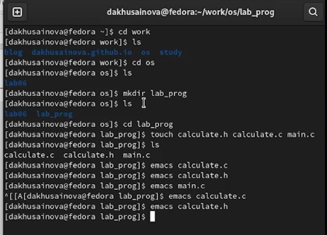{ #fig:001 width=70% }

**2.** Реализация функций калькулятора в файле calculate.h( рис. [-@fig:003]). 

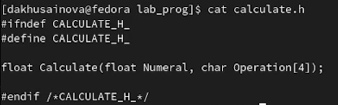{ #fig:003 width=70% }

**3.** Реализация функций калькулятора в файле calculate.с( рис. [-@fig:002]).  

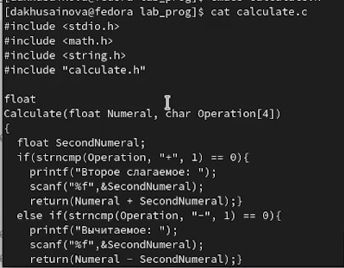{ #fig:002 width=70% }

**4.** Реализация функций калькулятора в файле main.с( рис. [-@fig:004]).  

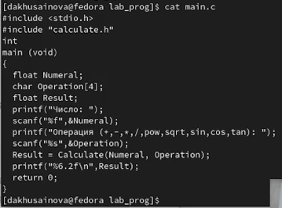{ #fig:004 width=70% }

**5.** Выполняем компиляцию программы посредством gcc( рис. [-@fig:005]).  

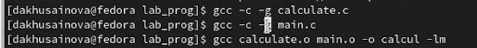{ #fig:005 width=70% }

**6.** Создаем Makefile со следующим содержанием( рис. [-@fig:006]).  

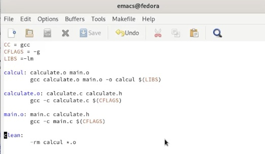{ #fig:006 width=70% }

**7.** Запускаем наш калькулятор и проверяем его работу. Просматриваем строки файлов, ставим точки останова, запускаем программу внутри отладчика и убеждаемся, что программа остановится в момент прохождения точки останова( рис. [-@fig:007],[-@fig:008],[-@fig:009],[-@fig:010],[-@fig:011],[-@fig:012]).  

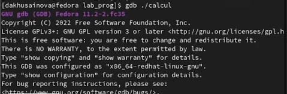{ #fig:007 width=70% }

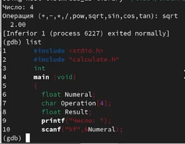{ #fig:008 width=70% }

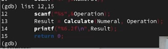{ #fig:009 width=70% }

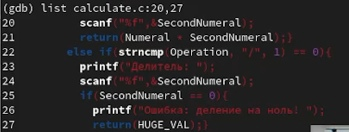{ #fig:010 width=70% }

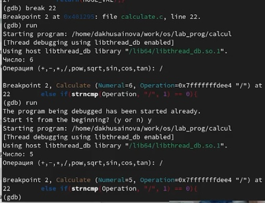{ #fig:011 width=70% }

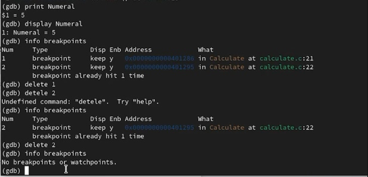{ #fig:012 width=70% }

**8.** С помощью утилиты splint проанализируем коды файлов calculate.c и main.c( рис. [-@fig:013],[-@fig:014]).

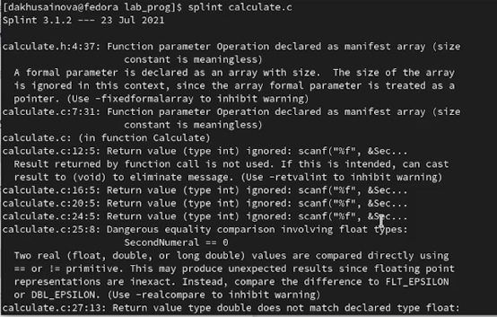{ #fig:013 width=70% }

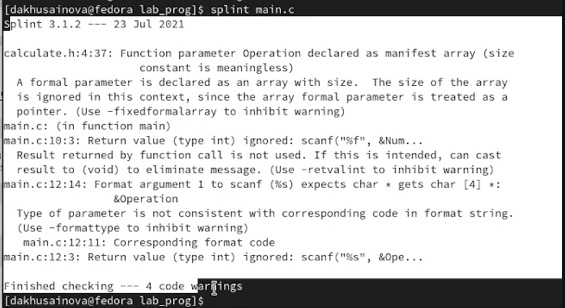{ #fig:014 width=70% }

# Контрольные вопросы

**1.** Как получить информацию о возможностях программ gcc, make, gdb и др.?  
Чтобы получить информацию о возможностях программ gcc, make, gdb и др. нужно воспользоваться командой man или опцией -help (-h) для каждой команды.

**2.** Назовите и дайте краткую характеристику основным этапам разработки приложений в UNIX.  
Процесс разработки программного обеспечения обычно разделяется на следующие этапы:
•	планирование, включающее сбор и анализ требований кфункционалу и другим характеристикам разрабатываемого приложения;
•	проектирование, включающее в себя разработку базовых алгоритмов и спецификаций, определение языка программирования;
•	непосредственная разработка приложения:
•	кодирование − по сути создание исходного текста программы (возможно в нескольких вариантах);
•	анализ разработанного кода;
•	сборка, компиляция и разработка исполняемого модуля;
•	тестирование и отладка, сохранение произведённых изменений;
•	документирование.  
Для создания исходного текста программы разработчик может воспользоваться любым удобным для него редактором текста: vi, vim, mceditor, emacs, geany и др.
После завершения написания исходного кода программы (возможно состоящей из нескольких файлов), необходимо её скомпилировать и получить исполняемый модуль.

**3.** Что такое суффикс в контексте языка программирования? Приведите примеры использования.  
Для имени входного файла суффикс определяет какая компиляция требуется. Суффиксы указывают на тип объекта. Файлы с расширением (суффиксом) .c воспринимаются gcc как программы на языке С, файлы с расширением .cc или .C − как файлы на языке C++, а файлы c расширением .o считаются объектными. Например, в команде «gcc -c main.c»: gcc по расширению (суффиксу) .c распознает тип файла для компиляции и формирует объектный модуль − файл с расширением .o. Если требуется получить исполняемый файл с определённым именем (например, hello), то требуется воспользоваться опцией -o и в качестве параметра задать имя создаваемого файла: «gcc -o hello main.c».

**4.** Каково основное назначение компилятора языка С в UNIX?  
Основное назначение компилятора языка Си в UNIX заключается вкомпиляции всей программы и получении исполняемого файла/модуля.

**5.** Для чего предназначена утилита make?  
Для сборки разрабатываемого приложения и собственно компиляции полезно воспользоваться утилитой make. Она позволяет автоматизировать процесс преобразования файлов программы из одной формы в другую, отслеживает взаимосвязи между файлами.

**6.** Приведите пример структуры Makefile. Дайте характеристику основным элементам этого файла.  
Для работы с утилитой make необходимо в корне рабочего каталога с Вашим проектом создать файл с названием makefile или Makefile, в котором будут описаны правила обработки файлов Вашего программного комплекса.
В самом простом случае Makefile имеет следующий синтаксис:
  … :   …
<команда 1>
…
Сначала задаётся список целей, разделённых пробелами, за которым идёт двоеточие и список зависимостей. Затем в следующих строках указываются команды. Строки с командами обязательно должны начинаться с табуляции.
В качестве цели в Makefile может выступать имя файла или название какого-то действия. Зависимость задаёт исходные параметры (условия) для достижения указанной цели. Зависимость также может быть названием какого-то действия. Команды − собственно действия, которые необходимо выполнить для достижения цели.  
Общий синтаксис Makefile имеет вид:  
target1 [target2…]:[:] [dependment1…]  
[(tab)commands] [#commentary]  
[(tab)commands] [#commentary]  
Здесь знак # определяет начало комментария (содержимое от знака # и до конца строки не будет обрабатываться. Одинарное двоеточие указывает на то, что последовательность команд должна содержаться водной строке. Для переноса можно в длинной строке команд можно использовать обратный слэш (). Двойное двоеточие указывает на то, что последовательность команд может содержаться в нескольких последовательных строках.

**7.**	Назовите основное свойство, присущее всем программам отладки. Что необходимо сделать, чтобы его можно было использовать?  
Во время работы над кодом программы программист неизбежно сталкивается с появлением ошибок в ней. Использование отладчика для поиска и устранения ошибок в программе существенно облегчает жизнь программиста. В комплект программ GNU для ОС типа UNIX входит отладчик GDB (GNU Debugger).
Для использования GDB необходимо скомпилировать анализируемый код программы таким образом, чтобы отладочная информация содержалась в результирующем бинарном файле. Для этого следует воспользоваться опцией -g компилятора gcc:
gcc -c file.c -g
После этого для начала работы с gdb необходимо в командной строке ввести одноимённую команду, указав в качестве аргумента анализируемый бинарный файл:
gdb file.o

**8.**	Назовите и дайте основную характеристику основным командам отладчика gdb.  
Основные команды отладчика gdb:  
backtrace − вывод на экран пути к текущей точке останова (по сути вывод − названий всех функций)  
break − установить точку останова (в качестве параметра может быть указан номер строки или название функции)  
clear − удалить все точки останова в функции  
continue − продолжить выполнение программы  
delete − удалить точку останова  
display − добавить выражение в список выражений, значения   которых отображаются при достижении точки останова программы  
finish − выполнить программу до момента выхода из функции  
info breakpoints − вывести на экран список используемых точек останова  
info watchpoints − вывести на экран список используемых контрольных выражений  
list − вывести на экран исходный код (в качестве параметра может быть указано название файла и через двоеточие номера начальной и конечной строк)  
next − выполнить программу пошагово, но без выполнения вызываемых в программе функций  
print − вывести значение указываемого в качестве параметра выражения  
run − запуск программы на выполнение  
set − установить новое значение переменной  
step − пошаговое выполнение программы  
watch − установить контрольное выражение, при изменении значения которого программа будет остановлена  
Для выхода из gdb можно воспользоваться командой quit (или её сокращённым вариантом q) или комбинацией клавиш Ctrl-d. Более подробную информацию по работе с gdb можно получить с помощью команд gdb -h и man gdb.

**9.** Опишите по шагам схему отладки программы, которую Вы использовали при выполнении лабораторной работы.  
Cхема отладки программы показана в 6 пункте лабораторной работы.

**10.** Прокомментируйте реакцию компилятора на синтаксические ошибки в программе при его первом запуске.  
При первом запуске компилятор не выдал никаких ошибок, но в коде программы main.c допущена ошибка, которую компилятор мог пропустить (возможно, из-за версии 8.3.0-19): в строке scanf(“%s”, &Operation); нужно убрать знак &, потому что имя массива символов уже является указателем на первый элемент этого массива.

**11.** Назовите основные средства, повышающие понимание исходного кода программы.  
Система разработки приложений UNIX предоставляет различные средства, повышающие понимание исходного кода. К ним относятся:
•	cscope − исследование функций, содержащихся в программе,
•	lint − критическая проверка программ, написанных на языке Си.

**12.** Каковы основные задачи, решаемые программой splint?  
Утилита splint анализирует программный код, проверяет корректность задания аргументов использованных в программе функций и типов возвращаемых значений, обнаруживает синтаксические и семантические ошибки.
В отличие от компилятора C анализатор splint генерирует комментарии с описанием разбора кода программы и осуществляет общий контроль, обнаруживая такие ошибки, как одинаковые объекты, определённые в разных файлах, или объекты, чьи значения не используются в работепрограммы, переменные с некорректно заданными значениями и типами и многое другое.

# Вывод 

Я приобрела простейшие навыки разработки, анализа, тестирования и отладки приложений в ОС типа UNIX/Linux на примере создания на языке программирования С калькулятора с простейшими функциями.

::: {#refs}
:::