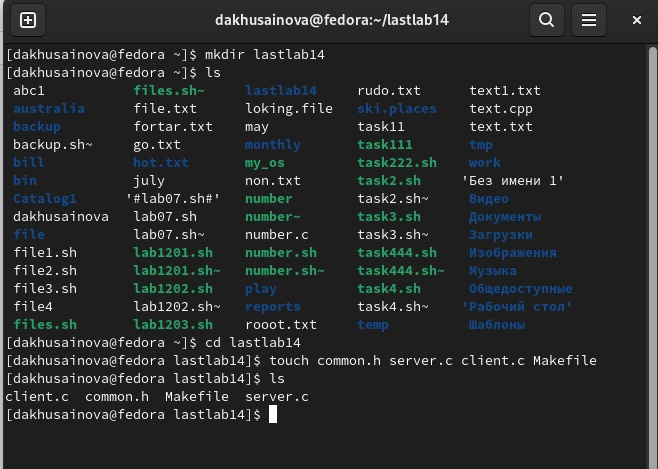
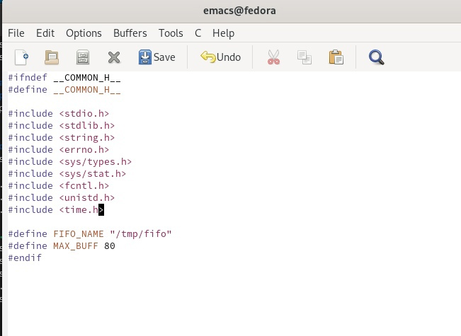
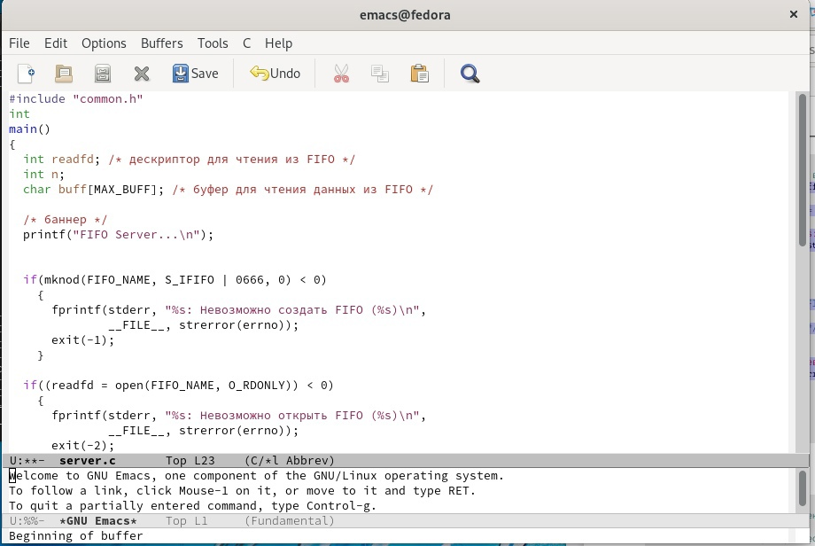
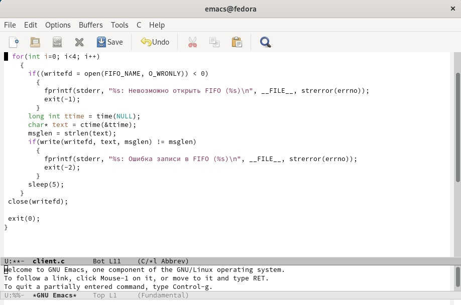
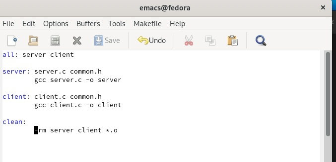
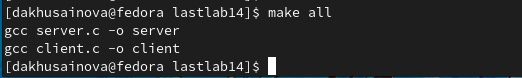
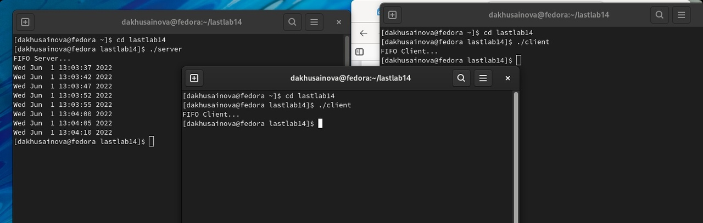

---
## Front matter
lang: ru-RU
title: Лабораторная работа 14 Именованные каналы
author: |
	Хусаинова Динара Айратовна
institute: |
	RUDN
date: 02.06.2022

## Formatting
toc: false
slide_level: 2
theme: metropolis
header-includes: 
 - \metroset{progressbar=frametitle,sectionpage=progressbar,numbering=fraction}
 - '\makeatletter'
 - '\beamer@ignorenonframefalse'
 - '\makeatother'
aspectratio: 43
section-titles: true
---

## Цель работы

Приобретение практических навыков работы с именованными каналами.

## Создание файлов

Создаем неоходимые файлы(рис. [-@fig:001]). 

{ #fig:001 width=70% }

## common.h

В файле common.h добавляем стандартныезаголовочные файлы unistd.h и time.h, необходимые для работы кодов других файлов(рис. [-@fig:002]).

{ #fig:002 width=70% }

## server.c

В файл server.c добавляем цикл while для контроля за временем работы сервера(рис. [-@fig:003]).

{ #fig:003 width=70% }

## client.c

В файл client.c добавляем цикл, которых отвечает за количество сообщений о текущем времени, которое получается в результате выполнения команд, и команду sleep(5) для приостановки работы клиента на 5 секунд(рис. [-@fig:005]).

{ #fig:005 width=70% }

## Makefile

Makefile оставляем без изменений( рис. [-@fig:006]).  

{ #fig:006 width=70% }

## Компиляция

После написания кода, мы используем команду make all, чтобы скомпилировать все файлы( рис. [-@fig:008]).  

{ #fig:008 width=70% }

## Проверка

Проверяем работу файлов( рис. [-@fig:009]).  

{ #fig:009 width=70% }

## Вывод

Я приобрела практические навыки работы с именованными каналами.

