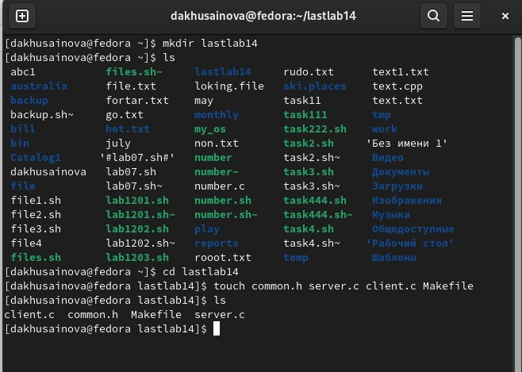
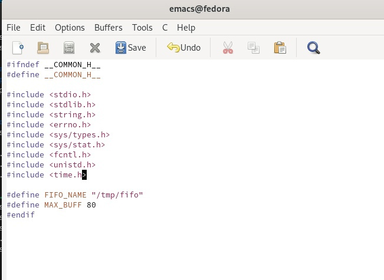
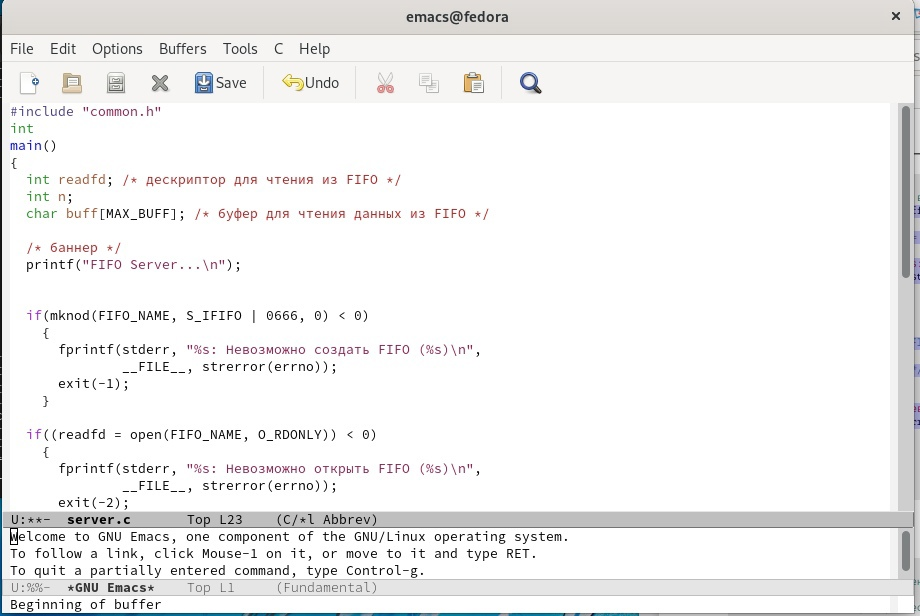
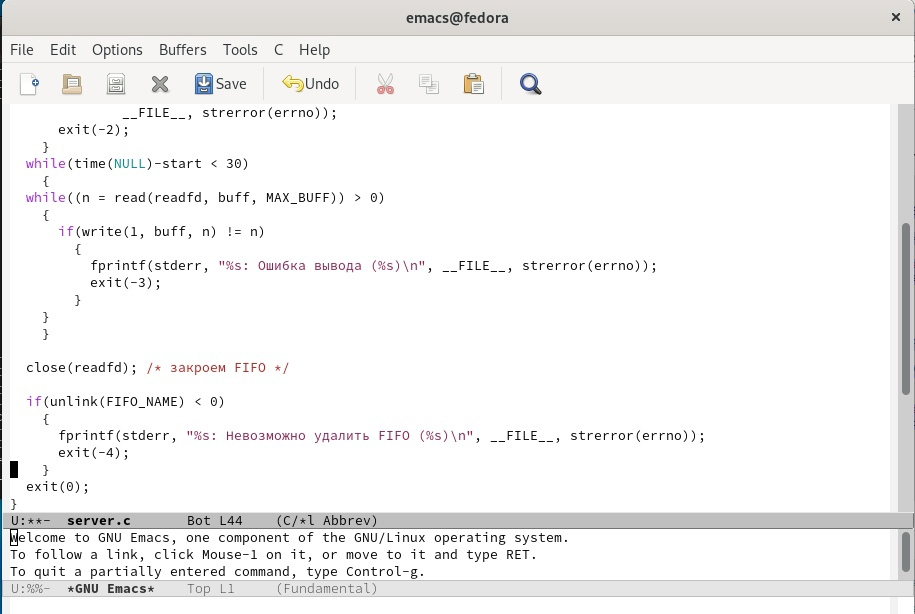
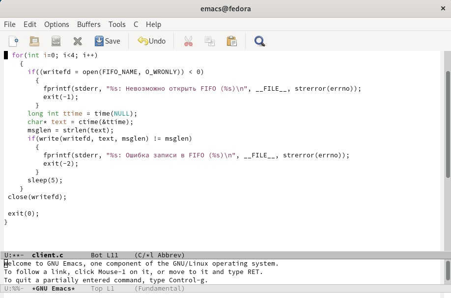
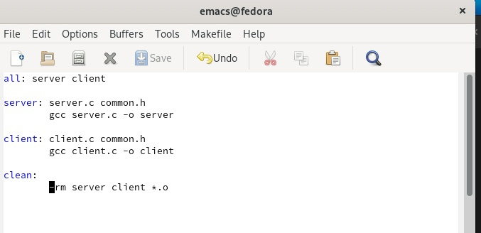
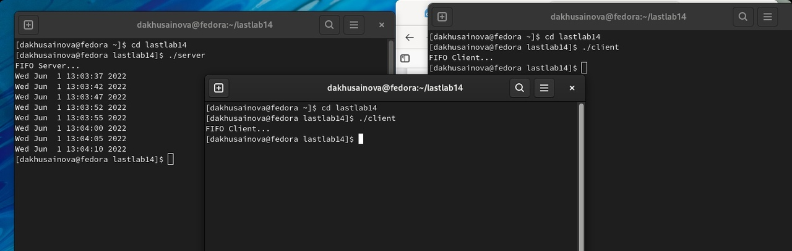

---
## Front matter
title: "Отчёт по лабораторной работе №14"
subtitle: "Именованные каналы"
author: "Хусаинова Динара Айратовна"

## Generic otions
lang: ru-RU
toc-title: "Содержание"

## Bibliography
bibliography: bib/cite.bib
csl: pandoc/csl/gost-r-7-0-5-2008-numeric.csl

## Pdf output format
toc: true # Table of contents
toc-depth: 2
lof: true # List of figures
lot: true # List of tables
fontsize: 12pt
linestretch: 1.5
papersize: a4
documentclass: scrreprt
## I18n polyglossia
polyglossia-lang:
  name: russian
  options:
	- spelling=modern
	- babelshorthands=true
polyglossia-otherlangs:
  name: english
## I18n babel
babel-lang: russian
babel-otherlangs: english
## Fonts
mainfont: PT Serif
romanfont: PT Serif
sansfont: PT Sans
monofont: PT Mono
mainfontoptions: Ligatures=TeX
romanfontoptions: Ligatures=TeX
sansfontoptions: Ligatures=TeX,Scale=MatchLowercase
monofontoptions: Scale=MatchLowercase,Scale=0.9
## Biblatex
biblatex: true
biblio-style: "gost-numeric"
biblatexoptions:
  - parentracker=true
  - backend=biber
  - hyperref=auto
  - language=auto
  - autolang=other*
  - citestyle=gost-numeric
## Pandoc-crossref LaTeX customization
figureTitle: "Рис."
tableTitle: "Таблица"
listingTitle: "Листинг"
lofTitle: "Список иллюстраций"

lolTitle: "Листинги"
## Misc options
indent: true
header-includes:
  - \usepackage{indentfirst}
  - \usepackage{float} # keep figures where there are in the text
  - \floatplacement{figure}{H} # keep figures where there are in the text
---

# Цель работы

Приобретение практических навыков работы с именованными каналами.

# Теоретическое введение

Одним из видов взаимодействия между процессами в операционных системах является обмен сообщениями. Под сообщением понимается последовательность байтов,
передаваемая от одного процесса другому.
В операционных системах типа UNIX есть 3 вида межпроцессорных взаимодействий:  
общеюниксные (именованные каналы, сигналы), System V Interface Definition (SVID — разделяемая память, очередь сообщений, семафоры) и BSD (сокеты).
Для передачи данных между неродственными процессами можно использовать механизм именованных каналов (named pipes). Данные передаются по принципу FIFO (First
In First Out) (первым записан — первым прочитан), поэтому они называются также FIFO
pipes или просто FIFO. Именованные каналы отличаются от неименованных наличием
идентификатора канала, который представлен как специальный файл (соответственно имя именованного канала — это имя файла). Поскольку файл находится на локальной файловой системе, данное IPC используется внутри одной системы.
Файлы именованных каналов создаются функцией mkfifo(3).
Первый параметр — имя файла, идентифицирующего канал, второй параметр — маска
прав доступа к файлу.
После создания файла канала процессы, участвующие в обмене данными, должны открыть этот файл либо для записи, либо для чтения. При закрытии файла сам канал продолжает существовать. Для того чтобы закрыть сам канал, нужно удалить его файл,например с помощью вызова unlink(2).
Рассмотрим работу именованного канала на примере системы клиент–сервер. Сервер создаёт канал, читает из него текст, посылаемый клиентом, и выводит его на терминал.
Вызов функции mkfifo() создаёт файл канала (с именем, заданным макросомFIFO_NAME).   
В качестве маски доступа используется восьмеричное значение 0600, разрешающее процессу с аналогичными реквизитами пользователя чтение и запись.
Ждём сообщение от клиента. Сообщение читаем с помощью функции read() и печатаем на экран. После этого удаляется файл FIFO_NAME и сервер прекращает работу.  
Клиент открывает FIFO для записи как обычный файл:  
Посылаем сообщение серверу с помощью функции write().
Для создания файла FIFO можно использовать более общую функцию mknod(2), предназначенную для создания специальных файлов различных типов (FIFO, сокеты, файлы
устройств и обычные файлы для хранения данных).
1 mknod(FIFO_NAME, S_IFIFO | 0600, 0);
Каналы представляют собой простое и удобное средство передачи данных, которое,
однако, подходит не во всех ситуациях. Например, с помощью каналов довольно трудно
организовать обмен асинхронными сообщениями между процессами.

# Ход работы

**1.** Создаем неоходимые файлы(рис. [-@fig:001]), после этого изучаем приведённые в тексте программы server.c и client.c. Взяв данные примеры за образец, напишем аналогичные программы, внеся изменения. 

{ #fig:001 width=70% }

В файле common.h добавляем стандартныезаголовочные файлы unistd.h и time.h, необходимые для работы кодов других файлов(рис. [-@fig:002]).

{ #fig:002 width=70% }

В файл server.c добавляем цикл while для контроля за временем работы сервера(рис. [-@fig:003],[-@fig:004]).

{ #fig:003 width=70% }

{ #fig:004 width=70% }

В файл client.c добавляем цикл, которых отвечает за количество сообщений о текущем времени, которое получается в результате выполнения команд, и команду sleep(5) для приостановки работы клиента на 5 секунд(рис. [-@fig:005]).

{ #fig:005 width=70% }

**2.** Makefile оставляем без изменений( рис. [-@fig:006]).  

{ #fig:006 width=70% }

**3.** После написания кода, мы используем команду make all, чтобы скомпилировать все файлы( рис. [-@fig:008]).  

{ #fig:008 width=70% }

**5.** Проверяем работу файлов. Открывает три консоли и запускаем: в первом терминале server, в остальных двух client. Также проверяем длительность работы сервера. Он завершил свою работу спустя 30 секунд. Если сервер завершит свою работу, не закрыв канал, то, когда мы будем запускать этот сервер снова, появится ошибка, так как у нас уже есть один канал( рис. [-@fig:009]).  

{ #fig:009 width=70% }

# Контрольные вопросы

**1.** В чем ключевое отличие именованных каналов от неименованных?  	
Именованные каналы отличаются от неименованных наличием идентификатора канала, который представлен как специальный файл (соответственно имя именованного канала − это имя файла). Поскольку файл находится на локальной файловой системе, данное IPC используется внутри одной системы.

**2.** Возможно ли создание неименованного канала из командной строки?  	
Чтобы создать неименованный канал из командной строки нужно использовать символ |, служащий для объединения двух и более процессов: процесс_1 | процесс_2 | процесс_3…

**3.** Возможно ли создание именованного канала из командной строки?  
Чтобы создать именованный канал из командной строки нужно использовать либо команду «mknod », либо команду «mkfifo».

**4.**	Опишите функцию языка С, создающую неименованный канал.  
Неименованный канал является средством взаимодействия между связанными процессами − родительским и дочерним. Родительский процесс создает канал при помощи системного вызова: «int pipe(int fd[2]);».
Массив из двух целых чисел является выходным параметром этого системного вызова. Если вызов выполнился нормально, то этот массив содержит два файловых дескриптора. fd[0] является дескриптором для чтения из канала, fd[1] − дескриптором для записи в канал. Когда процесс порождает другой процесс, дескрипторы родительского процесса наследуются дочерним процессом, и, таким образом, прокладывается трубопровод между двумя процессами. Естественно, что один из процессов использует канал только для чтения, а другой − только для записи. Поэтому, если, например, через канал должны передаваться данные из родительского процесса в дочерний, родительский процесс сразу после запуска дочернего процесса закрывает дескриптор канала для чтения, а дочерний процесс закрывает дескриптор для записи. Если нужен двунаправленный обмен данными между процессами, то родительский процесс создает два канала, один из которых используется для передачи данных в одну сторону, а другой − в другую.

**5.** Опишите функцию языка С, создающую именованный канал.  
Файлы именованных каналов создаются функцией mkfifo() или функцией mknod:
•	«int mkfifo(const char *pathname, mode_t mode);», где первый параметр − путь, где будет располагаться FIFO (имя файла, идентифицирующего канал), второй параметр определяет режим работы с FIFO (маска прав доступа к файлу),
•	«mknod (namefile, IFIFO | 0666, 0)», где namefile − имя канала, 0666 − к каналу разрешен доступ на запись и на чтение любому запросившему процессу),
•	«int mknod(const char *pathname, mode_t mode, dev_t dev);».
Функция mkfifo() создает канал и файл соответствующего типа. Если указанный файл канала уже существует, mkfifo() возвращает -1. После создания файла канала процессы, участвующие в обмене данными, должны открыть этот файл либо для записи, любо для чтения.

**6.** Что будет в случае прочтения из fifo меньшего числа байтов, чем находится в канале? Большего числа байтов?  
При чтении меньшего числа байтов, чем находится в канале или FIFO, возвращается требуемое число байтов, остаток сохраняется для последующих чтений.
При чтении большего числа байтов, чем находится в канале или FIFO, возвращается доступное число байтов. Процесс, читающий из канала, должен соответствующим образом обработать ситуацию, когда прочитано меньше, чем заказано.

**7.**	Аналогично, что будет в случае записи в fifo меньшего числа байтов, чем позволяет буфер? Большего числа байтов?  
Запись числа байтов, меньшего емкости канала или FIFO, гарантированно атомарно. Это означает, что в случае, когда несколько процессов одновременно записывают в канал, порции данных от этих процессов не перемешиваются.
При записи большего числа байтов, чем это позволяет канал или FIFO, вызов write(2) блокируется до освобождения требуемого места. При этом атомарность операции не гарантируется. Если процесс пытается записать данные в канал, не открытый ни одним процессом на чтение, процессу генерируется сигнал SIGPIPE, а вызов write(2) возвращает 0 с установкой ошибки (errno=ERRPIPE) (если процесс не установил обработки сигнала SIGPIPE, производится обработка по умолчанию − процесс завершается).

**8.**	. Могут ли два и более процессов читать или записывать в канал?  
Количество процессов, которые могут параллельно присоединяться к любому концу канала, не ограничено. Однако если два или более процесса записывают в канал данные одновременно, каждый процесс за один раз может записать максимум PIPE BUF байтов данных. Предположим, процесс (назовем его А) пытается записать X байтов данных в канал, в котором имеется место для Y байтов данных. Если X больше, чем Y, только первые Y байтов данных записываются в канал, и процесс блокируется. Запускается другой процесс (например. В); в это время в канале появляется свободное пространство (благодаря третьему процессу, считывающему данные из канала). Процесс В записывает данные в канал. Затем, когда выполнение процесса А возобновляется,он записывает оставшиеся X-Y байтов данных в канал. В результате данные в канал записываются поочередно двумя процессами. Аналогичным образом, если два (или более) процесса одновременно попытаются прочитать данные из канала, может случиться так, что каждый из них прочитает только часть необходимых данных.

**9.**	Опишите функцию write (тип возвращаемого значения, аргументы и логику работы). Что означает 1 (единица) в вызове этой функции в программе server.c (строка 42)?  
Функция write записывает байты count из буфера buffer в файл, связанный с handle. Операции write начинаются с текущей позиции указателя на файл (указатель ассоциирован с заданным файлом). Если файл открыт для добавления, операции выполняются в конец файла. После осуществления операций записи указатель на файл (если он есть) увеличивается на количество действительно записанных байтов. Функция write возвращает число действительно записанных байтов. Возвращаемое значение должно быть положительным, но меньше числа count (например, когда размер для записи count байтов выходит за пределы пространства на диске). Возвращаемое значение -1 указывает на ошибку; errno устанавливается в одно из следующих значений:
EACCES − файл открыт для чтения или закрыт для записи,
EBADF − неверный handle-р файла,
ENOSPC − на устройстве нет свободного места.
Единица в вызове функции write в программе server.c означает идентификатор (дескриптор потока) стандартного потока вывода.

**10.**	Опишите функцию strerror.  
Прототип функции strerror: «char * strerror( int errornum );».  
Функция strerror интерпретирует номер ошибки, передаваемый в функцию в качестве аргумента − errornum, в понятное для человека текстовое сообщение (строку). Откуда берутся эти ошибки? Ошибки эти возникают при вызове функций стандартных Си-библиотек. То есть хорошим тоном программирования будет − использование этой функции в паре с другой, и если возникнет ошибка, то пользователь или программист поймет, как исправить ошибку, прочитав сообщение функции strerror.
Возвращенный указатель ссылается на статическую строку с ошибкой, которая не должна быть изменена программой. Дальнейшие вызовы функции strerror перезапишут содержание этой строки. Интерпретированные сообщения об ошибках могут различаться, это зависит от платформы и компилятора.

# Вывод 

Я приобрела практические навыки работы с именованными каналами.

::: {#refs}
:::