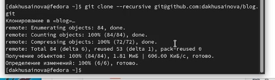
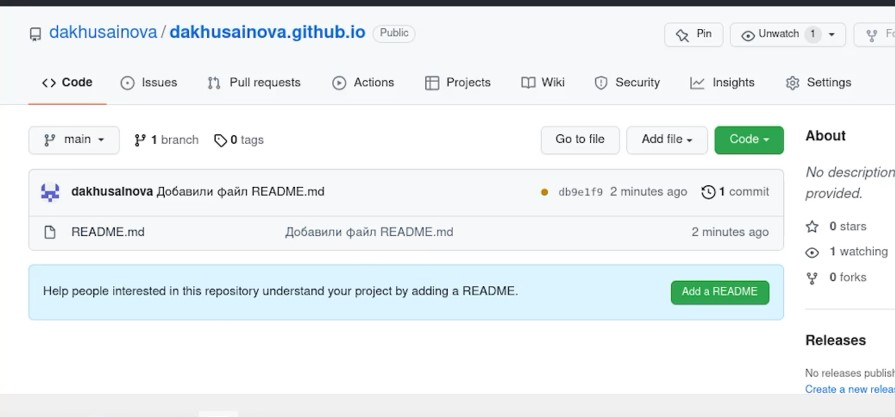
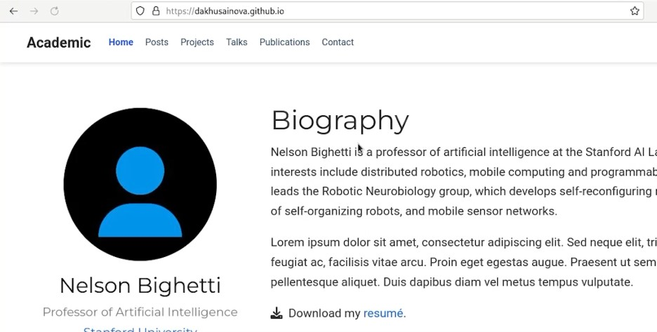

---
## Front matter
lang: ru-RU
title: Первый этап индивидуального проекта
author: |
	Хусаинова Динара Айратовна
institute: |
	RUDN University, Moscow, Russian Federation

date: 29.04.2022

## Formatting
toc: false
slide_level: 2
theme: metropolis
header-includes: 
 - \metroset{progressbar=frametitle,sectionpage=progressbar,numbering=fraction}
 - '\makeatletter'
 - '\beamer@ignorenonframefalse'
 - '\makeatother'
aspectratio: 43
section-titles: true
---

# Первый этап Размещение на Github pages заготовки для персонального сайта.

## Цель работы 

Разместить на Github pages заготовки для персонального сайта.

## Скачивание файла

Скачаем исполняемый файл hugo (рис. [-@fig:001]).

{ #fig:001 width=70% }

## Открываем наш сайт

Создаем необходимый репозиторий и открываем наш сайт (рис. [-@fig:006]).

{ #fig:006 width=70% }

## Создание репозитория для сайта

Создаем репозиторий для сайта и клонируем в public все папки и файлы для сайта (рис. [-@fig:018]).

{ #fig:018 width=70% }

## Сайт

Наблюдаем наш сайт, проходя по ссылке, соответсвующей названию нашего репозитория (рис. [-@fig:025]).

{ #fig:025 width=70% }

## Вывод 

Мы разместили на Github pages заготовки для персонального сайта.
