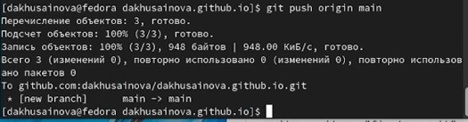

---
## Front matter
title: "Индивидуальный проект"
subtitle: "Первый этап Размещение на Github pages заготовки для персонального сайта."
author: "Хусаинова Динара Айратовна"

## Generic otions
lang: ru-RU
toc-title: "Содержание"

## Bibliography
bibliography: bib/cite.bib
csl: pandoc/csl/gost-r-7-0-5-2008-numeric.csl

## Pdf output format
toc: true # Table of contents
toc-depth: 2
lof: true # List of figures
lot: true # List of tables
fontsize: 12pt
linestretch: 1.5
papersize: a4
documentclass: scrreprt
## I18n polyglossia
polyglossia-lang:
  name: russian
  options:
	- spelling=modern
	- babelshorthands=true
polyglossia-otherlangs:
  name: english
## I18n babel
babel-lang: russian
babel-otherlangs: english
## Fonts
mainfont: PT Serif
romanfont: PT Serif
sansfont: PT Sans
monofont: PT Mono
mainfontoptions: Ligatures=TeX
romanfontoptions: Ligatures=TeX
sansfontoptions: Ligatures=TeX,Scale=MatchLowercase
monofontoptions: Scale=MatchLowercase,Scale=0.9
## Biblatex
biblatex: true
biblio-style: "gost-numeric"
biblatexoptions:
  - parentracker=true
  - backend=biber
  - hyperref=auto
  - language=auto
  - autolang=other*
  - citestyle=gost-numeric
## Pandoc-crossref LaTeX customization
figureTitle: "Рис."
tableTitle: "Таблица"
listingTitle: "Листинг"
lofTitle: "Список иллюстраций"
lotTitle: "Список таблиц"
lolTitle: "Листинги"
## Misc options
indent: true
header-includes:
  - \usepackage{indentfirst}
  - \usepackage{float} # keep figures where there are in the text
  - \floatplacement{figure}{H} # keep figures where there are in the text
---

# Цель работы

Разместить на Github pages заготовки для персонального сайта.

# Задание

- Установить необходимое программное обеспечение.
- Скачать шаблон темы сайта.
- Разместить его на хостинге git.
- Установить параметр для URLs сайта.
- Разместить заготовку сайта на Github pages.

# Выполнение лабораторной работы

1. Скачиваем исполняемый файл для hugo(рис. [-@fig:001])

{ #fig:001 width=70% }

2. Создаем папку bin и перемещаем туда исполняемый файл (рис. [-@fig:002])

{ #fig:002 width=70% }

3. Переходим в репозиторий starter-hugo-academic и создаем по его шаблону репозиторий blog (рис. [-@fig:003],[-@fig:004] )

{ #fig:003 width=70% }

{ #fig:004 width=70% }

4. Клонируем этот репозиторий к себе (рис. [-@fig:005], [-@fig:006])

{ #fig:005 width=70% }

{ #fig:006 width=70% }

5. Устанавливаем golang (рис. [-@fig:008]).

{ #fig:008 width=70% }

6. В папке blog замечаем каталог public, затем его удаляем на время (рис. [-@fig:009],[-@fig:010])

{ #fig:009 width=70% }

{ #fig:010 width=70% }

7. Выполняем hugo server, копируем ссылку в конце сообщения и проходим на наш сайт с заготовками( рис. [-@fig:011],[-@fig:012],[-@fig:013]).

{ #fig:011 width=70% }

{ #fig:012 width=70% }

{ #fig:013 width=70% }

8. Удаляем определенный сайт для того, чтобы избавиться от предупреждения в начале нашего сайта (рис. [-@fig:014]).

{ #fig:014 width=70% }

9. Создаем новый репозиторий, клонируем его к себе, создаем в нем файл README.md и загружаем все в GitHub(рис. [-@fig:015],[-@fig:016], [-@fig:017], [-@fig:018]).

{ #fig:015 width=70% }

{ #fig:016 width=70% }

{ #fig:017 width=70% }

{ #fig:018 width=70% }

10. Помещаем все файлы для сайта в каталог public, потом комментируем public в файле gitignore (рис. [-@fig:019], [-@fig:020], [-@fig:021]).

{ #fig:019 width=70% }

{ #fig:020 width=70% }

{ #fig:021 width=70% }

11. Выполняем hugo и проверяем связь нашего репозитория с public (рис. [-@fig:022], [-@fig:023]).

{ #fig:022 width=70% }

{ #fig:023 width=70% }

12. Клонируем весь каталог public (рис. [-@fig:024]).

{ #fig:024 width=70% }

13. Открываем сайт и видим наши заготовки (рис. [-@fig:025]).

{ #fig:025 width=70% }

# Выводы

Разместили на Github pages заготовки для персонального сайта.

::: {#refs}
:::