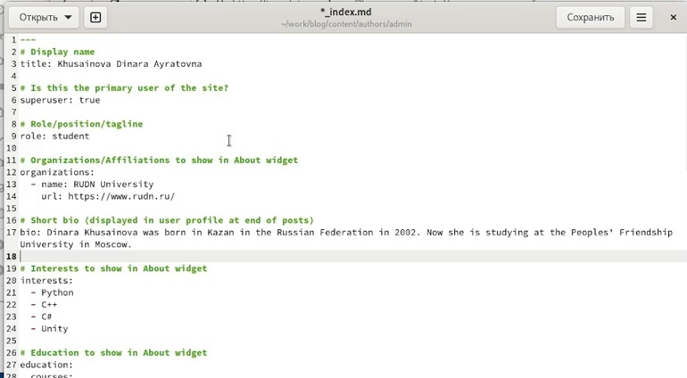
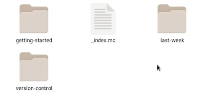
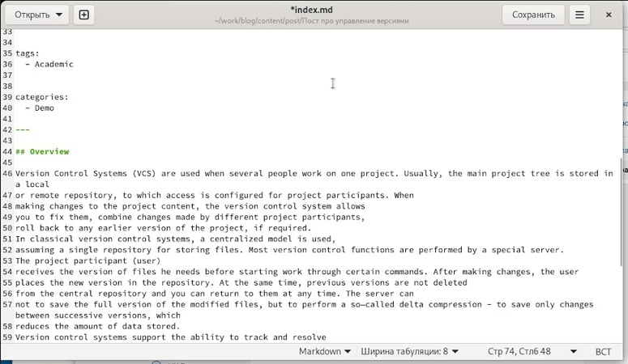

---
## Front matter
lang: ru-RU
title: Второй этап индивидуального проекта
author: |
	Хусаинова Динара Айратовна
institute: |
	RUDN University, Moscow, Russian Federation

date: 04.05.2022

## Formatting
toc: false
slide_level: 2
theme: metropolis
header-includes: 
 - \metroset{progressbar=frametitle,sectionpage=progressbar,numbering=fraction}
 - '\makeatletter'
 - '\beamer@ignorenonframefalse'
 - '\makeatother'
aspectratio: 43
section-titles: true
---

# Второй этап Добавление к сайту данных о себе

## Цель работы 

Добавить к сайту данные о себе.

## Редактирование имеющихся файлов

Вставляем в файл свое имя, образование, интересы, биографию и описание, меняем в этой папке фотографию на свою(рис. [-@fig:001]).

{ #fig:001 width=70% }

## Создаем папки для двух постов

Новые папки для поста о прошедшей неделе и об управлении версиями(рис. [-@fig:003]).

{ #fig:003 width=70% }

## Редактирование имеющихся файлов для постов на сайте

Вставляем в файлы нужную для постов информацию (рис. [-@fig:004]).

{ #fig:004 width=70% }

## Обновляем информацию

После этого мы в консоли открываем наш каталог blog, запускаем hugo, а после переходим в папку public и вбиваем следующие команды:  
git add .  
git commit -am "наш комментарий"  
git push origin main

## Вывод 

Мы добавили к сайту данные о себе.
