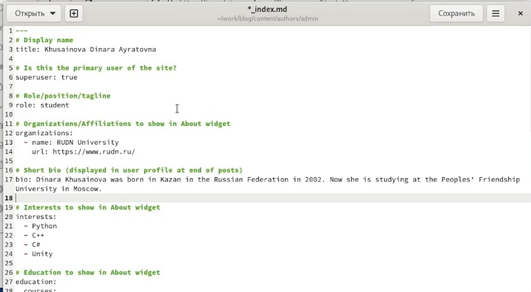
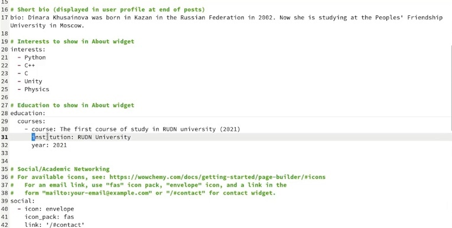
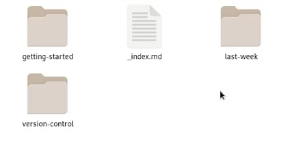
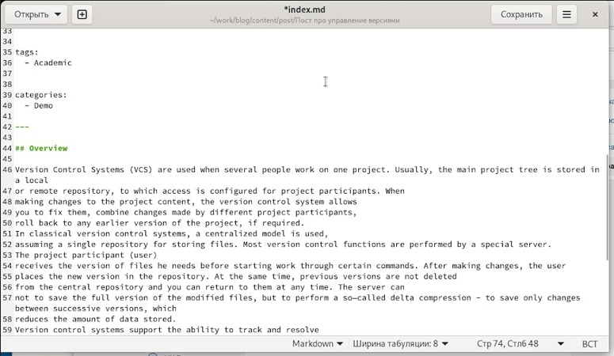
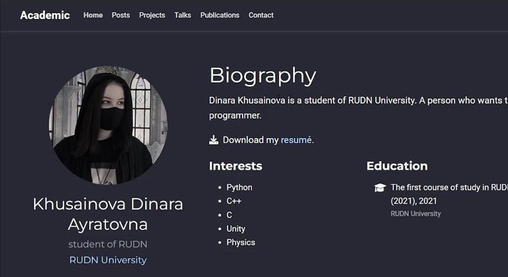

---
## Front matter
title: "Индивидуальный проект"
subtitle: "Второй этап Добавление к сайту данных о себе."
author: "Хусаинова Динара Айратовна"

## Generic otions
lang: ru-RU
toc-title: "Содержание"

## Bibliography
bibliography: bib/cite.bib
csl: pandoc/csl/gost-r-7-0-5-2008-numeric.csl

## Pdf output format
toc: true # Table of contents
toc-depth: 2
lof: true # List of figures
lot: true # List of tables
fontsize: 12pt
linestretch: 1.5
papersize: a4
documentclass: scrreprt
## I18n polyglossia
polyglossia-lang:
  name: russian
  options:
	- spelling=modern
	- babelshorthands=true
polyglossia-otherlangs:
  name: english
## I18n babel
babel-lang: russian
babel-otherlangs: english
## Fonts
mainfont: PT Serif
romanfont: PT Serif
sansfont: PT Sans
monofont: PT Mono
mainfontoptions: Ligatures=TeX
romanfontoptions: Ligatures=TeX
sansfontoptions: Ligatures=TeX,Scale=MatchLowercase
monofontoptions: Scale=MatchLowercase,Scale=0.9
## Biblatex
biblatex: true
biblio-style: "gost-numeric"
biblatexoptions:
  - parentracker=true
  - backend=biber
  - hyperref=auto
  - language=auto
  - autolang=other*
  - citestyle=gost-numeric
## Pandoc-crossref LaTeX customization
figureTitle: "Рис."
tableTitle: "Таблица"
listingTitle: "Листинг"
lofTitle: "Список иллюстраций"
lotTitle: "Список таблиц"
lolTitle: "Листинги"
## Misc options
indent: true
header-includes:
  - \usepackage{indentfirst}
  - \usepackage{float} # keep figures where there are in the text
  - \floatplacement{figure}{H} # keep figures where there are in the text
---

# Цель работы

Добавить к сайту данные о себе.

# Задание

Добавить данные. Список добавляемых данных:
- Разместить фотографию владельца сайта.
- Разместить краткое описание владельца сайта (Biography).
- Добавить информацию об интересах (Interests).
- Добавить информацию от образовании (Education).
- Сделать пост по прошедшей неделе.
- Добавить пост на тему по выбору:  
Управление версиями. Git.  
Непрерывная интеграция и непрерывное развертывание (CI/CD).

# Выполнение второго этапа

1. Открываем в домашнем каталоге папку work, проходим после этого в папку blog, потом content, после этого в папку authors,admin, потом редактируем файл index.md, вставляя в него свое имя, образование, интересы, биографию и описание, меняем в этой папке фотографию на свою(рис. [-@fig:001],[-@fig:002])

{ #fig:001 width=70% }

{ #fig:002 width=70% }

2. В той же папке content находим папку post, а затем создаем там две папки, которые будут соответствовать нашим двум постам, в них мы копируем файл md из той папки, которая находилась в папке post, а потом меняем там информацию о наших постах, заменяя уже имеющуюся там(рис. [-@fig:003],[-@fig:004])

{ #fig:003 width=70% }

{ #fig:004 width=70% }

3. После этого мы в консоли открываем наш каталог blog, запускаем hugo, а после переходим в папку public и вбиваем следующие команды:  
git add .  
git commit -am "наш комментарий"  
git push origin main

4. Через некоторое время наблюдаем обновленный сайт с нашей информацией (рис. [-@fig:005],[-@fig:006]).

{ #fig:005 width=70% }

{ #fig:006 width=70% }

# Выводы

Мы добавили к сайту данные о себе.

::: {#refs}
:::