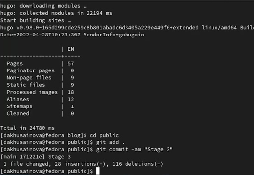

---
## Front matter
lang: ru-RU
title: Третий этап индивидуального проекта
author: |
	Хусаинова Динара Айратовна
institute: |
	RUDN University, Moscow, Russian Federation

date: 04.05.2022

## Formatting
toc: false
slide_level: 2
theme: metropolis
header-includes: 
 - \metroset{progressbar=frametitle,sectionpage=progressbar,numbering=fraction}
 - '\makeatletter'
 - '\beamer@ignorenonframefalse'
 - '\makeatother'
aspectratio: 43
section-titles: true
---

# Третий этап Добавление к сайту достижений

## Цель работы 

Добавить к сайту свои достижения

## Редактирование имеющихся файлов

Заходим в папку blog, потом content, потом home, находим файлы с следующими названиями и редактируем их под себя:  
skills.md  
experience.md  
accomplishments.md  
(рис. [-@fig:001],[-@fig:002],[-@fig:003])

## Редактирование файла Accomplishments

{ #fig:001 width=70% }

## Редактирование файла Experience

{ #fig:002 width=70% }

## Редактирование файла Skills

{ #fig:003 width=70% }

## Обновления 

Отправляем измения(рис. [-@fig:004])

{ #fig:004 width=70% }

## Результат 

Наблюдаем наши изменения на сайте (рис. [-@fig:005],[-@fig:006],[-@fig:007]).

{ #fig:005 width=70% }

## Результат

{ #fig:006 width=70% } 

## Результат

{ #fig:007 width=70% }

## Готовим посты 

Создаем папки для двух новых постов на сайте, загружаем фотографии, пишем текст постов, а потом так же, как и в предыдущий раз, отправляем наши обновления на сайт с помощью hugo и git(рис. [-@fig:008],[-@fig:009]?[-@fig:010]).

{ #fig:008 width=70% }

## Готовим посты 

{ #fig:009 width=70% }

## Папки для будущих постов

{ #fig:010 width=70% }

## Опубликованные посты на сайте 

Наблюдаем наши посты на сайте (рис. [-@fig:011]).

{ #fig:011 width=70% }

## Вывод 

Мы добавили к сайту свои достижения.
