---
## Front matter
title: "Индивидуальный проект"
subtitle: "Третий этап Добавление к сайту достижений"
author: "Хусаинова Динара Айратовна"

## Generic otions
lang: ru-RU
toc-title: "Содержание"

## Bibliography
bibliography: bib/cite.bib
csl: pandoc/csl/gost-r-7-0-5-2008-numeric.csl

## Pdf output format
toc: true # Table of contents
toc-depth: 2
lof: true # List of figures
lot: true # List of tables
fontsize: 12pt
linestretch: 1.5
papersize: a4
documentclass: scrreprt
## I18n polyglossia
polyglossia-lang:
  name: russian
  options:
	- spelling=modern
	- babelshorthands=true
polyglossia-otherlangs:
  name: english
## I18n babel
babel-lang: russian
babel-otherlangs: english
## Fonts
mainfont: PT Serif
romanfont: PT Serif
sansfont: PT Sans
monofont: PT Mono
mainfontoptions: Ligatures=TeX
romanfontoptions: Ligatures=TeX
sansfontoptions: Ligatures=TeX,Scale=MatchLowercase
monofontoptions: Scale=MatchLowercase,Scale=0.9
## Biblatex
biblatex: true
biblio-style: "gost-numeric"
biblatexoptions:
  - parentracker=true
  - backend=biber
  - hyperref=auto
  - language=auto
  - autolang=other*
  - citestyle=gost-numeric
## Pandoc-crossref LaTeX customization
figureTitle: "Рис."
tableTitle: "Таблица"
listingTitle: "Листинг"
lofTitle: "Список иллюстраций"
lotTitle: "Список таблиц"
lolTitle: "Листинги"
## Misc options
indent: true
header-includes:
  - \usepackage{indentfirst}
  - \usepackage{float} # keep figures where there are in the text
  - \floatplacement{figure}{H} # keep figures where there are in the text
---

# Цель работы

Добавить к сайту свои достижения.

# Задание

Добавить информацию о навыках (Skills).  
Добавить информацию об опыте (Experience).  
Добавить информацию о достижениях (Accomplishments).  
Сделать пост по прошедшей неделе.  
Добавить пост на тему по выбору:  
Легковесные языки разметки.  
Языки разметки. LaTeX.  
Язык разметки Markdown.  

# Выполнение третьего этапа

1. Заходим в папку blog, потом content, потом home, находим файлы с следующими названиями и редактируем их под себя:  
skills.md  
experience.md  
accomplishments.md  
(рис. [-@fig:001],[-@fig:002],[-@fig:003])

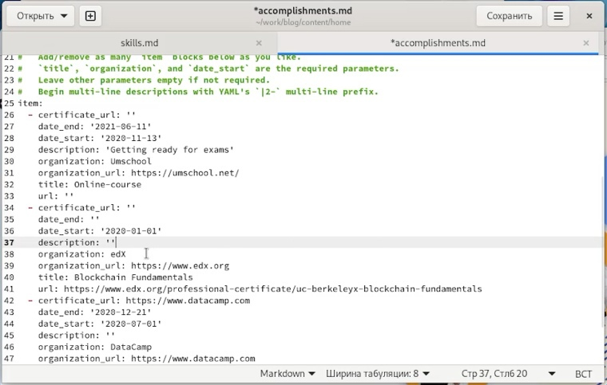{ #fig:001 width=70% }

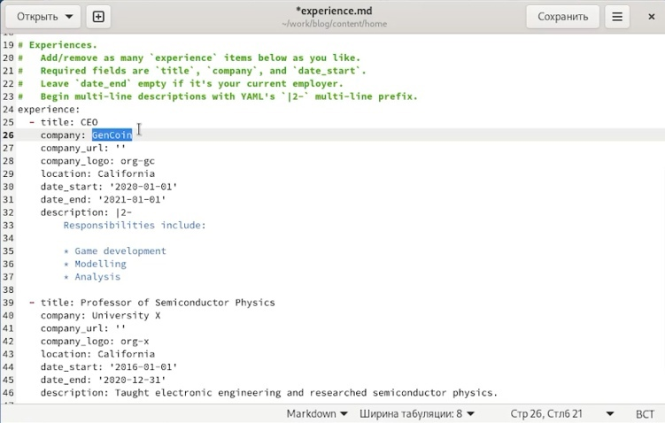{ #fig:002 width=70% }

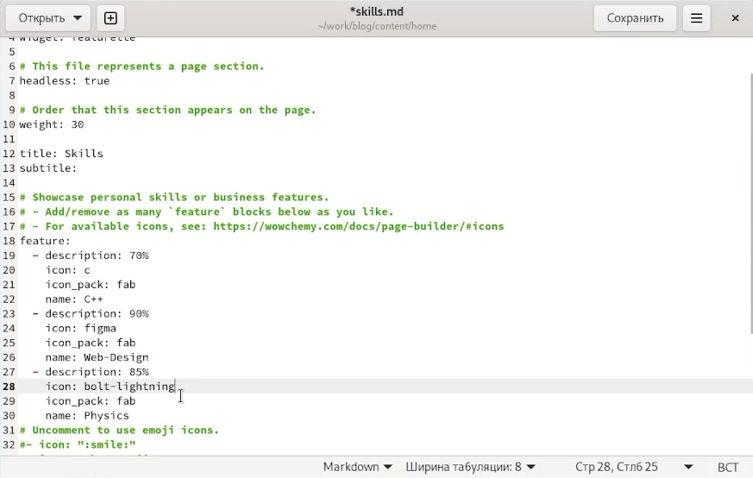{ #fig:003 width=70% }

2. Отправляем измения(рис. [-@fig:004])

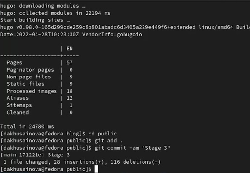{ #fig:004 width=70% }

3. Наблюдаем наши изменения на сайте (рис. [-@fig:005],[-@fig:006],[-@fig:007]).

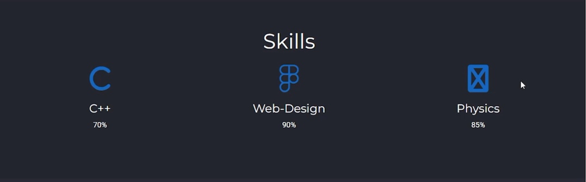{ #fig:005 width=70% }

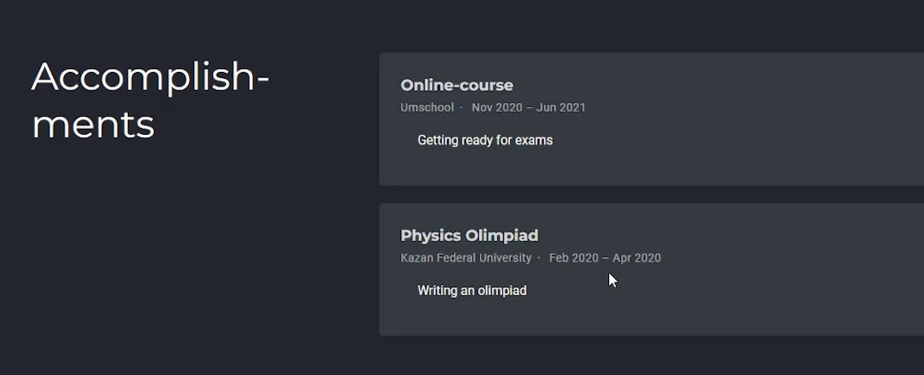{ #fig:006 width=70% } 

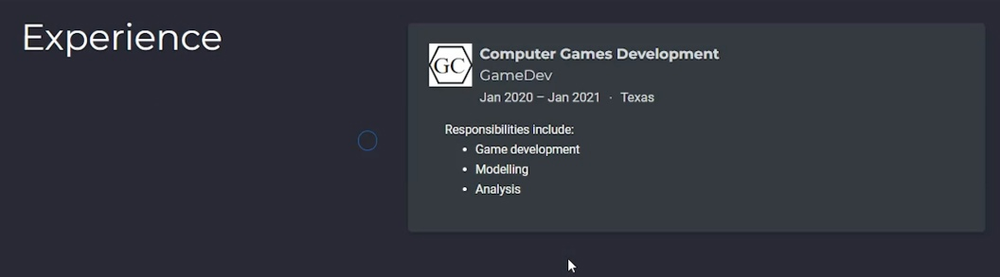{ #fig:007 width=70% }

4. Создаем папки для двух новых постов на сайте, загружаем фотографии, пишем текст постов, а потом так же, как и в предыдущий раз, отправляем наши обновления на сайт с помощью hugo и git(рис. [-@fig:008],[-@fig:009]?[-@fig:010]).

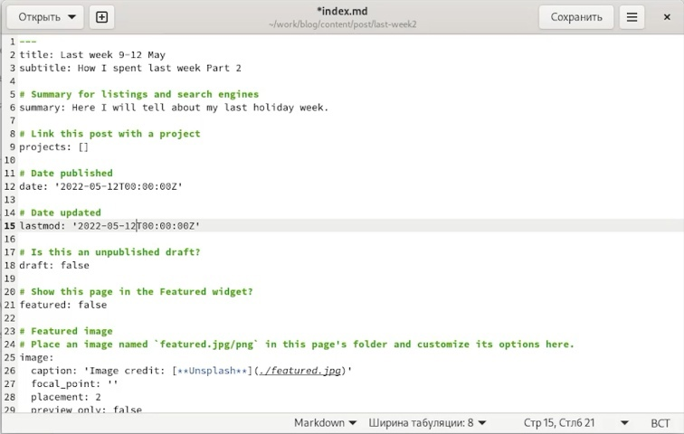{ #fig:008 width=70% }

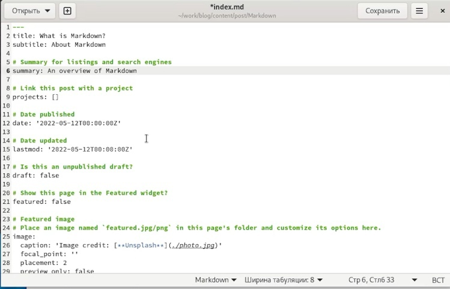{ #fig:009 width=70% }

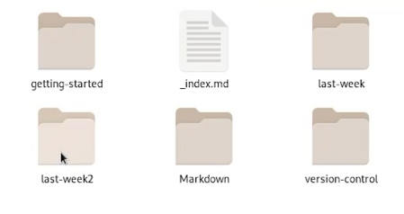{ #fig:010 width=70% }

5. Наблюдаем наши посты на сайте (рис. [-@fig:011]).

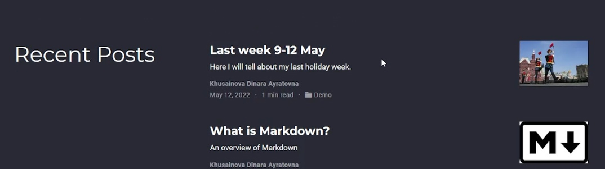{ #fig:011 width=70% }

# Выводы

Мы добавили к сайту наши достижения.

::: {#refs}
:::