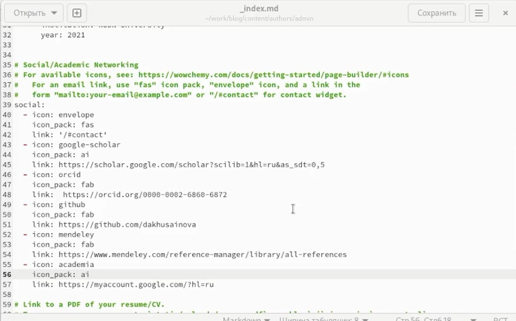
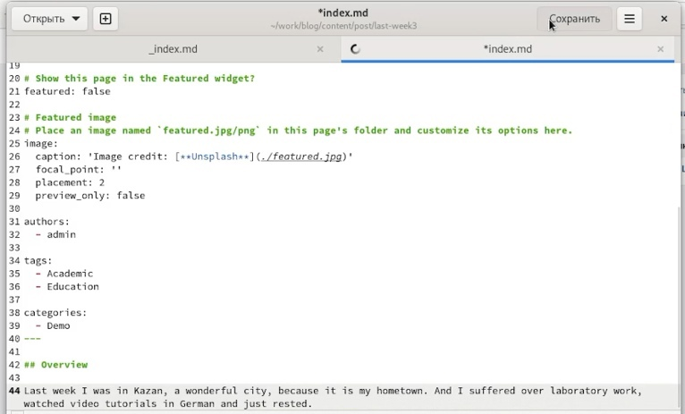
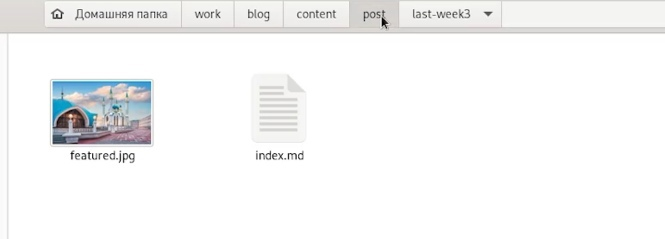
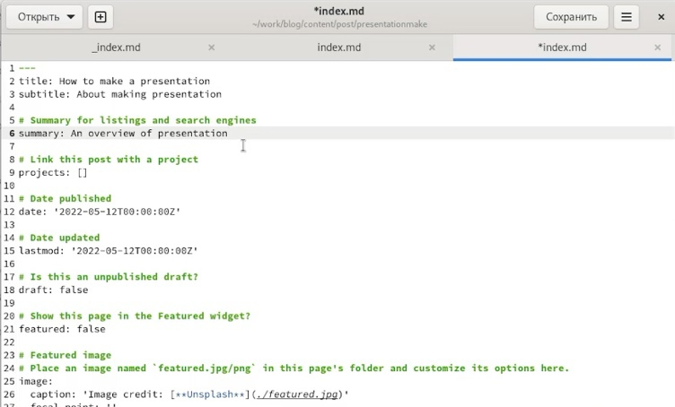
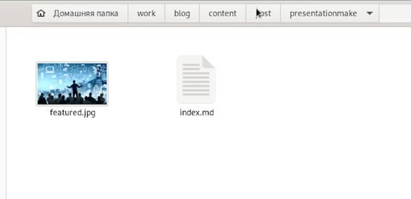
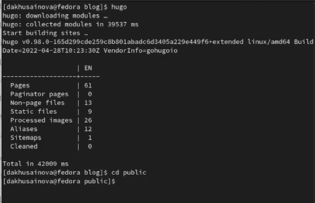
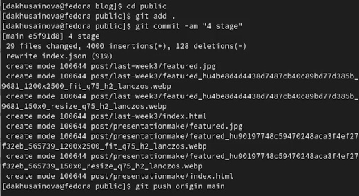
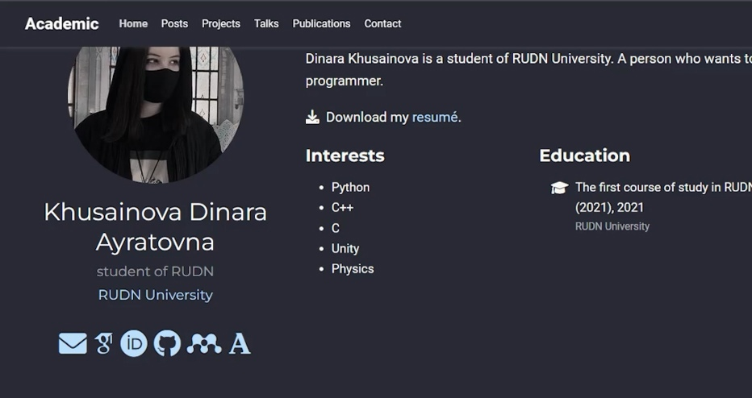
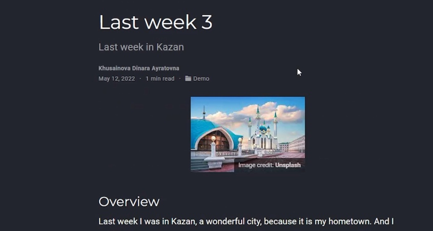

---
## Front matter
lang: ru-RU
title: Четвертый этап индивидуального проекта
author: |
	Хусаинова Динара Айратовна
institute: |
	RUDN University, Moscow, Russian Federation

date: 04.05.2022

## Formatting
toc: false
slide_level: 2
theme: metropolis
header-includes: 
 - \metroset{progressbar=frametitle,sectionpage=progressbar,numbering=fraction}
 - '\makeatletter'
 - '\beamer@ignorenonframefalse'
 - '\makeatother'
aspectratio: 43
section-titles: true
---

# Четвертый этап Добавление к сайту ссылок на научные и библиометрические ресурсы

## Цель работы 

Добавить к сайту ссылки на научные и библиометрические ресурсы.

## Редактирование имеющихся файлов

Переходим по папкам blog > content > authors > admin, редактируем файл под свои аккаунты на данных сайтах, используя новые иконки, вставляя ссылки (рис. [-@fig:001],[-@fig:002]).

{ #fig:001 width=70% }

## Создание поста по прошедшей неделе

Находим папку post, создаем в ней папки для двух новых постов, займемся постом по прошлой неделе. Для этого откроем файл в скопированной папке и редактируем его под прошедшую неделю, находим фотографию и вставляем ее в ту же папку(рис. [-@fig:003],[-@fig:005]).

## Создание поста по прошедшей неделе 

{ #fig:003 width=70% }

## Создание поста по прошедшей неделе

{ #fig:005 width=70% }

## Создание поста по подготовке презентации

Создаем пост по созданию презентации, делаем все то же самое (рис. [-@fig:006],[-@fig:007]).

{ #fig:006 width=70% }

## Создание поста по подготовке презентации

{ #fig:007 width=70% } 

## Отправляем обновления

Открываем в терминале папку blog, запускаем hugo, а потом в папке public все отправляем (рис. [-@fig:008],[-@fig:009]).

{ #fig:008 width=70% }

## Отправляем обновления

{ #fig:009 width=70% } 

## Результат обновления иконок и ссылок

Наблюдаем через какое-то время наши обновления на сайте (рис. [-@fig:010],[-@fig:011],[-@fig:012]).

{ #fig:010 width=70% }

## Результат Пост по прошедшей неделе

{ #fig:011 width=70% }

## Результат Пост по подготовке перезентации

{ #fig:012 width=70% }

## Вывод 

Мы добавили к сайту ссылки на научные и библиометрические ресурсы.
