---
## Front matter
title: "Индивидуальный проект"
subtitle: "Четвертый этап Добавление к сайту ссылок на научные и библиометрические ресурсы"
author: "Хусаинова Динара Айратовна"

## Generic otions
lang: ru-RU
toc-title: "Содержание"

## Bibliography
bibliography: bib/cite.bib
csl: pandoc/csl/gost-r-7-0-5-2008-numeric.csl

## Pdf output format
toc: true # Table of contents
toc-depth: 2
lof: true # List of figures
lot: true # List of tables
fontsize: 12pt
linestretch: 1.5
papersize: a4
documentclass: scrreprt
## I18n polyglossia
polyglossia-lang:
  name: russian
  options:
	- spelling=modern
	- babelshorthands=true
polyglossia-otherlangs:
  name: english
## I18n babel
babel-lang: russian
babel-otherlangs: english
## Fonts
mainfont: PT Serif
romanfont: PT Serif
sansfont: PT Sans
monofont: PT Mono
mainfontoptions: Ligatures=TeX
romanfontoptions: Ligatures=TeX
sansfontoptions: Ligatures=TeX,Scale=MatchLowercase
monofontoptions: Scale=MatchLowercase,Scale=0.9
## Biblatex
biblatex: true
biblio-style: "gost-numeric"
biblatexoptions:
  - parentracker=true
  - backend=biber
  - hyperref=auto
  - language=auto
  - autolang=other*
  - citestyle=gost-numeric
## Pandoc-crossref LaTeX customization
figureTitle: "Рис."
tableTitle: "Таблица"
listingTitle: "Листинг"
lofTitle: "Список иллюстраций"
lotTitle: "Список таблиц"
lolTitle: "Листинги"
## Misc options
indent: true
header-includes:
  - \usepackage{indentfirst}
  - \usepackage{float} # keep figures where there are in the text
  - \floatplacement{figure}{H} # keep figures where there are in the text
---

# Цель работы

Добавить к сайту ссылки на научные и библиометрические ресурсы.

# Теоретическое введение

Сайт, или веб-сайт (от англ. website: web — «паутина, сеть» и site — «место», букв. — «место, сегмент, часть в сети»), также веб-узел, — одна или несколько логически связанных между собой веб-страниц; также место расположения контента сервера. Обычно сайт в Интернете представляет собой массив связанных данных, имеющий уникальный адрес и воспринимаемый пользователями как единое целое. Веб-сайты называются так, потому что доступ к ним происходит по протоколу HTTP[1].

Веб-сайт как система электронных документов (файлов данных и кода) может принадлежать частному лицу или организации и быть доступным в компьютерной сети под общим доменным именем и IP-адресом или локально на одном компьютере. В статье журнала «Хозяйство и право» также было высказано мнение, что каждый сайт имеет своё название, которое при этом не следует путать с доменным именем[2]. С точки зрения авторского права сайт является составным произведением, соответственно название сайта подлежит охране наряду с названиями всех прочих произведений.

Все сайты в совокупности составляют Всемирную паутину, где коммуникация (паутина) объединяет сегменты информации мирового сообщества в единое целое — базу данных и коммуникации планетарного масштаба. Для прямого доступа клиентов к сайтам на серверах был специально разработан протокол HTTP.

# Задание

Зарегистрироваться на соответствующих ресурсах и разместить на них ссылки на сайте:  
eLibrary : https://elibrary.ru/;  
Google Scholar : https://scholar.google.com/;  
ORCID : https://orcid.org/;  
Mendeley : https://www.mendeley.com/;  
ResearchGate : https://www.researchgate.net/;  
Academia.edu : https://www.academia.edu/;  
arXiv : https://arxiv.org/;  
github : https://github.com/.  
Сделать пост по прошедшей неделе.  
Добавить пост на тему по выбору:  
Оформление отчёта.  
Создание презентаций.  
Работа с библиографией  

# Выполнение четвертого этапа

1. Переходим по папкам blog > content > authors > admin, редактируем файл под свои аккаунты на данных сайтах, используя новые иконки, вставляя ссылки (рис. [-@fig:001],[-@fig:002]).

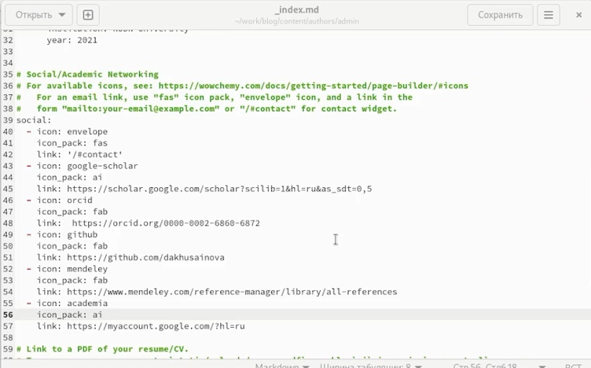{ #fig:001 width=70% }

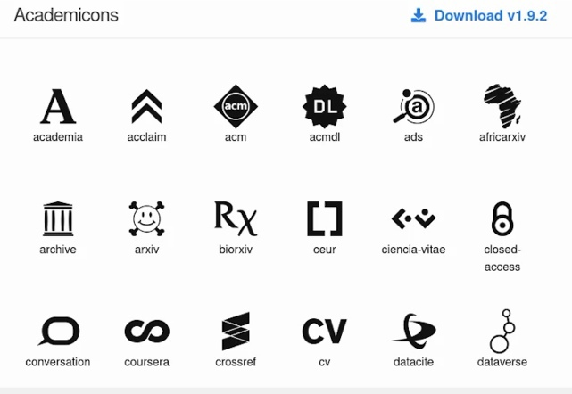{ #fig:002 width=70% }

2. Находим папку post, создаем в ней папки для двух новых постов, займемся постом по прошлой неделе. Для этого откроем файл в скопированной папке и редактируем его под прошедшую неделю, находим фотографию и вставляем ее в ту же папку(рис. [-@fig:003],[-@fig:004],[-@fig:005]).

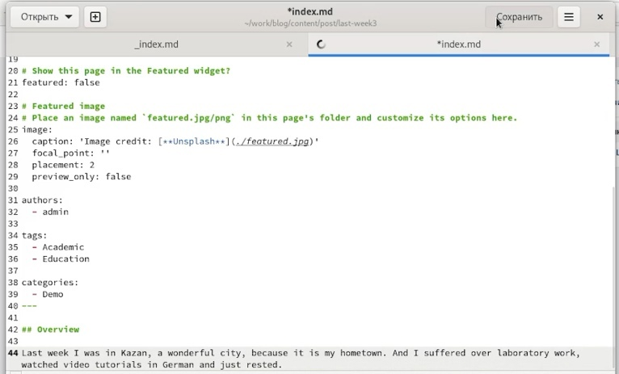{ #fig:003 width=70% }

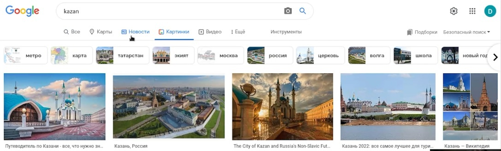{ #fig:004 width=70% }

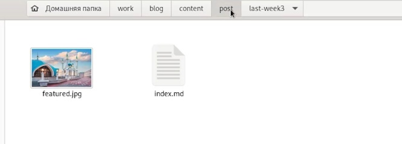{ #fig:005 width=70% }

3. Теперь создаем пост по созданию презентации, делаем все то же самое (рис. [-@fig:006],[-@fig:007]).

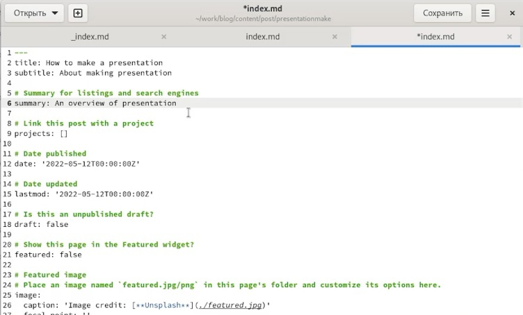{ #fig:006 width=70% }

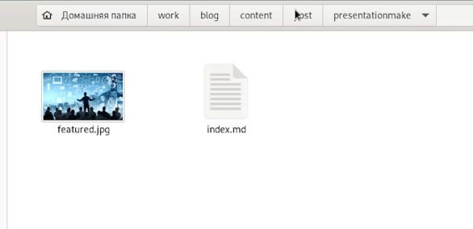{ #fig:007 width=70% } 

4. Открываем в терминале папку blog, запускаем hugo, а потом в папке public все отправляем (рис. [-@fig:008],[-@fig:009]).

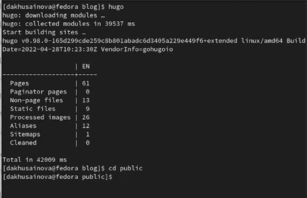{ #fig:008 width=70% }

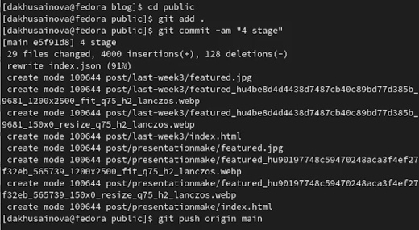{ #fig:009 width=70% } 

5. Наблюдаем через какое-то время наши обновления на сайте (рис. [-@fig:010],[-@fig:011],[-@fig:012]).

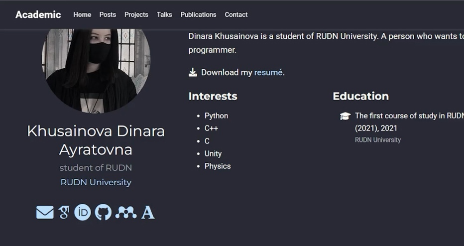{ #fig:010 width=70% }

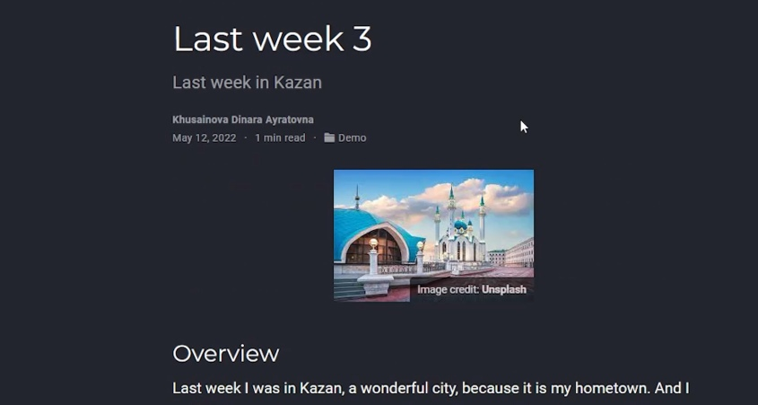{ #fig:011 width=70% }

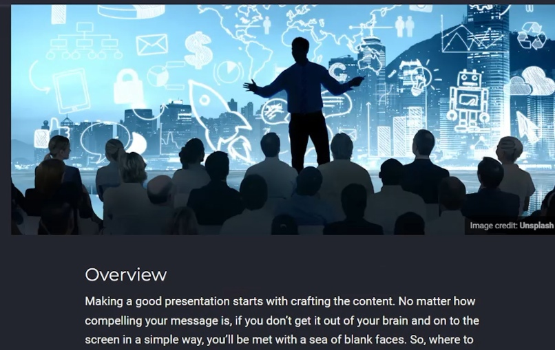{ #fig:012 width=70% }

# Выводы

Мы добавили к сайту ссылки на научные и библиометрические ресурсы.

::: {#refs}
:::