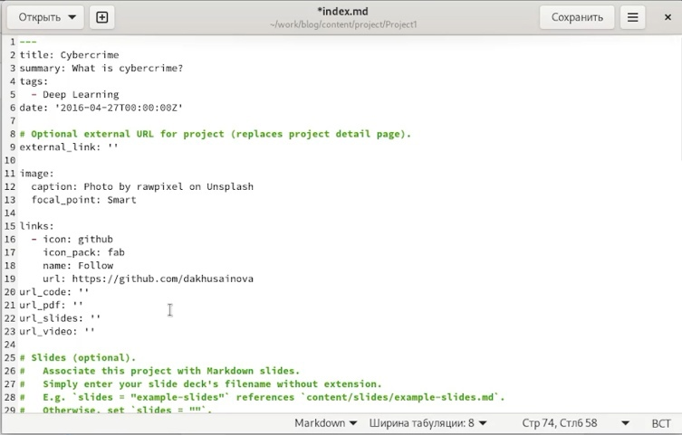
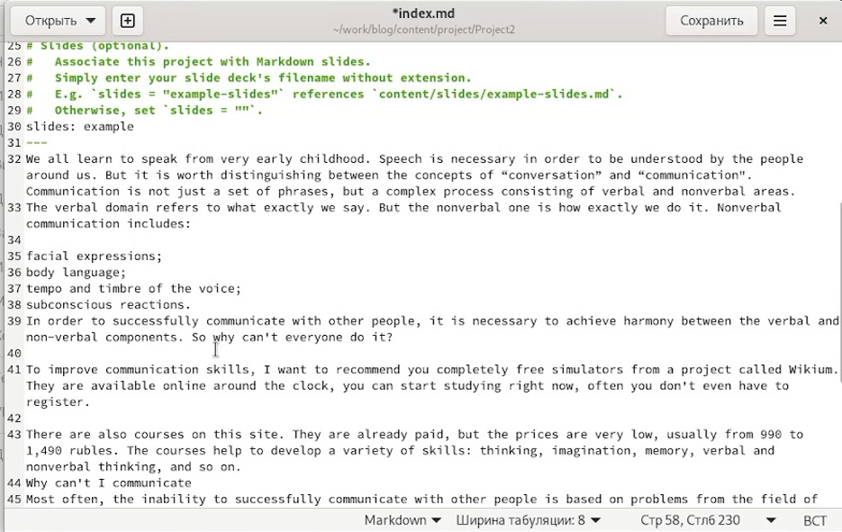
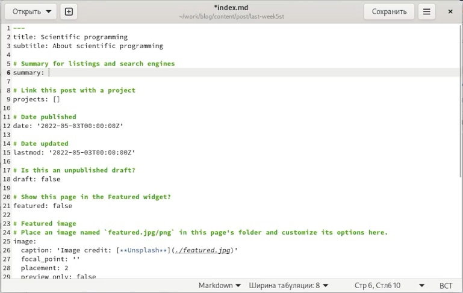
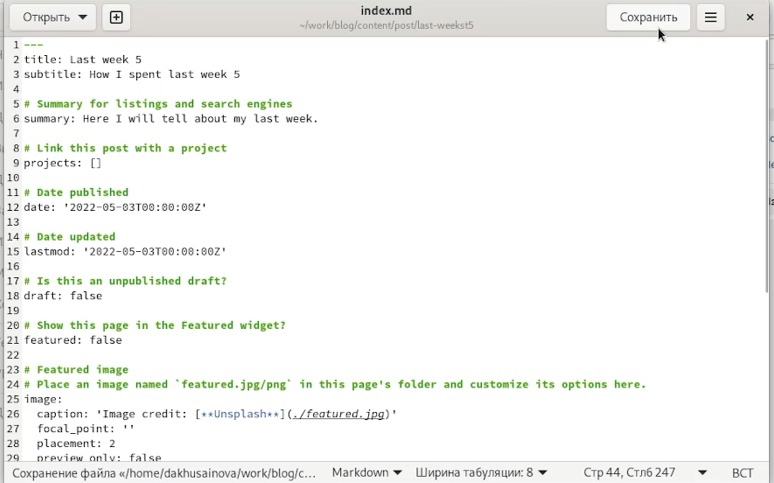
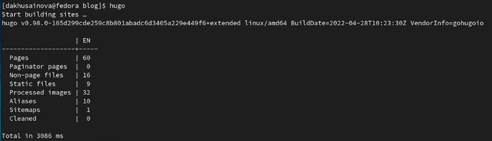
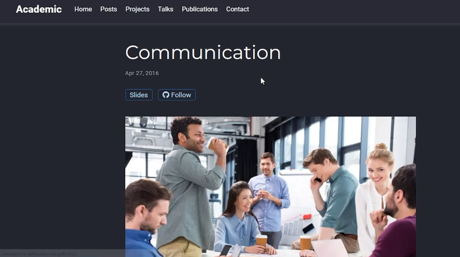
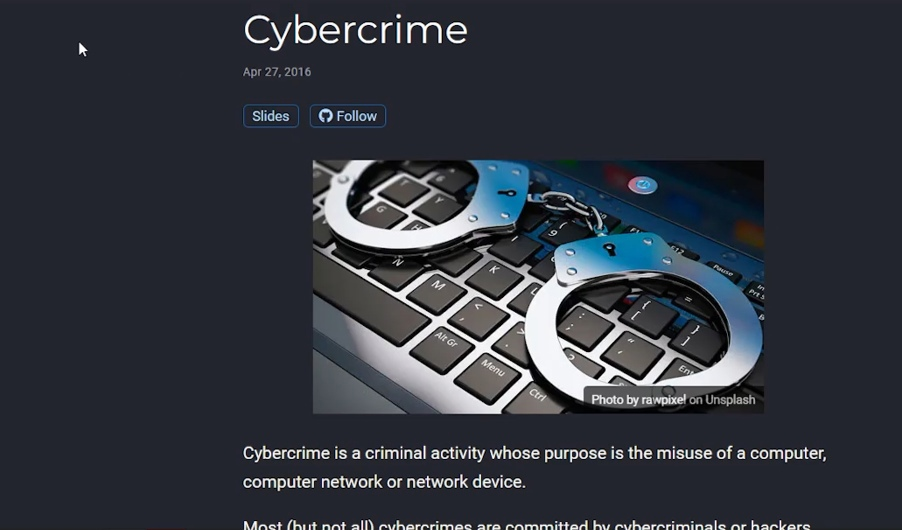
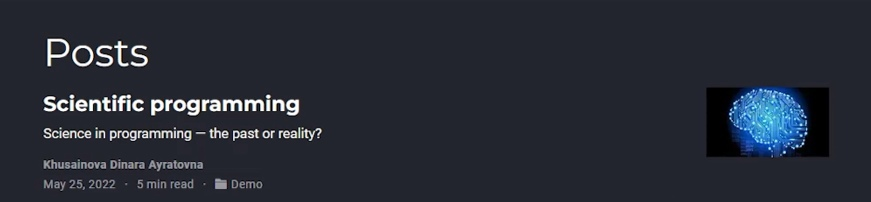
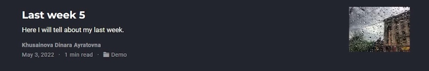

---
## Front matter
lang: ru-RU
title: Пятый этап индивидуального проекта
author: |
	Хусаинова Динара Айратовна
institute: |
	RUDN University, Moscow, Russian Federation

date: 25.05.2022

## Formatting
toc: false
slide_level: 2
theme: metropolis
header-includes: 
 - \metroset{progressbar=frametitle,sectionpage=progressbar,numbering=fraction}
 - '\makeatletter'
 - '\beamer@ignorenonframefalse'
 - '\makeatother'
aspectratio: 43
section-titles: true
---

# 5 этап Добавление к сайту остальных элементов

## Цель работы 

Добавить к сайту все остальные элементы(проекты).

## Редактирование имеющихся файлов

Сделаем записи для персональных проектов. Для этого пройдем в папку Project в папке content, создадим две папки и отредактируем имеющийся файл формата md, также загрузим картинки(рис. [-@fig:002],[-@fig:005]).

## Проект по киберпреступности

{ #fig:002 width=70% }

## Проект по навыкам общения 

{ #fig:005 width=70% }

## Создание постов

Находим папку post, создаем в ней папки для двух новых постов, займемся постом по языку программирования. Для этого откроем файл в скопированной папке и редактируем его под нашу тему, находим фотографию и вставляем ее в ту же папку. Тоже самое делаем для создания поста по прошлой неделе(рис. [-@fig:007],[-@fig:009]).

## Пост по теме Языки научного программирования

{ #fig:007 width=70% }

## Пост по прошедшей неделе

{ #fig:009 width=70% } 

## Отправляем обновления

Открываем в терминале папку blog, запускаем hugo, а потом в папке public все отправляем (рис. [-@fig:010]).

{ #fig:010 width=70% }

## Результат создания проектов и постов

Наблюдаем через какое-то время наши обновления на сайте (рис. [-@fig:013],[-@fig:014],[-@fig:015],[-@fig:016]).

{ #fig:013 width=70% }

## Результат проекта по киберпреступности

{ #fig:014 width=70% }

## Результат Пост по языкам научного программирования

{ #fig:015 width=70% }

## Результат Пост по прошедшей неделе

{ #fig:016 width=70% }

## Вывод 

Мы добавили к сайту все остальные элементы(проекты) и создали два поста.
