---
## Front matter
title: "Индивидуальный проект"
subtitle: "Пятый этап Добавление к сайту остальных элементов"
author: "Хусаинова Динара Айратовна"

## Generic otions
lang: ru-RU
toc-title: "Содержание"

## Bibliography
bibliography: bib/cite.bib
csl: pandoc/csl/gost-r-7-0-5-2008-numeric.csl

## Pdf output format
toc: true # Table of contents
toc-depth: 2
lof: true # List of figures
lot: true # List of tables
fontsize: 12pt
linestretch: 1.5
papersize: a4
documentclass: scrreprt
## I18n polyglossia
polyglossia-lang:
  name: russian
  options:
	- spelling=modern
	- babelshorthands=true
polyglossia-otherlangs:
  name: english
## I18n babel
babel-lang: russian
babel-otherlangs: english
## Fonts
mainfont: PT Serif
romanfont: PT Serif
sansfont: PT Sans
monofont: PT Mono
mainfontoptions: Ligatures=TeX
romanfontoptions: Ligatures=TeX
sansfontoptions: Ligatures=TeX,Scale=MatchLowercase
monofontoptions: Scale=MatchLowercase,Scale=0.9
## Biblatex
biblatex: true
biblio-style: "gost-numeric"
biblatexoptions:
  - parentracker=true
  - backend=biber
  - hyperref=auto
  - language=auto
  - autolang=other*
  - citestyle=gost-numeric
## Pandoc-crossref LaTeX customization
figureTitle: "Рис."
tableTitle: "Таблица"
listingTitle: "Листинг"
lofTitle: "Список иллюстраций"
lotTitle: "Список таблиц"
lolTitle: "Листинги"
## Misc options
indent: true
header-includes:
  - \usepackage{indentfirst}
  - \usepackage{float} # keep figures where there are in the text
  - \floatplacement{figure}{H} # keep figures where there are in the text
---

# Цель работы

Добавить к сайту все остальные элементы(проекты).

# Теоретическое введение

Сайт, или веб-сайт (от англ. website: web — «паутина, сеть» и site — «место», букв. — «место, сегмент, часть в сети»), также веб-узел, — одна или несколько логически связанных между собой веб-страниц; также место расположения контента сервера. Обычно сайт в Интернете представляет собой массив связанных данных, имеющий уникальный адрес и воспринимаемый пользователями как единое целое. Веб-сайты называются так, потому что доступ к ним происходит по протоколу HTTP[1].

Веб-сайт как система электронных документов (файлов данных и кода) может принадлежать частному лицу или организации и быть доступным в компьютерной сети под общим доменным именем и IP-адресом или локально на одном компьютере. В статье журнала «Хозяйство и право» также было высказано мнение, что каждый сайт имеет своё название, которое при этом не следует путать с доменным именем[2]. С точки зрения авторского права сайт является составным произведением, соответственно название сайта подлежит охране наряду с названиями всех прочих произведений.

Все сайты в совокупности составляют Всемирную паутину, где коммуникация (паутина) объединяет сегменты информации мирового сообщества в единое целое — базу данных и коммуникации планетарного масштаба. Для прямого доступа клиентов к сайтам на серверах был специально разработан протокол HTTP.

# Задание

Добавить с сайту все остальные элементы.  
Сделать записи для персональных проектов.  
Сделать пост по прошедшей неделе.  
Добавить пост на тему по выбору.  
Языки научного программирования.  

# Выполнение пятого этапа

1. Сделаем записи для персональных проектов. Для этого пройдем в папку Project в папке content, создадим две папки и отредактируем имеющийся файл формата md, также загрузим картинки(рис. [-@fig:001],[-@fig:002],[-@fig:003],[-@fig:004],[-@fig:005],[-@fig:006]).

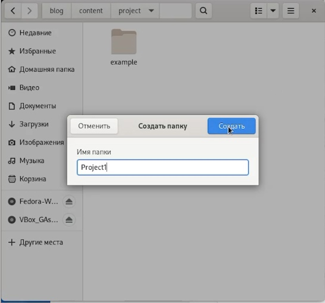{ #fig:001 width=70% }

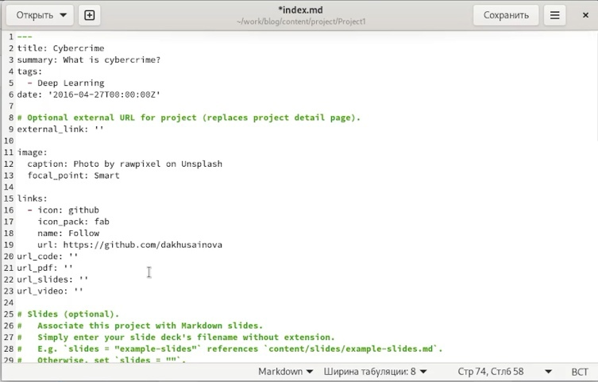{ #fig:002 width=70% }

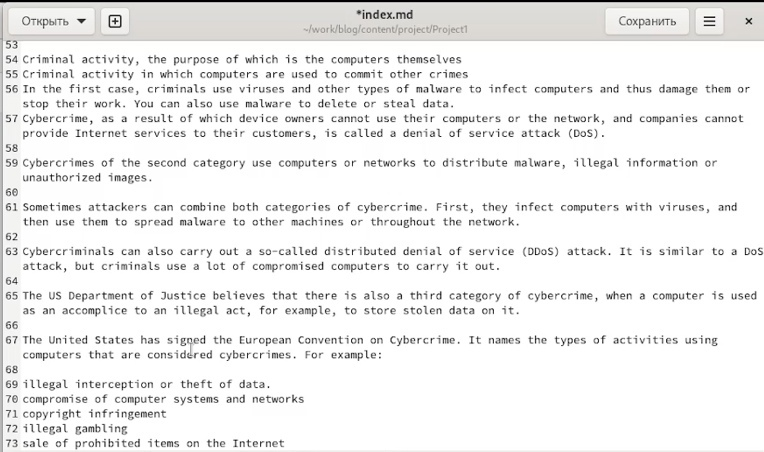{ #fig:003 width=70% }

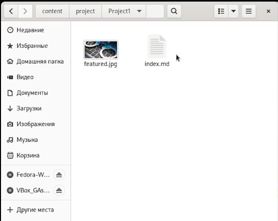{ #fig:004 width=70% }

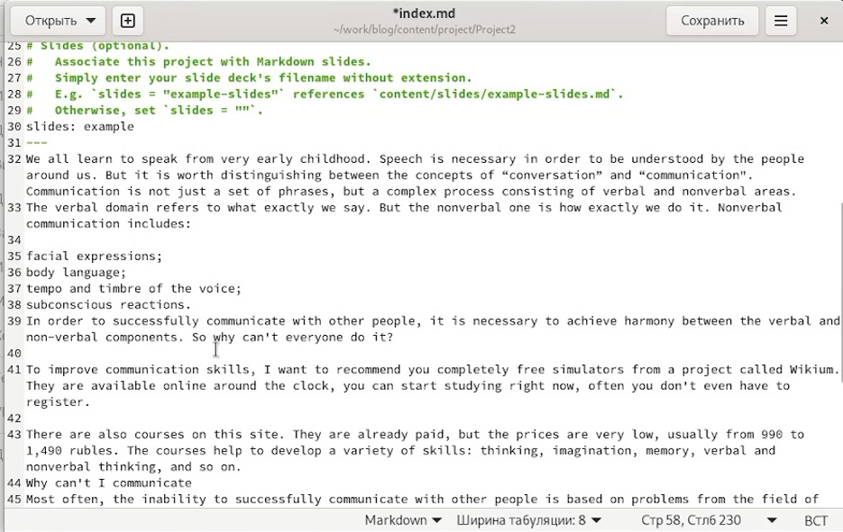{ #fig:005 width=70% }

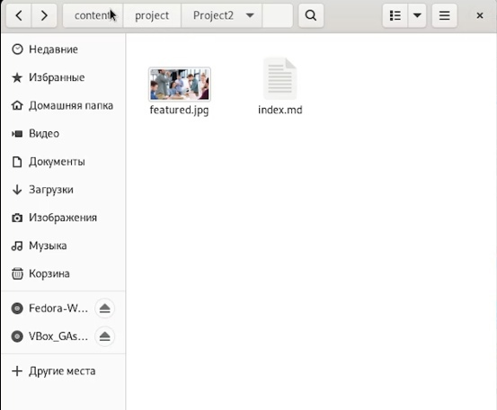{ #fig:006 width=70% }

2. Находим папку post, создаем в ней папки для двух новых постов, займемся постом по языку программирования. Для этого откроем файл в скопированной папке и редактируем его под нашу тему, находим фотографию и вставляем ее в ту же папку. Тоже самое делаем для создания поста по прошлой неделе(рис. [-@fig:007],[-@fig:008],[-@fig:009]).

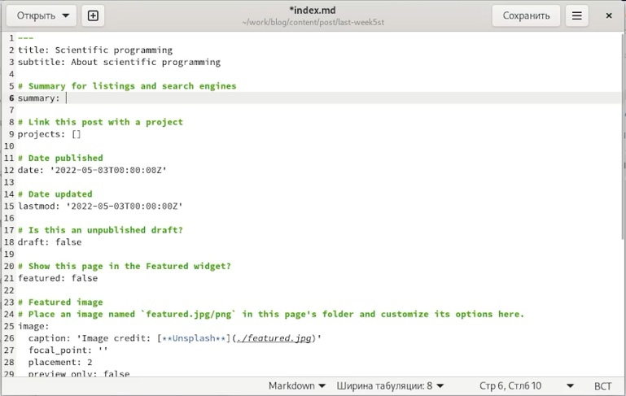{ #fig:007 width=70% }

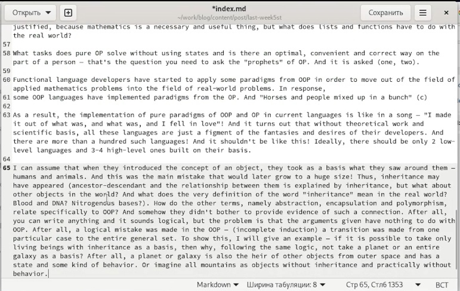{ #fig:008 width=70% }

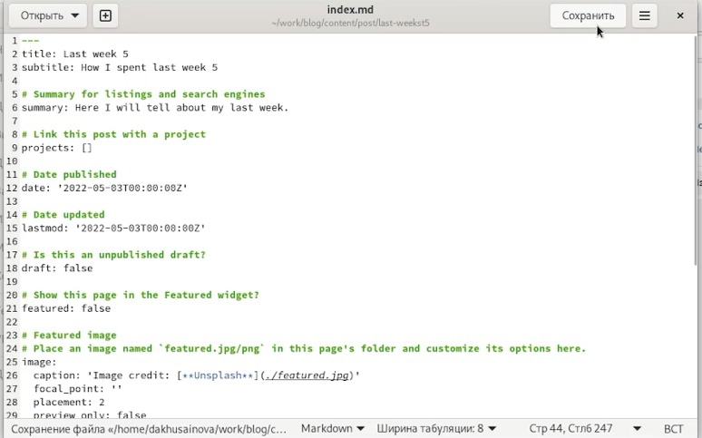{ #fig:009 width=70% }

3. Открываем в терминале папку blog, запускаем hugo, а потом в папке public все отправляем (рис. [-@fig:010],[-@fig:011]).

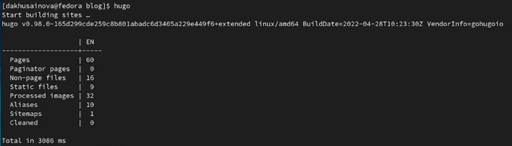{ #fig:010 width=70% }

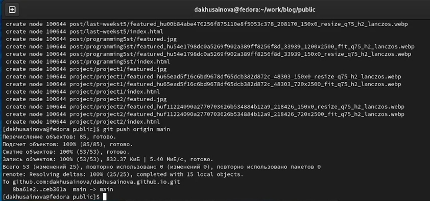{ #fig:011 width=70% } 

5. Наблюдаем через какое-то время наши обновления на сайте (рис. [-@fig:012],[-@fig:013],[-@fig:014],[-@fig:015],[-@fig:016]).

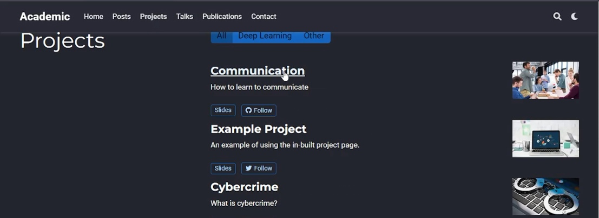{ #fig:012 width=70% }

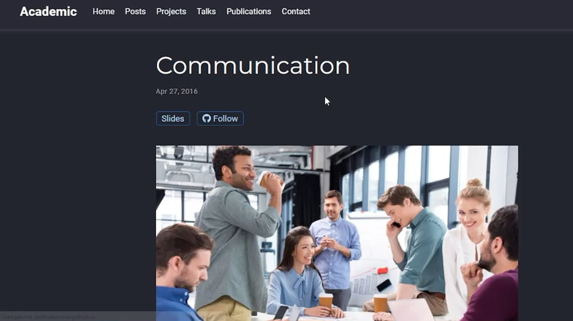{ #fig:013 width=70% }

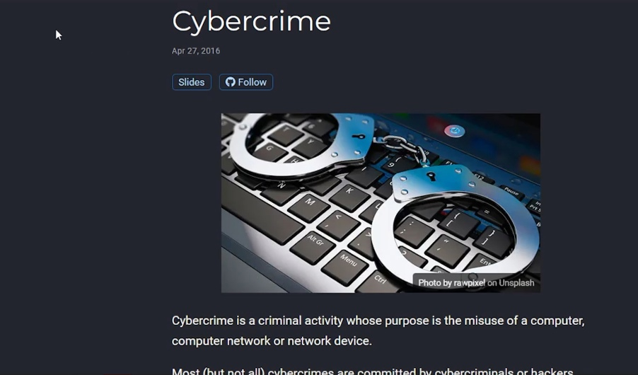{ #fig:014 width=70% }

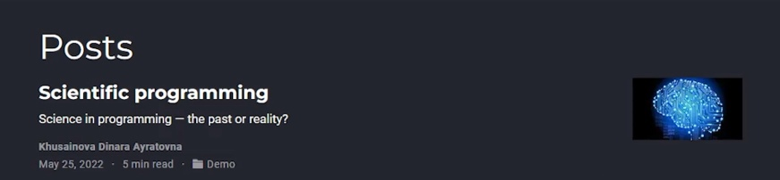{ #fig:015 width=70% }

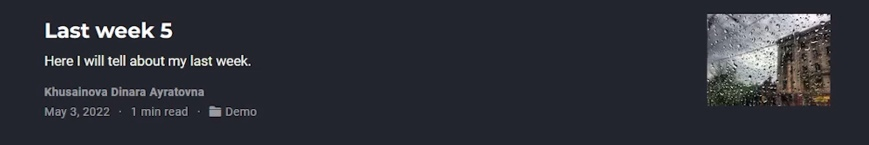{ #fig:016 width=70% }

# Выводы

Мы добавили к сайту все остальные элементы(проекты) и создали два поста.

::: {#refs}
:::