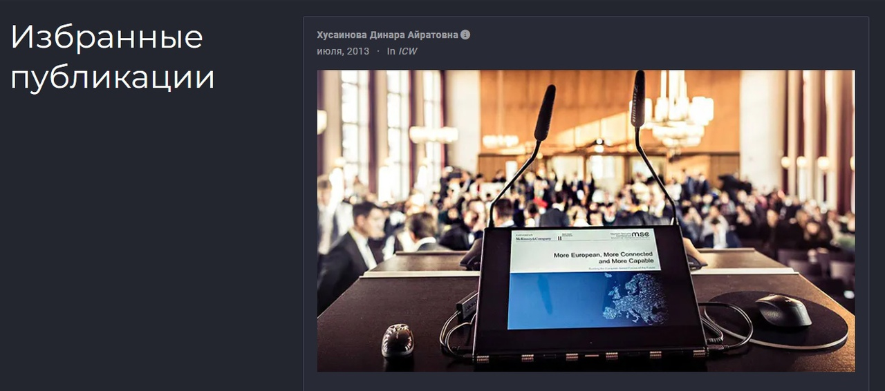

---
## Front matter
lang: ru-RU
title: Шестой этап индивидуального проекта
author: |
	Хусаинова Динара Айратовна
institute: |
	RUDN University, Moscow, Russian Federation

date: 02.06.2022

## Formatting
toc: false
slide_level: 2
theme: metropolis
header-includes: 
 - \metroset{progressbar=frametitle,sectionpage=progressbar,numbering=fraction}
 - '\makeatletter'
 - '\beamer@ignorenonframefalse'
 - '\makeatother'
aspectratio: 43
section-titles: true
---

# 6 этап Размещение двуязычного сайта на Github

## Цель работы 

Сделать поддержку английского и русского языков. Разместить элементы сайта на обоих языках. Разместить контент на обоих языках.

## Перевод меню на русский язык

Открываем файл languages.yaml и добавляем там русское меню(рис. [-@fig:002]).

{ #fig:002 width=70% }

## Перевод всего контента

В папке content разбиваем все файлы и папки на две папки en и ru для английского и русского контента, после этого в папке ru переводим все файлы на русский язык(файлы постов, файл информации о работнике, файлы проектов, файлы навыков, опыта, достижений, всех недавних постов и другого контента(рис. [-@fig:003],[-@fig:004],[-@fig:005],[-@fig:010]).

## Создание папок языков

{ #fig:003 width=70% }

## Перевод титульной информации

{ #fig:004 width=70% } 

## Перевод постов

{ #fig:005 width=70% }

## Перевод проектов

{ #fig:010 width=70% }

## Загрузка обновлений 

Отправляем наши обновления на сайт. Наблюдаем через какое-то время наши обновления на уже переведнном на любимый русский язык сайте (рис. [-@fig:011],[-@fig:012],[-@fig:013],[-@fig:014],[-@fig:015],[-@fig:016],[-@fig:017],[-@fig:018],[-@fig:019]).

## Переведенная титульная информация

{ #fig:011 width=70% }

## Переведенные навыки

{ #fig:012 width=70% }

## Переведенный опыт

{ #fig:013 width=70% }

## Переведенные достижения

{ #fig:014 width=70% }

## Переведенные посты

{ #fig:015 width=70% }

## Переведенные проекты

{ #fig:016 width=70% }

## Переведенные переговоры

{ #fig:017 width=70% }

## Переведенные избранные публикации

{ #fig:018 width=70% }

## Переведенные контакты

{ #fig:019 width=70% }

## Создание двух постов

Создали два поста( один о прошедшей неделе, а другой о языке С# в разработке игр).

## Вывод 

Я сделала поддержку английского и русского языков, разместила элементы сайта на обоих языках, разместила контент на обоих языках, сделала пост по прошедшей неделе и добавила пост на тему по выбору (на двух языках). 
