---
## Front matter
title: "Индивидуальный проект"
subtitle: "Шестой этап Размещение двуязычного сайта на Github"
author: "Хусаинова Динара Айратовна"

## Generic otions
lang: ru-RU
toc-title: "Содержание"

## Bibliography
bibliography: bib/cite.bib
csl: pandoc/csl/gost-r-7-0-5-2008-numeric.csl

## Pdf output format
toc: true # Table of contents
toc-depth: 2
lof: true # List of figures
lot: true # List of tables
fontsize: 12pt
linestretch: 1.5
papersize: a4
documentclass: scrreprt
## I18n polyglossia
polyglossia-lang:
  name: russian
  options:
	- spelling=modern
	- babelshorthands=true
polyglossia-otherlangs:
  name: english
## I18n babel
babel-lang: russian
babel-otherlangs: english
## Fonts
mainfont: PT Serif
romanfont: PT Serif
sansfont: PT Sans
monofont: PT Mono
mainfontoptions: Ligatures=TeX
romanfontoptions: Ligatures=TeX
sansfontoptions: Ligatures=TeX,Scale=MatchLowercase
monofontoptions: Scale=MatchLowercase,Scale=0.9
## Biblatex
biblatex: true
biblio-style: "gost-numeric"
biblatexoptions:
  - parentracker=true
  - backend=biber
  - hyperref=auto
  - language=auto
  - autolang=other*
  - citestyle=gost-numeric
## Pandoc-crossref LaTeX customization
figureTitle: "Рис."
tableTitle: "Таблица"
listingTitle: "Листинг"
lofTitle: "Список иллюстраций"
lotTitle: "Список таблиц"
lolTitle: "Листинги"
## Misc options
indent: true
header-includes:
  - \usepackage{indentfirst}
  - \usepackage{float} # keep figures where there are in the text
  - \floatplacement{figure}{H} # keep figures where there are in the text
---

# Цель работы

Сделать поддержку английского и русского языков. Разместить элементы сайта на обоих языках. Разместить контент на обоих языках.

# Теоретическое введение

Сайт, или веб-сайт (от англ. website: web — «паутина, сеть» и site — «место», букв. — «место, сегмент, часть в сети»), также веб-узел, — одна или несколько логически связанных между собой веб-страниц; также место расположения контента сервера. Обычно сайт в Интернете представляет собой массив связанных данных, имеющий уникальный адрес и воспринимаемый пользователями как единое целое. Веб-сайты называются так, потому что доступ к ним происходит по протоколу HTTP[1].

Веб-сайт как система электронных документов (файлов данных и кода) может принадлежать частному лицу или организации и быть доступным в компьютерной сети под общим доменным именем и IP-адресом или локально на одном компьютере. В статье журнала «Хозяйство и право» также было высказано мнение, что каждый сайт имеет своё название, которое при этом не следует путать с доменным именем[2]. С точки зрения авторского права сайт является составным произведением, соответственно название сайта подлежит охране наряду с названиями всех прочих произведений.

Все сайты в совокупности составляют Всемирную паутину, где коммуникация (паутина) объединяет сегменты информации мирового сообщества в единое целое — базу данных и коммуникации планетарного масштаба. Для прямого доступа клиентов к сайтам на серверах был специально разработан протокол HTTP.

# Задание

Сделать поддержку английского и русского языков.
Разместить элементы сайта на обоих языках.
Разместить контент на обоих языках.
Сделать пост по прошедшей неделе.
Добавить пост на тему по выбору (на двух языках).  

# Выполнение шестого этапа

1. Первым делом открываем файл config.yaml, оставляем там свою ссылку на сайт для дальнейших обновлений(рис. [-@fig:001]

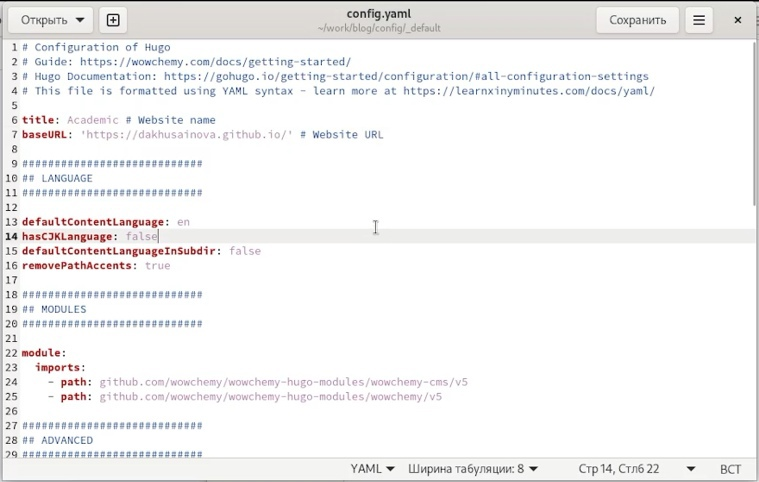{ #fig:001 width=70% }

2. Открываем файл languages.yaml и добавляем там русское меню(рис. [-@fig:002]).

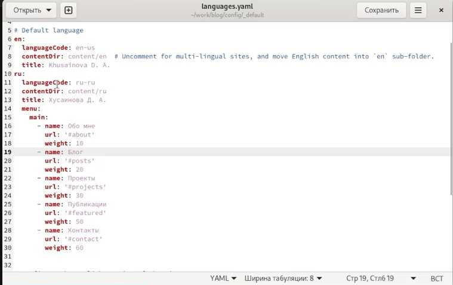{ #fig:002 width=70% }

3. В папке content разбиваем все файлы и папки на две папки en и ru для английского и русского контента, после этого в папке ru переводим все файлы на русский язык(файлы постов, файл информации о работнике, файлы проектов, файлы навыков, опыта, достижений, всех недавних постов и другого контента(рис. [-@fig:003],[-@fig:004],[-@fig:005],[-@fig:006],[-@fig:007],[-@fig:008],[-@fig:009],[-@fig:010]).

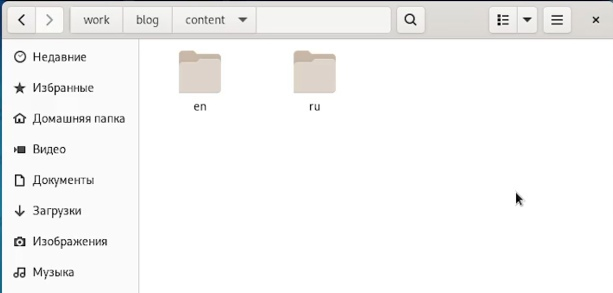{ #fig:003 width=70% }

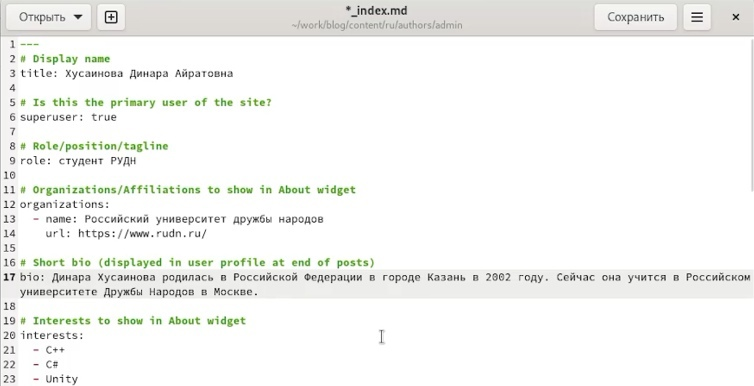{ #fig:004 width=70% } 

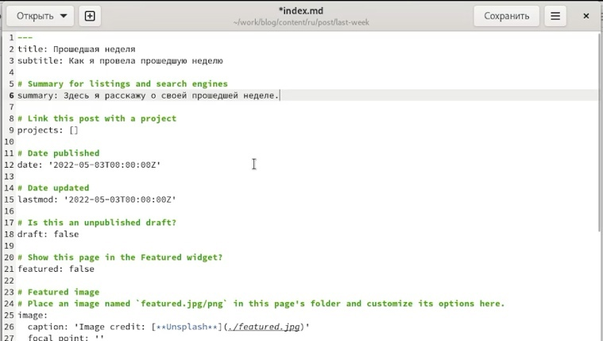{ #fig:005 width=70% }

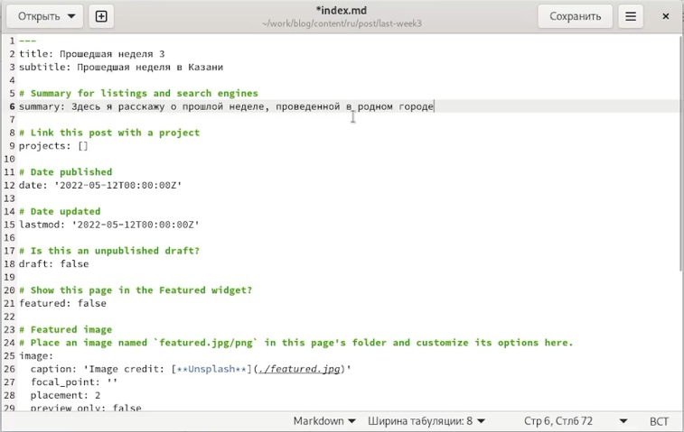{ #fig:006 width=70% }

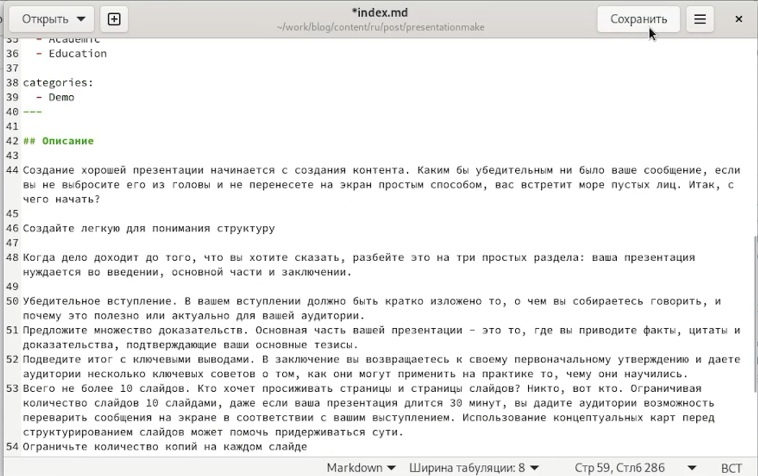{ #fig:007 width=70% }

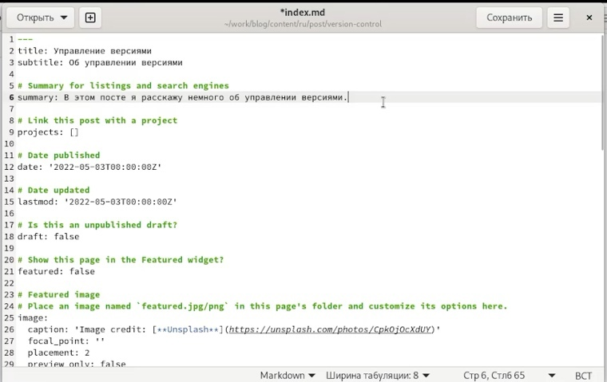{ #fig:008 width=70% }

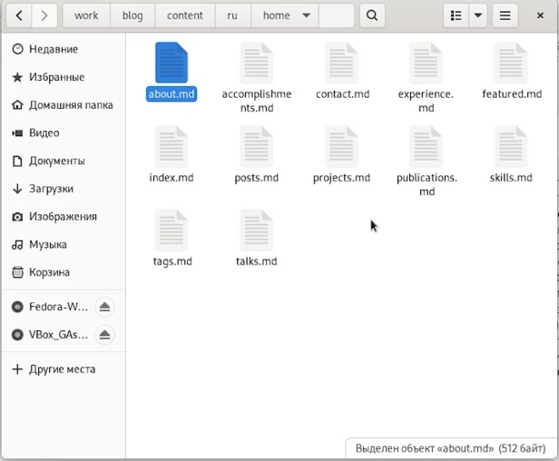{ #fig:009 width=70% }

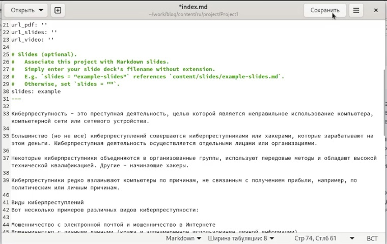{ #fig:010 width=70% }

5. Отправляем наши обновления на сайт. Наблюдаем через какое-то время наши обновления на уже переведнном на любимый русский язык сайте (рис. [-@fig:011],[-@fig:012],[-@fig:013],[-@fig:014],[-@fig:015],[-@fig:016],[-@fig:017],[-@fig:018],[-@fig:019]).

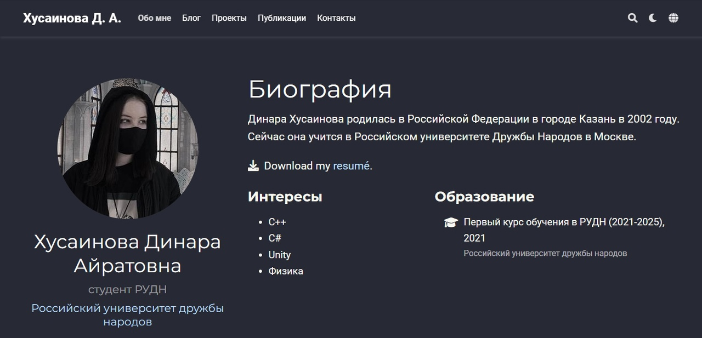{ #fig:011 width=70% }

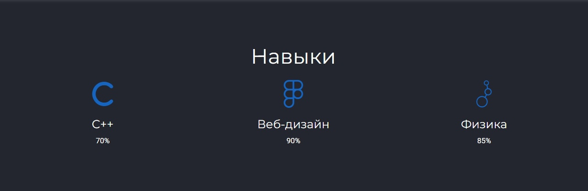{ #fig:012 width=70% }

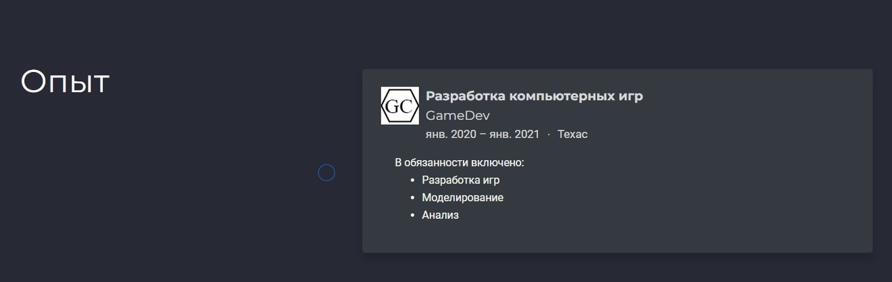{ #fig:013 width=70% }

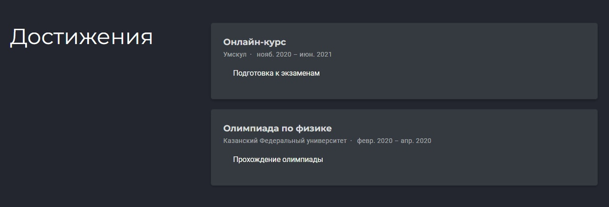{ #fig:014 width=70% }

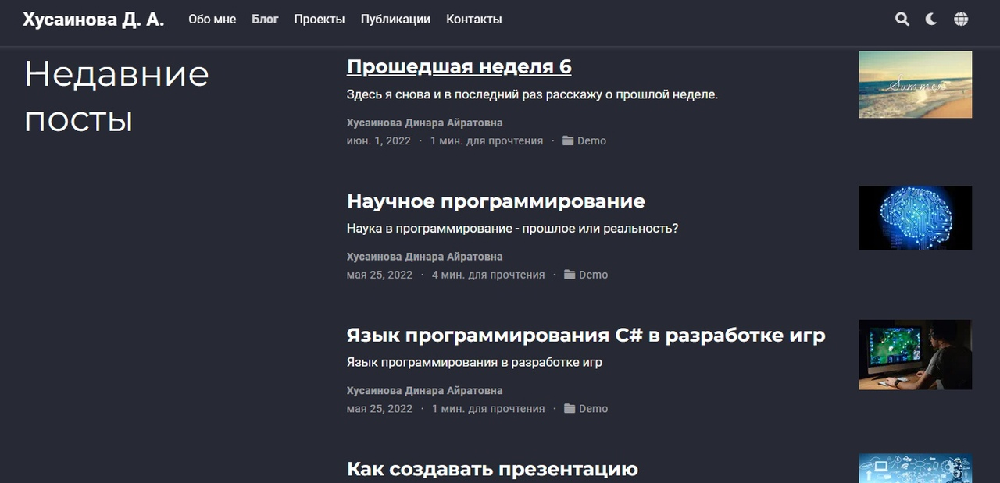{ #fig:015 width=70% }

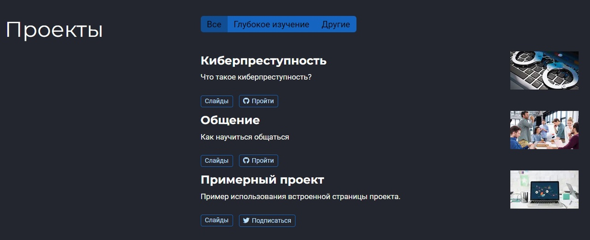{ #fig:016 width=70% }

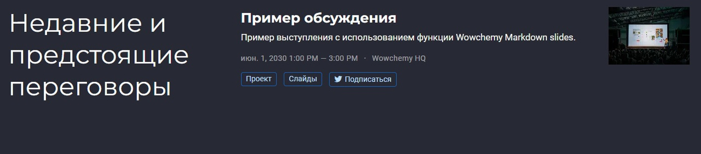{ #fig:017 width=70% }

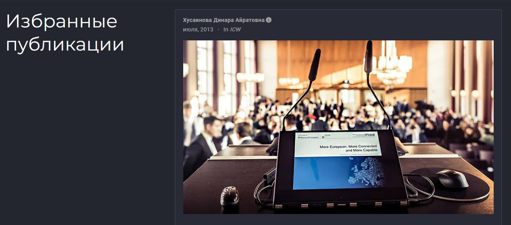{ #fig:018 width=70% }

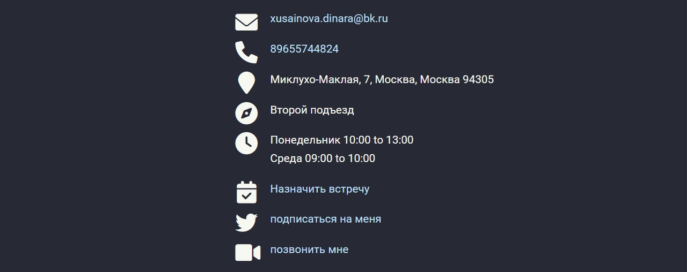{ #fig:019 width=70% }

# Выводы

Я сделала поддержку английского и русского языков, разместила элементы сайта на обоих языках, разместила контент на обоих языках, сделала пост по прошедшей неделе и добавила пост на тему по выбору (на двух языках).  

::: {#refs}
:::